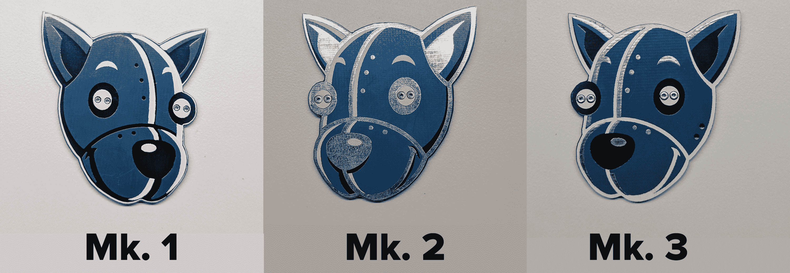
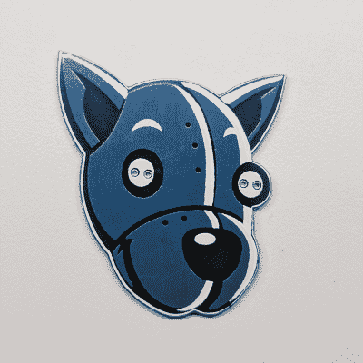
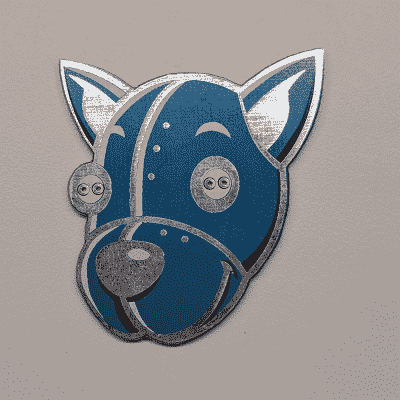
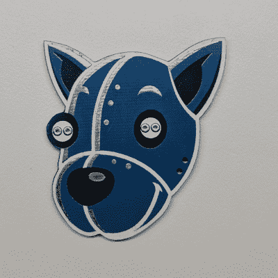
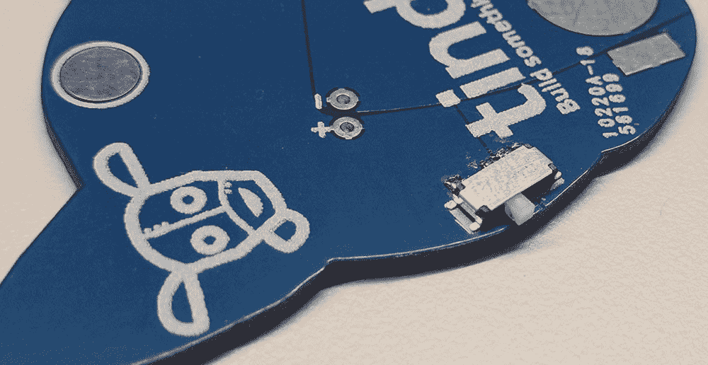
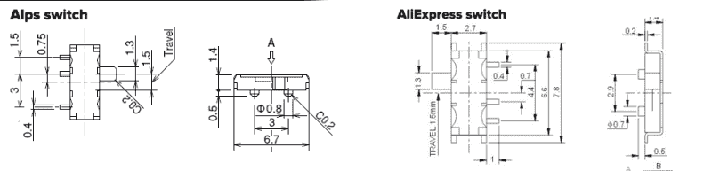
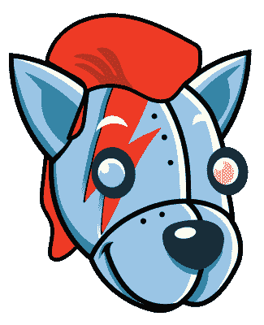

# BOM 成本优化和 Tindie 徽章工程

> 原文：<https://hackaday.com/2017/10/06/bom-cost-optimization-and-tindie-badge-engineering/>

在过去的几个月里，我一直忙于电子会议徽章。今年，[我在 DEF CON](https://hackaday.io/project/25150-the-official-hackaday-defcon-25-badge) 上创造了一个最令人向往的徽章。我还制作了[几个 Tindie 徽章](https://hackaday.com/2017/07/27/building-a-def-con-badge-in-two-weeks/)，现在我正在做 Hackaday 超级会议徽章背后的后勤工作。在最后一个问题上保持冷静——下个月我们会做一些非常非常特别的事情。

大多数徽章项目都是一次性生产。这是从一个只打算在单个事件中分发的硬件中所期望的。Tindie 徽章是不同的。现在这是一件*事情*，我们正在为 Hackaday 和 Tindie 今年剩余时间参加的所有会议和会议制作多个徽章。这意味着我有机会对 Tindie 徽章进行硬件修改。现在，我已经制作了三个版本的 Tindie，我们已经在 DEF CON、纽约 Maker Faire 和开放硬件峰会上分发了大约两千个这样的套件。

经过大约两千个单位，我想我们终于有这个下来。这就是我如何在几个月内设计了三个版本的硬件，并将每个徽章的 BOM 成本减半。这几乎是一个令人印象深刻的工程，也是 BOM 成本优化的一个很好的教训。

###  **廷迭徽章，Mk. 1**

 这是汀蝶徽章的第一次改版。[我早些时候在 Hackaday 博客](https://hackaday.com/2017/07/27/building-a-def-con-badge-in-two-weeks/)上写过，但简单的版本就像茉莉花说，“嘿，我们应该为 DEF CON 制作一个 Tindie 徽章”。我当时并不忙，所以我同意承担这个项目。我们在两周内设计、订购、接收、配备并分发了 300 枚 Tindie 徽章。

Mk. 1 Tindie 徽章就是这么简单。有一个电池座，一个电池和两个闪烁的 RGB LEDs。Eagle 中的一些 BMP 黑客制作了一个很棒的 PCB，焊接在 PCB 背面的“别针扣”使它成为一个真正的可穿戴设备。

该徽章的包装和分发非常顺利，BOM 成本也很合理:每枚徽章 1.83 美元，数量为 300 枚。对 DEF CON 来说很棒，而且有可能成为一个很棒的赃物。无论如何，比一堆 t 恤更容易携带。

### **廷迭徽章 Mk. 2**

 随着 Tindie DEF CON 徽章的成功，我们决定为我们的下一个活动再做一些:纽约的世界创客大会。我们对快速组装徽章的能力充满信心，我们的目标数量是 1000 个。一千枚徽章，只有一个半月的时间来收集。没问题。

从 Mk. 1 到 Mk. 2 徽章的变化纯粹是装饰性的。虽然使用多层铜、丝绸、铜抗蚀剂和掩模作为艺术板已经足够好了，但我对 Tindie 徽章的第一个版本并不太满意。深蓝色和浅蓝色之间没有太大的区别，眼睛可以使用更多的定义，Tindie 的铆钉应该看起来像真正的铆钉。这意味着我需要改变一些黑暗的领域，以罐头领域。没问题——只是在玩 Illustrator、BMP 和 Eagle。

Maker Faire 的 Mk. 2 徽章是成功的，无论是作为一点战利品还是从工程的角度来看。Mk. 2 版本的价格仅为 1.23 美元，而不是第一版的 1.83 美元。我们使用相同的零件供应商，所以这只是数量上的折扣。这仍然是一个**显著的**成本降低，考虑到我们在活动中分发了多少贴纸，这是一个非常有吸引力的赠品。

我满意吗？没有。到处放镀锡铜的计划没有成功，最初的徽章看起来更好。最起码鼻子和耳朵要深蓝色。在 Illustrator 中，没有完成的纸板，您只能模拟这么多。尽管如此，我们还是为 Maker Faire 做了 1000 个，而且每个徽章的成本大大降低了。

### **廷迭徽章 Mk. 3**

 继 Maker Faire 之后，我们的下一个活动是在丹佛举行的[开放式硬件峰会](https://2017.oshwa.org/)。在那之后，是 Hackaday Supercon，我们希望它能让机器狗头下雨。

当然，要解决的最重要的问题是艺术。艺术背后的基本思想是完善设计，使鼻子和“内侧”耳朵呈深蓝色，保持铆钉为银色，并更多地使用白色丝绸。我写了另一篇关于如何在 Eagle 中做这种艺术的 Hackaday 帖子，这很容易就完成了。我们对结果都很满意。

Mk. 3 Tindie 徽章是一个重大修订。我们正在做实际的，真实的，硬件的改变。最大的变化是什么？一个开关。我测试过 Tindie 的徽章，一块新电池会眨眼好几天，但是有些人因为某些原因喜欢把电池拿出来。不管怎样，我们需要一个开关。

Tindie Badge Mk. 3, with the handy-dandy switch

对这个开关的要求意味着它必须是一个 SMD(所以前面的艺术不会被搞乱)SPST 开关。越小越好，对于所有组件，我们都在寻找最便宜的选择。我们选择了 Mouser 的 Alps 开关，1000 片订量的价格为 0.14 美元。这已经够便宜了。

有了我们满意的纸板艺术和基本分类的 BOM，让我们对 1000 个 Mk. 3 徽章进行成本分解:

| **部分** | **单位成本** | **总成本** | **来源** |
| 包 | $0.03 | Forty-four point nine six | 全球速卖通 |
| 附加 | $0.11 | One hundred and fourteen point one one | 全球速卖通 |
| 电池盒 | $0.36 | Three hundred and fifty-seven point two six | 数码钥匙 BK-916-CT-ND |
| 电池 | $0.17 | One hundred and seventy point three five | 亚马孙 |
| 5 毫米 LED | $0.02 | Forty-nine point eight | 亚马孙 |
| 纸板 | $0.54 | Three hundred and twenty-one point seven seven | Seeed |
| 转换 | $0.14 | One hundred and forty-four | Mouser 688-SSSS810701 |

每枚徽章(数量为 1000 枚)的总成本为 1.37 美元，基本上与 Mk. 2 徽章相同，但增加了一个开关。可以接受，但我仍然不满意我们为电池座和开关支付的费用。我们将为开放硬件峰会和 Supercon 推出 Mk. 3 徽章，但我将对未来的 BOM 进行一些更改。

### **真实工程和 BOM 成本优化**

我们不会削减袋子、大头钉或 led 的 BOM 成本。这些东西已经很便宜了。同样，PCB 的价格也不会降太多，除非我们订购更多。我在制造第一个电池之前货比三家，相信我，亚马逊有非常非常便宜的 CR1220 电池。

这基本上留下了开关和电池座作为我们要削减成本的地方。

Two nearly identical switches. The switch on the left costs $0.14 in quantity 1000, the switch on the right costs $0.03 in quantity 1000

我发现的第一个符合要求的开关来自 Alps，但相当多的机电零件都有中国的同类产品，差不多一样。经过一番搜索，[我在全球速卖通](https://www.aliexpress.com/item/1000pcs-MINI-micro-Slide-Switch-On-OFF-2-Position-1P2T-SPDT-Miniature-Horizontal-Slide-Switch-SMD/32770868105.html)上找到了这个家伙。看看这两幅画:不，它们不一样。开关底部的“螺柱”不同；全球速卖通开关有 0.7 毫米直径的螺柱，Alps 有 0.8 毫米直径的螺柱。如果你真的研究这些画，它们或多或少是一样的。它们实际上是可以互换的，如果你在 Eagle 中为其中一个做了一个零件，你就为两个都做了一个零件。

更有意思的是:我可以花 144 美元买到 1000 个 Alps 开关。我还可以花 31.26 美元买 1000 份全球速卖通特色菜。阿尔卑斯山版的徽章价格为 0.14 美元，全球速卖通版为 0.03 美元。我刚刚存了 11 美分。对于 1000 块板，那是 110 美元。太棒了。

BOM 上最大的开销是板子，我对此无能为力。下一个最大的开销是电池座，而且差距很大。不是*电池*，提醒你:电池*座*。这只是一小片冲压金属，千片订量的成本为 0.36 美元。不幸的是，全球速卖通在这里不帮我。通常来自中国供应商的 CR1220 电池座绝大多数是塑料通孔组件。我不想那样；它们是较大的部件，会破坏正面的艺术效果，而且它们仍然非常昂贵，1000 片的价格约为 0.20 美元。

Mk. 1、Mk. 2 和 Mk. 3 徽章[的电池座来自 Digikey](https://www.digikey.com/product-detail/en/mpd-memory-protection-devices/BK-916-TR/BK-916-CT-ND/6200238) 。他们工作，他们很棒，但是你应该在设计之前在 Mouser 和 Digikey 上搜索。(或者报名参加 [Findchips](https://www.findchips.com/) 。那可能会节省一些钱。)[这是我在 Mouser](http://www.mouser.com/Search/ProductDetail.aspx?R=BAT-HLD-012-SMTvirtualkey66280000virtualkey712-BAT-HLD-012-SMT) 上发现的。这是来自不同供应商的不同零件，并且仅适用于 CR1216 和 CR1225 电池，而非 CR1220 电池。

那些知道硬币细胞的名字是如何得来的人现在正在笑，但事情是这样的。前两个数字是直径。这些电池直径为 12 毫米。后两个数字是厚度。CR1216 电池的直径为 12 毫米，厚度为 1.6 毫米。CR1225 电池的直径为 12 毫米，厚度为 2.5 毫米。当然，我的 CR1220 电池将在一个既接受 1216 和 1225 电池的电池座中工作。为什么鼠标部分没有被标记为 CR1220 电池座，我不明白。

Mouser 零件的千片订量为 0.19 美元，每板为我节省了 0.17 美元。1000 片订量是 170 美元。让我们再看一下 BOM，看看新零件:

| **部分** | **单位成本** | **总成本** | **来源** |
| 包 | $0.03 | Forty-four point nine six | 全球速卖通 |
| 附加 | $0.11 | One hundred and fourteen point one one | 全球速卖通 |
| 电池盒 | $0.19 | One hundred and ninety-one | Mouser 712-BAT-HLD-012-SMT |
| 电池 | $0.17 | Eighty-three point three five | 亚马孙 |
| 5 毫米 LED | $0.02 | Forty-nine point eight | 亚马孙 |
| 纸板 | $0.54 | Three hundred and twenty-one point seven seven | Seeed |
| 转换 | $0.03 | Thirty-one point two six | 全球速卖通 |
|  |  |  |  |
| **总成本:** | **$1.09** |  |  |

经过三次修改，我们对 Tindie 徽章上的艺术很满意，我们降低了成本，每个徽章节省了近 1 美元。这真是不可思议，证明了只要看看你有哪些选择，你就能节省多少钱。

### 不要叫他们钻石狗。那是错误的专辑。

You’ll catch your death in the fog

Tindie 徽章的未来计划是什么？我们几乎已经准备好了超级订单，这将是我们今年参加的最后一场比赛。不过，明年，我们会到处分发 Tindie blinky 徽章。

Tindie 徽章是我们拥有的最便宜的东西，人们喜欢它们。这是一个焊接套件，非常适合我们要做的“在 Tindie 上制造和销售硬件”这一整体。这些焊接工具也比 t 恤衫便宜得多，更容易分发。我们的目标是到新年的时候达到几千个，我们会让机器狗头下雨。

这个徽章是一个实验。当我为 Mk. 1 Tindie 徽章订购 300 块电路板时，我不知道结果会如何。如果我们是通过 OSHPark 做这些板，那就不成问题了；[【Andrew Sowa】已经想出了](http://andrewsowa.com/blog/2017/3/19/creating-the-benchoff-nickel)紫色 PCB 层叠拆分成单独层时的样子。不过，蓝色阻焊膜有点棘手，需要实验。你可以对它在 Photoshop 中的样子做出合理的猜测，但它永远不会*完全*正确。我仍然对结果不满意，但我的一些其他追求是专注于真正定制的彩色印刷电路板和多色印刷电路板。最终，我会得到一些看起来很棒的东西。

展望未来，我们可以利用 Tindie 徽章做一些选择。我正在用定制的丝绸和阻焊膜做一些实验，我认为这是展示一些新技术的完美平台。这些实验的首选是一个阿拉丁神智清醒的 Tindie 徽章，一个 Kiss Army Tindie，也许还有一个有迈克泰森脸纹身的。或者查克泰。我总是把那些弄混。期待明年三月左右多色火绒。这是 2018 年会议季开始的时候，我们将在各地分发这些东西。