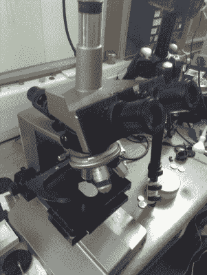

# 破解冶金显微镜

> 原文：<https://hackaday.com/2017/10/01/hacking-a-metallurgical-microscope/>

 【阿门】想要检查印刷电路板上的集成电路是否适合再利用，所以他[买了一台金相显微镜](http://trochilidae.blogspot.com/2017/09/new-microscope-ive-been-looking-at-lot.html)，它是从上面照而不是从下面照，因为它通常能看到不透明的东西。它的工作距离为 0.5 毫米和 10 毫米，没有太多的空间来焊接。

显微镜没有带载片托盘，所以【阿门】在易贝找了个便宜的。他需要一个连接器块，将一些食物托盘熔化成一个锭，然后将锭磨成块状，钻孔，用于将载玻片托盘连接到显微镜上。

这个东西配有一个手动 XY 工作台，操作员可以通过旋转旋钮来调节。对于大多数基本的应用程序来说，这很好，但是对于更复杂的项目来说，比如拼接一张巨大的骰子照片，这也是一件痛苦的事情。[阿门]目前正在基于 DVD 驱动器的步进组件开发一个由[驱动的 XY。](http://trochilidae.blogspot.com/2017/09/prototype-x-y-table-new-microscope-came.html)

如果你正在寻找更多的显微镜项目，请仔细阅读我们之前发布的[被黑的检查显微镜](https://hackaday.com/2017/06/26/hacking-an-inspection-microscope/)和[圆周率零点范围](https://hackaday.com/2017/04/26/get-up-close-to-your-soldering-with-a-pi-zero-microscope/)。