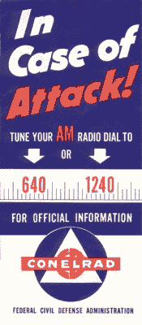
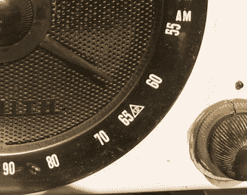
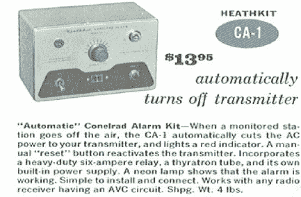

# Retrotechtacular:当你躲避时可以听的广播

> 原文：<https://hackaday.com/2017/10/12/retrotechtacular-radio-to-listen-to-when-you-duck-and-cover/>

CONELRAD 听起来像是一个虚构的机器人的名字，但它实际上是控制电子辐射的缩写。这是美国在冷战高峰时期(1951 年至 1963 年)建立的一个系统，有两个目的:一个是向民众传播民防信息，另一个是消除作为敌方飞行员导航信标的无线电信号。

 [https://www.youtube.com/embed/6X1v1reylmo?version=3&rel=1&showsearch=0&showinfo=1&iv_load_policy=1&fs=1&hl=en-US&autohide=2&wmode=transparent](https://www.youtube.com/embed/6X1v1reylmo?version=3&rel=1&showsearch=0&showinfo=1&iv_load_policy=1&fs=1&hl=en-US&autohide=2&wmode=transparent)

## 科内拉德是如何工作的

 它是这样工作的:在发生攻击的情况下，某些关键站点会得到通知。他们会用一个非常简单的序列来表示有警报。一旦警报响起，所有联邦通信委员会许可的电台都必须停止传输。这是个不错的主意。在第二次世界大战中，轰炸机使用无线电台寻找附近的目标。

然而，它确实让政府无法与人民沟通。通过广告，美国让人们知道，在紧急情况下，他们应该调到 640 千赫或 1240 千赫。某些商业广播电台将转到这些频率，轮流传送同样的信息。在另一个台接管之前，一个台会传送几分钟。这样，敌人的轰炸机就不会有太长的传输距离。

## 空袭期间调谐

可以接收到锥形信号的特殊接收器已经出现。此外，所有调幅收音机都必须在锥形频率上做标记(见下面收音机刻度盘上的三角形)。

检测警报很简单，但容易出错。关键站将停止发射 5 秒钟，回到空中 5 秒钟，然后再关闭 5 秒钟。然后，该站将返回空中，发送一个 1 千赫的音调，持续 15 秒。

    

虚惊一场并不罕见。此外，由于快速的开/关循环，一些发射器会失效。这导致该系统在 1963 年被紧急广播系统所取代。大多数监视器只是在两个锥形频率中的一个频率上寻找信号。其他人会寻找一个普通电台掉线的音调。

 [https://www.youtube.com/embed/0wrcwSebfoE?version=3&rel=1&showsearch=0&showinfo=1&iv_load_policy=1&fs=1&hl=en-US&autohide=2&wmode=transparent](https://www.youtube.com/embed/0wrcwSebfoE?version=3&rel=1&showsearch=0&showinfo=1&iv_load_policy=1&fs=1&hl=en-US&autohide=2&wmode=transparent)

## 如果呢？

幸运的是，CONELRAD 系统从未用于真实事件。与后来的系统不同，CONELRAD 不用于恶劣天气警报。如果它被激活，你不得不怀疑它的成功。仍然有电子管装置，当时的发射机可能都是基于电子管的。但是电磁脉冲效应肯定会消除确实存在的晶体管器件。除此之外，炸弹的空中爆炸无论如何都会对无线电通信造成严重破坏。