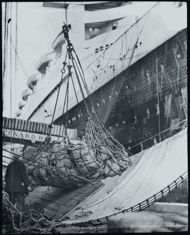
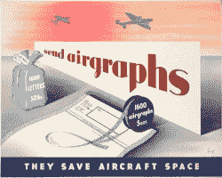

# 反科技:入侵战时邮件

> 原文：<https://hackaday.com/2017/10/06/retrotechtacular-hacking-wartime-mail/>

我猜你今天收到了不少邮件。但是你收到过 v-mail 吗？这听起来像是视频电子邮件的新术语，但实际上它可以追溯到第二次世界大战。如果你在欧洲，这个术语是 Airgraph——没有太多的描述性。

如果你研究战争，你会发现一件事。从长远来看，获胜的一方几乎总是能够保证他们的军队得到补给的一方。许多历史学家认为第二次世界大战不是靠武器赢得的，而是靠制造能力赢得的。这可能不完全正确，但补给对一支战斗部队来说是至关重要的。其他因素如战术、教义、训练和纯粹性也会发挥作用。

 另一方面，前线和大后方的士气也很重要。没有什么比家信更能鼓舞士气了。但是有一个问题。

虽然今天的战士可能有多种选择与家乡的人沟通，但在第二次世界大战中，沟通通常意味着书面信件。问题是从美国到欧洲的船只需要装满物资和士兵，而不是邮袋。欧洲战场上有近 200 万名美国士兵，处理来自家里的邮件是一个主要问题。

## 英国邮件黑客

英国人在 20 世纪 30 年代就已经解决了邮件问题。伊士曼柯达公司和帝国航空公司(后来成为英国航空公司)开发了 Airgraph 系统，以减轻邮件运载飞机的重量。Airgraph 允许人们在特殊的表格上填写士兵。表格被制成缩微胶卷，送到了现场。在接收端，缩微胶片被打印出来并作为普通邮件发送出去。

 当时的一张海报(见左图)声称，1600 封航空邮件需要 5 盎司，而真正的纸质邮件需要 50 磅。到 1941 年，第一批 70，000 架飞机被送往海外部队。最终，士兵们可以使用同样的服务将邮件寄回家中。

航空照片很便宜(3 便士)，但只有 2×3 英寸，所以它们多少是小明信片。所有这些都需要两端的设备，但到了 1944 年，飞机可以在整个欧洲战区和英联邦的其他地区使用。

 [https://www.youtube.com/embed/pNw1t3udpZc?version=3&rel=1&showsearch=0&showinfo=1&iv_load_policy=1&fs=1&hl=en-US&autohide=2&wmode=transparent](https://www.youtube.com/embed/pNw1t3udpZc?version=3&rel=1&showsearch=0&showinfo=1&iv_load_policy=1&fs=1&hl=en-US&autohide=2&wmode=transparent)

## 语音邮件

美国版的 Airgraph 是 V-Mail。一张 7×9 英寸的表格通过了审查，然后制成了缩微胶卷。目标打印机将以 60%或略高于 4×5 英寸的分辨率打印输出。国家邮政博物馆声称，15 万封单页信件需要 37 个超过 2500 磅的邮袋。同样数量的 V-Mail 可以装进一个 45 磅的袋子里。

Airgraph 和 V-Mail 还有一个优势。安全。隐形墨水、微粒和缩微印刷都无法通过将信息印在胶片上的过程。

 [https://www.youtube.com/embed/WR8cBKhgELc?version=3&rel=1&showsearch=0&showinfo=1&iv_load_policy=1&fs=1&hl=en-US&autohide=2&wmode=transparent](https://www.youtube.com/embed/WR8cBKhgELc?version=3&rel=1&showsearch=0&showinfo=1&iv_load_policy=1&fs=1&hl=en-US&autohide=2&wmode=transparent)

## 经验教训

如今有无数的通信方式，V-Mail 不会卷土重来。但这是一个很好的例子，说明了打破常规的思维可以取得怎样的成就。将邮件重量减少到 1.8%，体积减少到 2.7%，听起来像是不可能的目标，但柯达做到了。

我感兴趣的另一件事是高科技(因为，在当时这是高科技)可以多快地解决一个问题，然后几乎完全被遗忘。有多少本周出生的孩子会知道什么是 LED 手表或拨号调制解调器？菊花轮打印机或者软盘怎么样？你必须想知道还有什么技术几乎完全被遗忘了，这就是 Retrotechtacular 的用武之地。