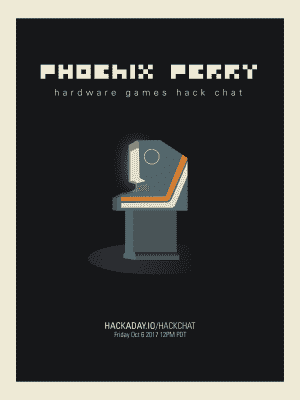

# 周五黑客聊天:硬件游戏

> 原文：<https://hackaday.com/2017/10/04/friday-hack-chat-hardware-games/>

在本周的黑客聊天中，我们谈论的都是硬件游戏。什么是硬件游戏？我们使用硬件、电子设备或代码进行用户交互的任何东西。这是一个很大很大的话题，有很多技巧和窍门可以让你获得既有价值又经得起任何人群考验的统一体验。

 我们本周 Hack Chat 的嘉宾是【菲尼克斯·佩里】，讲师，CS 博士研究员，游戏公司老板，艺术家，程序员，游戏设计师，活动家。对于计算机科学教学中的每一次人机交互，[Phoenix]都参与其中。她创办了[代码解放基金会](http://codeliberation.org/)，免费教女性编写游戏程序。她是伦敦大学金史密斯学院的物理计算讲师，她在黑客大会上发表演讲，她创造了[低聚合树](http://phoenixperry.com/)，

在这次聊天中，我们将讨论将硬件整合到游戏中，或者用硬件将游戏的想法变成现实。我们将讨论游戏设计，游戏的硬件设计(毕竟需要让它防白痴)，建设社区，以及教育他人。

像往常一样，我们接受观众的提问。如果你有一个必须回答的问题，[这里有一张讨论表](https://docs.google.com/spreadsheets/d/1VBut_GnouQhQY5v6Nft5kI51nTVNpzjT_Pj7JQVEjQE/edit#gid=0)。把它填好，我们可能会讨论你的问题

 我们的黑客聊天是在 [Hackaday.io 黑客聊天群发消息](https://hackaday.io/project/5373/token/7879571d-62c3-46a8-af36-2b6f265590f2?redirect=messages)上的现场社区活动。这次聊天将在太平洋时间 10 月 6 日星期五中午进行。想知道为什么英国人是第一个选择单一时区的人，而美国有更广泛的铁路网络和经度，所以时区是有意义的？这里有一个时区转换器！用它来思考宇宙的奥秘。

点击右边的语音气泡，你会被直接带到 Hackaday.io 上的黑客聊天群。

你不必等到星期五；随时加入，你可以看到社区在谈论什么。