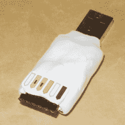

# 剑桥 Z88 的生命！(作为 USB 键盘)

> 原文：<https://hackaday.com/2017/10/05/the-cambridge-z88-lives-as-a-usb-keyboard/>

(克莱夫·辛克莱)接下来做了什么？在他的家用电脑系列，包括标志性的 ZX Spectrum，被卖给 Amstrad 之后。他不再从事家用电脑业务，为商业市场发布了一款便携式电脑。剑桥 Z88 的核心是 Z80，一个像样的键盘，一个纯文本的液晶显示器，依靠一组 AA 碱性电池运行了令人印象深刻的长时间。由于其罕见的 RS232 端口，它成为一个方便的便携式文字处理器或串行终端。也正是这个端口，[斯潘塞·欧文]在现代环境中使用了他的 Z88，[将它用作 USB 键盘](http://www.sowen.com/482/z88-as-a-usb-keyboard-using-a-minimus/)。

 它已经有几年的历史了，所以他使用 Minimus AVR 微控制器板来提供串行到 USB 的 HID 键盘接口，为了保持整洁，他使用 Sugru 为它做了一个穷人的外壳。这不是一个非常惊人的硬件黑客，但我们只是因为它对 Z88 的使用而将其作为特色。用作键盘的复古电脑是一个常见的主题，但 Z88 是一个特别折中的选择。

如果你不是英国人，你可能只知道[Sinclair]这个名字，因为英国人在互联网上对他们的 ZX 频谱计算机赞不绝口，但事实上他们背后的人是一个连续的电子企业家，他的职业生涯从 20 世纪 60 年代开始，除了他最著名的计算机之外，还涉及到便携式电视和自行车等多个领域。他的产品经常将技术发展到实用性的极限，但它们过去是，将来也会是值得关注的。如果(克莱夫·辛克莱)在某个领域工作，他的产品在发布时可能不会总是受到好评，但你可以保证，几年内你会从大公司那里买到同样的东西。Z88 是一款经典的 Sinclair 产品，比 1988 年推出的时间早了一点，将技术推进了一点点，但它提供了一款真正便携且功能强大的计算机，电池续航时间长达几十年，这比你在除少数其他利基制造商之外的所有制造商中找到相同的属性早了几十年。

没有足够的 USB HID 设备？莫尔斯键怎么样？如果[斯潘塞]有印象的话，他就是我们去年回顾的 RC 2014 逆向计算机[的创始人。](https://hackaday.com/2016/09/08/review-the-rc2014-z80-computer/)