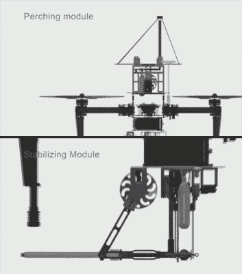

# spiderma 无人机拍摄网栖息和稳定

> 原文：<https://hackaday.com/2017/10/07/spidermav-drone-shoots-webs-to-perch-and-stabilize/>

向您介绍友好的邻居 SpiderMAV，这是一款[微型飞行器，它可以拍摄织带](https://spectrum.ieee.org/automaton/robotics/drones/spidermav-drone-shoots-webs-for-perching-and-stabilization)，使其能够悬挂在天花板上，并使用低功率保持水平稳定。它的灵感来自于[达尔文吠蛛](https://en.wikipedia.org/wiki/Darwin's_bark_spider)，这种吠蛛用长达 25 米(82 英尺)的锚线织出一张圆形的网。

为了让 DJI Matrice 100 无人机悬挂在天花板上，一个压缩气体气缸发射一个磁铁，尾部的聚苯乙烯线一直延伸到钢梁上。然后可以将线绕成所需的长度。对于水平稳定，线尾磁铁改为水平发射，然后卷起来拉紧线。

为了测试系统的有效性，使用风扇产生了侧风。在 DJI 姿态保持模式下，最大 X、Y 和 Z 偏差分别为 136、386 和 106 毫米。然而，随着稳定化，偏差减少到 47、80 和 74 mm。功率需求也减少到基本为零。请观看下面的视频。

SpiderMAV 是由[米尔科·科瓦奇]领导的伦敦帝国理工学院[空中机器人实验室](http://www.imperial.ac.uk/aerial-robotics)的成果，目前仍处于实验阶段。例如，磁体释放机构还没有被内置。或许卷轴装置的一次猛拽，或者无人机的一次突然推力会释放磁铁。或者永磁体可以用电磁体代替，只要所需的电流不会抵消效率的提高。你能想出什么解决办法？请在评论中告诉我们。

 [https://www.youtube.com/embed/SOWjXW57SB8?version=3&rel=1&showsearch=0&showinfo=1&iv_load_policy=1&fs=1&hl=en-US&autohide=2&wmode=transparent](https://www.youtube.com/embed/SOWjXW57SB8?version=3&rel=1&showsearch=0&showinfo=1&iv_load_policy=1&fs=1&hl=en-US&autohide=2&wmode=transparent)

 [https://www.youtube.com/embed/SAZYhjUhhxg?version=3&rel=1&showsearch=0&showinfo=1&iv_load_policy=1&fs=1&hl=en-US&autohide=2&wmode=transparent](https://www.youtube.com/embed/SAZYhjUhhxg?version=3&rel=1&showsearch=0&showinfo=1&iv_load_policy=1&fs=1&hl=en-US&autohide=2&wmode=transparent)

另一方面，如果你想把自己变成蜘蛛侠，那就试试这个使用微波炉变压器的[四肢爬壁装置](https://hackaday.com/2016/10/14/microwave-ovens-turn-you-into-spiderman/)，然后是同样必要的[电磁射网器](https://hackaday.com/2014/04/22/electromagnetic-spiderman-webshooter-railgun-grappling-hook/)。