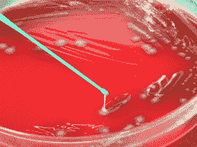
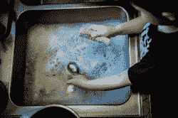

# 3D 打印和食物

> 原文：<https://hackaday.com/2017/10/17/3d-prints-and-food/>

我们最近发表了一篇关于一只可爱的 3D 打印小象的帖子，这只小象可以分发酒。该设计实际上没有塑料接触液体——有一个硅胶管携带镜头。然而，它确实在秘密黑客日掩体引发了一场关于使用 3D 打印物体制作食物有多安全的讨论。特别是，当我说 3D 打印时，我指的是熔融沉积建模。是的，还有其他技术，但我们大多数人都是用热喷嘴分层打印细丝。

有一个普遍的想法，ABS 是不好的，但 PET 和 PLA 是没有问题的，因为有这些塑料的食品安全版本。然而，塑料只是整个食品安全的一小部分。让我澄清一下:我不是医学专业人士，虽然我的计算机在过去几年里运行过一些塑料厂，但我也不是真正的高分子化学专家。然而，我不使用 3D 打印材料来保存或处理食物，虽然如果你这样做，你可能不会死掉，但你可能需要重新考虑。

的确，有些塑料不符合食品安全标准。美国美国食品药品监督管理局(FDA)谈论“食品接触物质”，并有许多关于这个主题的技术阅读资料，包括这个[最可读的介绍](https://www.fda.gov/Food/IngredientsPackagingLabeling/PackagingFCS/RegulatoryStatusFoodContactMaterial/default.htm)。甚至还有一个[数据库](https://www.accessdata.fda.gov/scripts/fdcc/?set=FCN)，里面有很多食品安全的材料(不仅仅是塑料)。

然而，即使一些塑料可以是食品安全的，这并不意味着你在易贝买的 11 美元的线轴实际上是食品安全的。你通常不知道是谁制造的，有多不纯，或者添加了什么来着色或修饰其他特性。然而，让我们假设你从一个可信的供应商那里找到了食品级的细丝。这是唯一的问题吗？事实证明，这甚至不是最大的问题。

## 细菌

 矛盾的是，最大的问题是微观的。如果你经常烹饪或储存食物，你可能知道你吃的所有东西都充满了细菌和其他小动物。如果你不相信，今晚留下一些剩菜。如果你用食品安全塑料注射成型来制作杯子，只要你在每次使用后清洗一下，就不会有问题。然而，3D 打印的物体将会有很少的裂缝和空间，尤其是在各层接触的地方。这些是细菌隐藏和繁殖的绝佳场所。有些食物也比其他食物差。例如，生鸡蛋和生肉因滋生危险的细菌而臭名昭著。

这里有两派思想。如果你在做一次性的东西，这可能没什么大不了的。任何被截留的细菌都会进入垃圾中。人们会做的另一件事是使用食品安全密封剂，如聚氨酯或硅树脂来覆盖食品接触表面。当然，现在你需要确定密封剂真的是食品级的。在大象的例子中，与其说它是密封剂，不如说它只是将一根管子穿过塑料。

已经有制造抗菌塑料的工作。下面的视频展示了一种这样的塑料，它甚至可以用洗碗机清洗。

 [https://www.youtube.com/embed/9A-XwD9qWZE?version=3&rel=1&showsearch=0&showinfo=1&iv_load_policy=1&fs=1&hl=en-US&autohide=2&wmode=transparent](https://www.youtube.com/embed/9A-XwD9qWZE?version=3&rel=1&showsearch=0&showinfo=1&iv_load_policy=1&fs=1&hl=en-US&autohide=2&wmode=transparent)

## 说到清洁

想想这并不有趣，但洗碗机里的盘子变干净的一个原因不是来自肘部的油脂，而是来自热水。一些最好的食品塑料——例如 PLA——在洗碗机的热水中可能会变形。因此，即使你不担心隐藏的错误，你仍然可能无法得到真正干净的塑料。我们没有试过，但我们听说最好的做法是使用温水和抗菌肥皂。

 当然，如果你打印一个解放军汤碗，然后装上热汤，也会发生同样的事情。那将是一个非常糟糕的主意。这并不是说你找不到耐温性更好的塑料，但请记住，像 ABS 这样的东西充满了令人讨厌的化学物质，通常被大多数人视为对食品不安全。

然而奇怪的是，FDA 实际上列出了 ABS 是食品安全的条件。不过，就像 PLA 一样，不能保证你廉价的 ABS 满足这些要求。还要注意，他们不允许腹肌接触酒精。

## 污染

好吧，你已经找到了你的食品级细丝，你已经完善了你的过程，所以你将得到一个可清洁的表面，但你仍然不清楚。你的细丝将通过一个挤压机和一个热端。这些部分会留下令人不愉快的残留物吗？例如，黄铜喷嘴通常含有铅。你的齿轮或螺栓咬入灯丝移动它可能也有一些不好的事情。

有人认为全金属热端比传统的 PEEK/PTFE 热端更安全。然而，很多便宜的“金属”热端有一些塑料内部组件。再说一遍，你必须考虑塑料能接触到的所有东西。如果所有这些表面都是可清洁的，这可能是个好主意。

也要记住，你的喷嘴可能有你以前打印过的塑料残留物。所以这意味着你应该有一台专门用于食品安全打印的机器。至少打印机接触灯丝的部分。

研究表明，3D 打印会产生超细颗粒。对于呼吸和摄入这些纳米粒子的健康风险，目前还没有明确的共识。你可以从激光打印机上得到同样的东西，但是——老实说——你可能不会从激光打印机的表面吃任何东西。

如果你打印食物，你会面临同样问题的一个变种。例如，挤压巧克力或糖衣的打印机不应该让食物在打印的过程中接触坏的东西。在这种情况下，清理食物路径非常关键。有认证的食品打印机，如下面视频中的厨师喷气机。

 [https://www.youtube.com/embed/WFH7lqLP-AQ?version=3&rel=1&showsearch=0&showinfo=1&iv_load_policy=1&fs=1&hl=en-US&autohide=2&wmode=transparent](https://www.youtube.com/embed/WFH7lqLP-AQ?version=3&rel=1&showsearch=0&showinfo=1&iv_load_policy=1&fs=1&hl=en-US&autohide=2&wmode=transparent)

## 食品安全丝可用吗？

如果你不担心所有其他问题，你可能会寻找食品安全的细丝。有一些在那里，包括一些 PET 细丝。然而，你可以肯定，如果灯丝真的是食品级的，供应商会这么说。例如，KeyTech(可能还有其他公司)有一款安全的 PLA。你仍然需要获得材料安全数据表(MSDS)并确保。但是，如果供应商没有说任何关于食品安全的话，这是一个很好的赌注，灯丝不被认为是食品安全的。

解放军呢？很多人都认为这是安全的。毕竟是玉米做的。如果你有不含色素或其他添加剂的 PLA，并且是以最大限度减少不安全污染物的方式制造的，也许它是可以接受的。1995 年有一项研究测试了 PLA，用的东西应该能滤出化学物质，如酒精——我们不知道他们是否用了大象——和其他在可食用材料中发现的溶剂。他们确实发现少量的乳酸会渗入到食物中，但这并不是一个严重的问题。

## 吃还是不吃？

铅焊料也很危险，但我用得够多了。然而，我没有动力去打印食品安全塑料。我认为允许其他人使用我的 3D 打印碗和杯子会更糟糕，因为他们可能不了解风险。我们听到人们说塑料刀或饼干切割器接触食物的时间不够长，不会有危险。我不相信，但我不是专家。如果你一定要切饼干的话，你可以试着在食物和切饼干的刀具之间放一层塑料薄膜。

我认识一些人，他们沿袭传统，从一台新的 3D 打印机打印出来的酒杯里喝一杯酒。尽管科学告诉我们不应该在腹肌中添加酒精，但我还没有听说有人因为这种做法而死亡。然而，身体是一个复杂的系统，长期和累积的影响可能正在发生，我不知道。

我警告过你我不是医生或化学家。我也不是律师，但我真的认为销售 3D 打印食品载体是一项危险的事业。当然，你可以清楚地标记它，或者美国法律有关于永久标记“非食用”的项目，所以这可能是一个漏洞。

最后，只有你能决定如何进行。但至少要确保你对塑料和你的打印设备做了足够的研究，以将你的风险降到最低。你吃过 3D 打印的食物吗？你会吗？还是会继续这样做？请在评论中分享你的观点。

哦，还有一件事。我们当然不是在吃培根细丝。

 [https://www.youtube.com/embed/78K4G1yW9OI?version=3&rel=1&showsearch=0&showinfo=1&iv_load_policy=1&fs=1&hl=en-US&autohide=2&start=506&wmode=transparent](https://www.youtube.com/embed/78K4G1yW9OI?version=3&rel=1&showsearch=0&showinfo=1&iv_load_policy=1&fs=1&hl=en-US&autohide=2&start=506&wmode=transparent)

