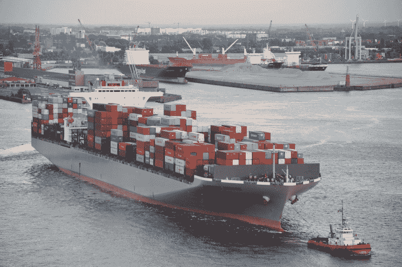
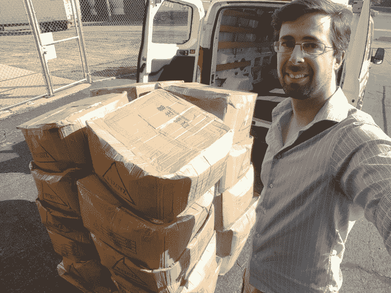

# 来自中国的海运挑战——一个拼命挣扎的管工的生活

> 原文：<https://hackaday.com/2018/08/30/the-challenges-of-shipping-from-china-life-of-a-flailing-tube-man/>

去年夏天，我开发了一种完全不同于我正常工作范围的产品；一套服装。我的万圣节服装如此受欢迎，以至于我决定试着将它商业化，这让我走上了一条我从未涉足的制造之路；从中国用船运输。简而言之，这是一个极其困难的烂摊子。

这套服装叫做[古怪舞者](https://wackydancers.com)，你可以访问网站或者在亚马逊上找到它。太棒了，我们做得很好。这就是音高。文章的其余部分是关于运输的，因为如果你打算自己尝试，你需要得到警告。

## 决定使用集装箱货运

当从中国采购零部件时，你首先会对价格感到高兴。然后你会点击订购按钮，发现空运通常和商品本身一样贵，甚至更贵。空运很贵，但是很快，也许更重要的是很容易。付款处理完成后，典型的订单大约需要一周才能到达。

顺便说一句，支付很有挑战性，因为你要从美国银行转账到中国银行。这可能需要几天时间，每笔交易大约花费 20 美元，而且他们通常不接受信用卡。使用 PayPal 避免了这种混乱，但并不是所有的工厂都支持它。

不过，有一个组件禁止空运。这套服装的可折叠框架有许多金属线，体积庞大，重达 550 公斤(1200 磅自由单位)，1000 件衣服占用 1.6 立方米的空间，包括盒子和托盘。空运的体积和重量太大了，所以我空运了 100 个，这样我可以早点开始销售，剩下的用船运。因为我没有自己的运输公司，所以我让中国的工厂使用他们熟悉的公司。这就是所谓的货运代理，他们的存在是为了帮助人们把东西从一个地方运到另一个地方。我收到了一份名为提单的文件，这是一个 PDF 文件，上面写着“你的东西放在 Y 船上的 X 集装箱里，正由 z 船公司处理，”然后我一个月都没有听到任何消息。

Somewhere on the 8212 TEU was my pallet of frames.

航运业有很多术语，你很快就会被 TLAs(三个字母的缩写)淹没。就我而言，我使用的是 LCL 航运，这是小于集装箱装载的缩写。这不是一个足以装满 20 英尺或 40 英尺标准集装箱的大货，所以航运公司会将一批 LCL 订单组合在一起装满一个集装箱，然后在到达目的港时处理物流拆分。我的目的港是芝加哥。

穿越太平洋的集装箱船不会停靠在芝加哥，把芝加哥当成一个港口很奇怪，但从物流的角度来看，这是有道理的。每个州都有对外贸易区，它们代表了必须缴纳关税的界限。我的集装箱船，容量超过 8000 TEU，是[海港大桥](http://www.marinetraffic.com/en/ais/home/shipid:462669/zoom:14)。一个标准箱相当于 20 英尺。当你看到一辆半挂车后面拖着一个集装箱时，很可能它有 40 英尺长，也就是 2 个标准箱。海港大桥就像 4000 辆半挂卡车同时驶过太平洋。她从中国的一个港口到韩国的一个港口，然后横跨太平洋大约 3 周，到达加州长滩。在那之后，我的货物被“联运”，这是“我们不会告诉你它是在火车上，半拖车上，还是在夏尔巴人的背上”的花哨说法。与此同时，我知道它最终会到达芝加哥的一个特定仓库。

## 海关和发票

当船抵达长滩时，我收到了通知和发票。在此之前，我不知道从中国运送货物到我家要花多少钱。有一些随机的费用，比如托盘费(我买了一个托盘！)，但有趣的是运费。从中国到芝加哥(7000 英里)是 41 美元。从芝加哥到麦迪逊的送货，WI(只有 150 英里)是 396 美元。

| 描述 | 数量 |
| --- | --- |
| 送货上门 | $396 |
| 海运进口 | $41 |
| 托盘费 | $40 |
| Stg 设施窗口费 | $35 |

世界目前正处于航运过剩的状态。建造了如此多的巨型集装箱船，以至于运力远远超过需求，航运价格也大幅下跌。对我来说不幸的是，职责没有，最近[它们变得更糟](https://hackaday.com/2018/07/02/electronics-manufacturers-react-to-china-trade-tariffs/)。

通知说我需要把我的海关文件整理好。我欠的税需要征收。船运公司告诉我雇一个报关行来做这件事。我联系了其中一家，给了他们我所有的文件，并搜索了确定我的特定商品税率的适当关税代码，他们给了我一张大额发票，其中包括许多关税和一些高额费用，以感谢他们用我从其他文件中获得的信息填写文件并将其提交给政府。第二张发票包括这个，大部分我不明白:

| 描述 | 数量 |
| --- | --- |
| 报关费 | $115 |
| RLF | $25 |
| PSDO | $45 |
| 电影胶片（motion-picture film） | $25 |
| 责任 | $74 |
| 单一项目债券 | $60 |
| 前哨入场费 | $125 |

## 最后一英里

货物在一个仓库里，我显然为它被送到我这里支付了 396 美元。我现在需要向他们提交一份送货订单，以及我通过海关检查的证明。为了能够交付，他们需要知道什么时候，如果你有一个装卸码头，如果你有一辆叉车，或者如果你需要一个叫做举升门的东西，这是一个连接到半挂车后面的迷你电梯。基本上，他们需要知道当他们到达时，你有能力从他们的卡车上卸下货物。

当货物到达仓库时，在他们开始每天向你收费之前，你通常有 5 天的免费存储时间。事实证明，在这一点上，惊人数量的运费被放弃了，因为收货人(接收运费的人)无法及时提货，无法支付，破产，或市场变化，他们无法从中赚钱。在与运输公司的沟通破裂后(他们花了我 5 天时间中的 4 天给我回复一些文书工作，他们无法安排第二天的交货)，我自己租了一辆 U-Haul，开车到仓库，自己拿起一托盘的框架。这绝对是了解卡车运输行业的一个窗口，在与适当的流程进行了一些斗争后，我设法将我的货物装上我租来的车，开回家，后来收回了 396 美元中的一部分。

20 boxes containing 900 frames, on a pallet about to go into a moving van

## 价格细目

总共有 1000 帧。100 件空运，900 件海运。空运 100 件货物的费用是货物价值的 3 倍。它花费了大约 3/4 的货物价值和一个下午的驾驶和提升 900。

## 请有人做得更好

最后我拿到了我的运费。不知怎么的就解决了。不过，这让我对航运业大开眼界。大多数交易都是通过简单的 PDF 表格来完成的，这些表格被来回扫描、传真和发电子邮件，每个人都想交换相同的数据，但是是在他们特殊的 PDF 上。如果你不知道他们的缩写或他们的流程，但愿不会如此，他们会让你为任何信息不对称付出昂贵的代价。由于这么多公司都参与了货物的运输，很难说谁负责这个过程的不同部分，所以很大程度上是由收货人来确保一切顺利进行。

## 你应该出货吗？

我可能会再做一次，但是下一次我会知道更多，并且能够做得更好。作为一般准则，

#### 在以下情况下使用空气:

*   你急着拿你的材料。在船上的时间是你的钱被占用的时间，而不是生产或销售的时间。
*   你的货物或轻或小或便宜。

#### 在以下情况下使用发货:

*   你有许多货物。每批货都有一些固定价格的费用，所以一单大单总比一堆小单好。
*   你有时间等。你可以空运一些，其余的用船运来弥补时间上的差距。
*   你利润微薄，需要尽可能节省每一块钱。
*   你是一个不怕惩罚和文书工作的人。

我们以前报道过从中国空运货物的挑战，以及一个很好的 T2 数据记录器来获得更多关于你的货物的信息。有没有什么方法可以不费力地把东西从那里运到这里？请在评论中告诉我们！