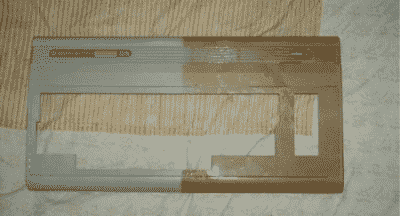

# 发黄:相当于晒伤的塑料

> 原文：<https://hackaday.com/2017/11/03/yellowing-the-plastic-equivalent-of-a-sunburn/>

你的消费电子产品的花哨的白色电子砖开始是白色的，但一段时间后它变黄了，变脆了。这是不应该发生的；塑料应该可以永久使用。原来塑料围挡和皮肤一样容易受到同样的东西的伤害，效果也差不多。当它们被太阳盯着看时，伤害就已经造成了，尽管你可能在相当长的一段时间内看不到它。

## 光降解

光降解是大自然告诉你应该多在室内玩电子游戏，而不是在户外。这个过程很复杂，充满了有趣的化学反应，但要点是太阳发出大量的紫外线辐射，导致塑料聚合物链的断裂和自由基的形成。自由基是具有高度活性的不成对电子的原子或分子。

即使塑料在地下室的盒子里存放了很长时间，装箱前暴露在阳光下也会产生破坏性影响，导致材料在盒子里变黄。你可以看到这个键盘上的白色键已经变成了病态的黄色，因为它在十年前就被停用了。

褪色也是紫外线辐射破坏染料中化学键的结果。这种染料之所以有效，是因为它的化学结构只反射特定波长的光，所以当这种结构被破坏时，它不再以同样的方式反射光。

光降解是一个术语，指的是原因，而不是结果。光正在造成损害，而且不仅仅是对颜色。通过分解塑料聚合物链，它使塑料变得更脆。这会影响 PVC 管和许多种类的绳子，在选择户外使用的材料时，应该考虑对紫外线辐射的敏感性，尤其是当绳子支撑着一个人时。

就像其他化学反应一样，热和压力会加速降解，所以即使是制造塑料的过程也会引发一些稍后会发生的损害。

## 紫外线稳定剂；工业防晒霜

塑料制造商试图通过添加添加剂来消除这种影响。这些紫外线稳定剂延缓了紫外线的有害影响。前三种紫外线稳定剂是紫外线吸收剂、猝灭剂和 HALS，它们都适用于光降解过程的不同阶段。紫外线吸收剂将子弹视为塑料，而不是将其分解，而是将其转化为热量或红外辐射，并通过聚合物基质消散。有许多紫外线吸收剂，取决于塑料的材料和颜色(炭黑是一种受欢迎的，但对白色或透明塑料不起作用)。淬灭剂在某种意义上更像是医生，它们在分子被紫外线照射分解之前拯救这些分子。HALS 或受阻胺光稳定剂是警察；它们捕捉自由基，所以不会造成任何伤害。

在塑料中使用这三种稳定剂是很常见的，但它们只会延缓光降解。最终，足够的暴露将淹没吸收剂、猝灭剂和 HALS，塑料将失去颜色并变脆。

## 阻燃剂

这是塑料的另一类添加剂，也是它们会随着时间变黄的另一个原因。一种常见的阻燃添加剂是溴，它可以很好地防止塑料燃烧，但对紫外线的抵抗力不是很强。溴分解并变成自由基，然后与氧结合。随着时间的推移，溴向表面迁移，变黄变得更加严重。

顺便说一句，你不应该激光切割阻燃塑料，因为其中的溴是一种卤素，对人和机器都有害。

## 修复它

坏消息是褪色和脆化是永久性的，无法修复。好消息是降解是由外而内发生的，所以发黄可能只是表面的。对于变黄，有一种被称为 retr0brite 的技术已被证明是成功的，它主要涉及使用更多的紫外光来打破溴氧键。然后过氧化氢被用于进入那里，用氢填充断裂的键，使溴更加稳定，并逆转变黄。不幸的是， [retr0brite 页面](http://retr0bright.wikispaces.com/)似乎被禁用，但仍可通过 archive.org 的[访问以了解更多详情。](http://web.archive.org/web/20121031124321/http://retr0bright.wikispaces.com:80/home)

## 防止它

只使用不含阻燃添加剂的塑料，远离所有窗户，并保护你的塑料免受任何紫外线辐射。或者只是做自己的事情，接受随着时间的推移，紫外线辐射会摧毁一切，包括我们所爱的人，无论他们是人还是塑料。