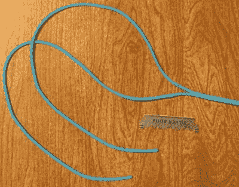

# 存储艺术的空间技术和录音带

> 原文：<https://hackaday.com/2017/10/14/space-technology-and-audio-tape-to-store-art/>

布莱恩·墨菲(Blaine Murphy)已经着手在盒式磁带上储存视觉艺术档案。为了做到这一点，他通过慢扫描电视([【SSTV】](https://en.wikipedia.org/wiki/Slow-scan_television))对图像进行编码，这是一种来自 50 年代后期的模拟技术，可以对图像进行编码以供无线电传输。如果你正在考虑“太空竞赛”,那你就对了，月球背面的第一批图像通过 SSTV 传到我们这里，并由苏联的月球 3 号宇宙飞船传送。

Yes, this happened

用 5os 技术编码图像只是这个正在进行的项目的一部分。存储和回放由 90 年代的磁带卡座处理，显示单元是当代的 Android 手机。将几代产品结合在一起会带来一系列挑战，比如在电话和录音机之间获得一个有效的音频连接或者修理旧的消费电子产品。[他关于这个话题的项目日志](https://hackaday.io/project/26877-tape-artchive/log/68348-belts-off)是“本周失败”帖子的有力竞争者。例如，[为卡式录音机制作自己的皮带](https://hackaday.io/project/26877-tape-artchive/log/68407-test-unrest)很吸引人，但却是一条死胡同。

该项目的技术广度使其每一次转折都更加有趣。这个周末留出一些时间来进行有趣的阅读。

就在几年前，业余无线电爱好者有机会解码 SSTV 在纪念尤里·加加林生日时从国际空间站传下来的信号。现在，如果这个项目的机械部分引起了你的兴趣，你也会想回顾一下这个使用多个卡带播放器的 [MIDI 采样器。](https://hackaday.com/2015/08/27/midi-sampling-off-magnetic-tapes/)