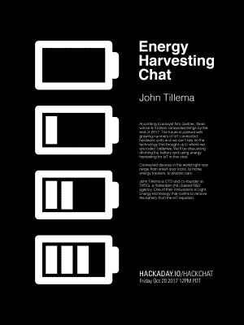

# 周五黑客聊天:能量收集

> 原文：<https://hackaday.com/2017/10/18/friday-hack-chat-energy-harvesting/>

想象一个联网设备，它永远不需要充电，永远不需要插在电源插座上，永远不会没电。仅用一个小太阳能电池，物联网模块就可以运行几十年。这是能量收集的承诺，它打开了许多有趣问题的大门。

 加入我们的[本周的黑客聊天](https://hackaday.io/event/27762-energy-harvesting-chat)将是 [TWTG](https://twtg.io/work/tryst-energy/) 的首席技术官兼联合创始人【约翰·蒂莱马】。他们正致力于将电池从物联网等式中完全移除。他们有一个很小的设备，只有 200 勒克斯的亮度——相当于桌面上的亮度。这是一种可以连接到互联网的设备，无需电池、壁疣或射频采集的黑魔法。你如何设计一个能运行一个世纪的设备？瓶盖也是这样分级的吗？你真的打算几十年后再下载固件更新吗？

在本周的 Hack Chat 中，我们将讨论能量收集实际上是什么，TWTG 的“光能”技术是什么，以及这项技术的能力。接下来，我们将讨论如何设计低功耗电路，如何选择使用寿命长达数十年的器件，以及如何测量和测试整个系统，使其能够实现永不停机、无需新电池的承诺。

这是一个社区黑客聊天，所以我们当然会接受来自社区的问题。如果您有问题，[将其添加到讨论页](https://docs.google.com/spreadsheets/d/12pdRwse7w_fa37hgPZezdCcVQ2WvNw--9SwoBAAFy-M/edit#gid=0)

 我们的黑客聊天是在 [Hackaday.io 黑客聊天群发消息](https://hackaday.io/project/5373/token/7879571d-62c3-46a8-af36-2b6f265590f2?redirect=messages)上的现场社区活动。这次聊天将在太平洋时间 10 月 20 日星期五中午进行。某个地方总是五点吗？是的，所以[这里有一个时区转换器！](https://www.timeanddate.com/countdown/generic?iso=20171020T12&p0=137&msg=Energy+Harvesting+Hack+Chat&font=cursive)

点击右边的语音气泡，你会被直接带到 Hackaday.io 上的黑客聊天群。

你不必等到星期五；随时加入，你可以看到社区在谈论什么。