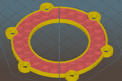

# DIY 气压计:为了你的健康！

> 原文：<https://hackaday.com/2017/10/27/diy-barometer-its-for-your-health/>

aciuc Marius 和他的同事注意到，低气压的日子加上他们体内的咖啡因意味着血压升高。考虑到这可能会影响他的心血管健康，他决定用罐子制作一个[相对压力气压计，以帮助他决定是否真的应该再喝一杯咖啡。](https://hackaday.io/project/27500-3d-printed-cute-barometer)

除了 3D 打印机，你还需要组装一个带盖子的小罐子，一些  螺丝，锁紧垫圈，螺母和一个柔性薄膜——一片橡胶手套或气球就可以了。[Marius]在他的项目页面上详细描述了构建过程，建议其他人[以 0.2 的分辨率打印部件](https://hackaday.io/project/27500/files)——甚至可能将挤压系数提高到 1.1——以防止打印中的间隙危及气压计正常工作所需的气密密封。

此外，厚胶或环氧树脂被推荐用于组装过程的其余部分——它不需要很漂亮，但它需要密封！只需拿着罐子就可以轻松测试最终产品。

虽然这个晴雨表有助于一个人做出健康的选择，但并非所有人都生来平等。这个直截了当地告诉你应该如何考虑开始工作，而其他人则被骗表现得像[触摸传感器](https://hackaday.com/2012/08/30/building-touch-sensors-from-digital-barometer-chips/)。