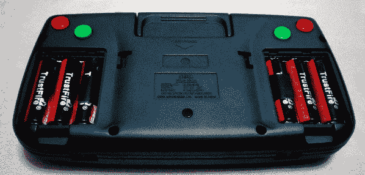

# SegaPi Zero 对游戏装备有所尊重

> 原文：<https://hackaday.com/2017/10/21/segapi-zero-shows-game-gear-some-respect/>

如果你是 1991 年的游戏玩家，你会面临一个看起来很容易的选择:你可以买一台任天堂游戏机，灰色的砖块，略带令人作呕的绿色屏幕，已经有几年的历史了，或者你可以给自己买一台漂亮的新世嘉游戏设备。凭借全彩色显示屏和直接从世嘉家用游戏机移植而来的游戏，这款游戏设备似乎是便携式游戏的真正未来。当然，事情并不是这样的。事实上，糟糕的电池寿命等技术问题阻碍了游戏设备的发展，相反，任天堂和他们的合作伙伴能够从 Game Boy 中挤出如此多的娱乐内容，以至于他们甚至在游戏发布近十年后才懒得为它创造一个真正的继任者。

虽然与 20 世纪 90 年代的 Game Boy 相比，Game Gear 是一个商业上的失败，并且从未得到官方的继任者，但想想可能会发生什么是很有趣的。游戏装备的一个假想后续是由[Halakor] 创造的 [SegaPi 杰欧的灵感。它配备了可充电电池、更多的面板按钮，以及可以连接到电视的“控制台”模式，可以发挥原始游戏设备的优势，改善其弱点。](https://imgur.com/r/raspberry_pi/tHxub)

顾名思义，SegaPi Zero 由 Raspberry Pi Zero 驱动，Arduino Pro Micro 通过安装在所有面部按钮后面的触觉开关来处理用户输入。一个 TP4056 充电模块和升压转换器也藏在那里，它们负责六个 3.7 锂离子 14500 电池，这些电池位于原始电池舱中。SegaPi Zero 的总容量约为 4,500 mAh，应该能够在 3-4 小时的电池寿命基础上有所改善，这一寿命曾帮助毁灭了最初的版本。

将树莓派塞进经典游戏系统的项目不在少数，但更多的时候，[它们更倾向于任天堂机器。这可能仅仅是出于对任天堂过去辉煌的怀念，但就个人而言，我们很高兴看到](https://hackaday.com/2016/11/12/pi-zero-transforms-to-game-boy/)[又一次进入](https://hackaday.com/2015/04/18/retropie-meets-game-gear-again/)[Sega 黑客相对较短的名单](https://hackaday.com/2017/06/02/game-gear-console-edition/)。