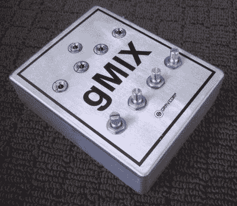
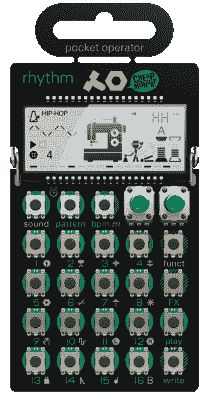
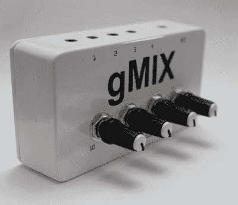

# 被动混合器的产品开发冒险

> 原文：<https://hackaday.com/2017/10/25/a-passive-mixer-from-concept-to-shelf/>

那是 2014 年，KORG 的 volca 系列小型合成器是音乐界的最新潮流。廉价的合成器和鼓机突然成为现实，所有这些都在一个适合背包的外形中。现在几乎任何人都可以成为电子音乐的轰动！

我和我的[唱片公司](http://www.ryoshi-transit.jp/)的朋友们参加了一次聚会，按照当时的风格，我们都带着我们最新最棒的装备出现了。有 microKORG，MiniNova 和几把吉他，但所有的注意力都在 volcas 上，拿起来玩是如此有趣。

只有一个问题。像任何改变游戏规则的低成本硬件一样，牺牲也是有的。volcas 使用 3.5 毫米插孔用于音频和同步脉冲，最初的阵容配备了低音线、铅和鼓合成器。通过在盒子之间用菊花链连接电缆，同步很容易，但如果你想录音或混音，你通常需要堆叠适配器，以获得其他音乐硬件使用的更典型的 6.5 毫米 TS 格式的信号。

闲混过后，我研究了一下其他人在做什么。大多数人和我们一样痛苦，试图将这些小机器连接成全尺寸的混合桌。这似乎有点过头了——当你只是想胡闹的时候，拖出一个 24 通道的有源混频器有点过了。我想找到一种方法，将 3 台这样的机器连接到一套耳机上，然后尽情享受音乐。

为了解决这个问题，我们需要一个混合器来匹配沃卡哲学；简单、易用、紧凑。它不需要镀金，也不需要有惊人的声音专长，它只需要几个 3.5 毫米的音频源，然后混合成一副耳机。

我听说过有人使用[耳机分离器，结果是混合的](https://www.reddit.com/r/volcas/comments/4wccx0/settling_the_belkin_rockstar_question/)，这让我想到了被动混合。突然间，一切都变得如此清晰——我或许可以带着一堆电位计和一些无源器件离开，然后就此收工！由于一个朋友急于找到解决方案，我决定模拟一个原型，并把它带到工作室进行测试。

### 第一个 gMIX

The prototype gMIX, in a Hammond 1590BB case.

很快，它就成功了。我通过四个电位计将四个输入连接到耳机的一个输出。连接上任何东西，从微型合成器到 iPod，你就可以随心所欲地混合和演奏。当时我正在经营一家名为 Grav Corp 的电子公司，所以我把这个设备命名为“gMIX”。有创意，我知道。

在这一点上，我意识到，随着 volca 系列的成功，可能不仅仅是我的朋友可以从这个设备中受益。由于硬件只比罐子和连接器多一点点，我想我可能可以相当便宜地制造这些东西，并有一个巨大的市场可以挖掘。

下一步是研究，我认为这是设计过程的主要基石。原型是手工接线的，装在一个大箱子里。这对于预期的用途来说是大材小用，而且花了很长时间。我需要优化设备的尺寸和制造成本。我在电脑屏幕前花了很多时间考虑每一种价格合理的立体声电位计和立体声连接器。我也知道我不想坐着自己焊接这些东西，所以我也研究了制造它们的方法。

### 从其他产品中发现好的想法

Teenage Engineering’s Pocket Operators influenced the gMIX design, through their use of a bare PCB in the absence of any enclosure.

此时已是 2015 年 1 月，少女工程推出了袖珍操作器系列紧凑型合成器。这是一个完美的时机——微型合成器正在起飞，它们的所有用户都是 gMIX 的潜在客户。更重要的是，我找到了灵感。

袖珍运营商线的合成器是没有一个外壳。元件直接焊接在 PCB 上，甚至包括一个挂钩，可以把合成器挂在销售架上。这是一个天才之举，给了青少年工程一个独特的审美，并以一个坦率地说荒谬的 59 美元的价格将合成器推向市场。也给我指明了前进的方向。

看着他们的成功，我意识到我可以把 gMIX 做成裸 PCB，省下昂贵外壳的成本。考虑到这一点，我开始寻找一家能够以可承受的成本生产小型产品的公司。一旦我找到一个，我就开始使用他们的首选供应商列表来指导我寻找零部件。

我选择表面贴装电阻和音频插孔，因为它比支付通孔组装的劳动力便宜得多。然后，我选择了 Phillips 电位计，因为它们看起来质量不错，而且可以压入电路板，然后焊接。这意味着电位计将自动对准 PCB 上的孔，从而避免了依赖装配技术人员将电位计完全定位在直线上。

### 引起他们的注意

我已经准备好开始生产了。因为它很流行，也因为它减少了对重大资本投资的需求，我决定采取众筹的方式，开始了 Kickstarter 活动。在通过我的朋友和商业伙伴在网上推广后，我突然想到了一个主意。这个产品不仅对 volca 用户有用。我最近开始融入澳大利亚的 chiptune 场景，他们是任天堂 Game Boy 作曲和现场表演的忠实用户。像 volca 一样，这依赖于 3.5 毫米立体声输出插孔，在舞台环境中使用可能会很头疼。

Once launched, the gMIX also came in a cased version. It’s just the bare PCB version, pushed into a Hammond box. It’s held in place by a combination of the threaded potentiometers and the 3.5mm jacks snap fitting into their respective holes.

一个产品只有在你能把它送到想要使用它的人手中时才会成功。也许让 gMIX 投入生产的最大成功是我与一个国际 chiptunes 小组分享了我的 Kickstarter，在那里它一夜之间获得了巨大的关注。接下来，我给我能找到的所有音乐硬件博客发了一份新闻稿。这是我看到的一个对比；chiptune 用户看到了一个很酷的产品，它解决了他们多年来一直存在的一个问题。Volca 用户通常是电子音乐新手，似乎也有同样的感受。相反，在音乐博客上生锈的 gearheads 对支付 35 澳元以上的“只是一个被动调音台”的想法深感不快。

古老的呼声消失了——“我花 5 美元就能在家里造出来！”

这是我完全预料到的事情。坏脾气的人是对的——制造一个非常便宜的无源混音器是可能的，尤其是当你有大量的旧音频硬件作为废品的时候。然而，以 5 美元的价格销售一个设计精美的集成式混音器，并把它运送到世界各地是不可能的。好吧，至少当你的初始生产量少于 200 台并且你的基地在澳大利亚之外的时候不会。

然而，最终粉丝们赢了。一个简单的事实是，虽然对于一个非常简单的产品来说，35 美元可能有点贵，但当时没有更好的方法来降低成本。我转移了比我预期更多的单位，并在这个过程中学到了很多东西，比如如何与海外制作公司合作，以及如何向媒体推广产品。

### 物流很棘手

A US-based gMIX customer sent this photo plugged into a Volca Keys, a Pocket Operator, and a Kaoss Pad.

最好的部分是看到 gMIX 在野外，并运送硬件到世界各地。最糟糕的是试图充分理解瑞士和土耳其的地址，以便将产品运送到遥远的目的地。这是一个成功的产品，填补了市场空白，虽然只是短期销售，但也带来了可观的利润。虽然 Grav Corp 不再交易，但 gMIX 完成了它的工作，此后其他公司推出了一系列产品，都在竞争 groovebox 混合冠军。总的来说，这是一次奇妙的学习经历，而且还让我获得了可观的利润。此外，我总是准备了一个袖珍搅拌器，方便那些惊喜的即兴表演。

我强烈建议任何在业余时间参与项目的人考虑设计一个商业产品。这是一项繁重的工作，但是这些技能可以在未来的几年里很好地为你服务。你需要让自己成为你的产品将要填补的领域的专家。人们想要什么，他们实际需要什么，以及已经存在的东西——这些都是你在准备扣动扳机时必须回答的问题。成功地与用户联系，为生产运作提供资金，并真正看到完成所有订单的过程，这本身就是一场过山车。我的一个警告是:做好在邮局待很长时间的准备。