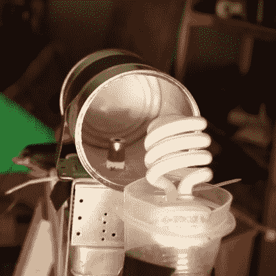

# 微波枪是真的吗？

> 原文：<https://hackaday.com/2017/10/23/are-microwave-guns-for-real/>

几乎就在一年前，[Kreosan]发布了一段视频，详细描述了一种由三个磁控管、一些电池和一个泰瑟枪组成的电磁“武器”。这一切似乎好得令人难以置信，所以[艾伦]决定尝试为自己复制这个结果。

[【Kreosan】的原创视频令人印象深刻](https://hackaday.com/2016/10/22/trio-of-magnetrons-power-a-microwave-rifle/)，展示了从家用音响到一辆不起眼的助力车在他们强大的设备面前爆炸的一切。然而，许多观看视频的人对这些镜头表示怀疑。大多数批评集中在磁控管供电的本质上，达不到微波炉中常见的 700-1000 瓦。

Initial testing with a single magnetron. This setup could light the bulb at a distance of a few centimeters.

[Allen]从实验单个磁控管开始，成功地用它点亮了几厘米范围内的紧凑型荧光灯。放大到带有纸板和箔馈电喇叭的完整三重磁控管设置，[Allen]充其量只能在几英尺的距离内摧毁一个计算器。

微波不会引起爆炸，而且该设备似乎没有接近[Kreosan]声称的他们设备的 50 英尺范围。[Allen]提出了一种理论，即在原始镜头中看到的爆炸更有可能来自小型鞭炮，而不是任何因微波而死亡的电子元件。

总的来说，这是一个坚实的尝试，重现其他人的工作来验证结果，科学的基石。然而，我们确实对 valiant 18650 被描述为“vape 电池”感到有些恼火。想了解更多微波的好处，[看看这一再造美国运输安全管理局人体扫描仪](https://hackaday.com/2010/12/03/make-your-own-tsa-naked-scanner/) [的尝试。](https://hackaday.com/2012/11/27/diy-tsa-backscatter-body-scanner/)