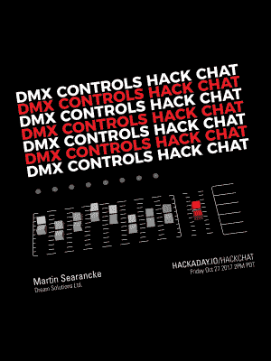

# 周五黑客聊天:DMX512 给你

> 原文：<https://hackaday.com/2017/10/25/friday-hack-chat-dmx512-gon-give-it-to-ya/>

DMX512 是剧院灯光的标准，最好的描述是“灯光的 MIDI”。它在 80 年代就已经存在了，几十年来，它一直被使用、滥用，并被塞进几乎所有能想到的东西里。

 在本周的黑客聊天中，我们将讨论 DMX512。 DMX512 是什么*？它是如何工作的？使用 DMX512 可以控制什么？有哪些开源项目使用它？这里有丰富的信息，你可以用这个无处不在的照明协议玩很多很酷的把戏。*

我们本周 Hack Chat 的嘉宾是[Martin Searancke]，Dream Solutions Ltd .的所有者[Martin]在开发可口可乐令人印象深刻的 3D 时代广场广告的早期就被联系过，以了解 Dream Solutions 的 LightFactory 软件是否可以用于驱动这种 3D 屏幕。该软件具有像素映射和媒体回放功能，并用于该项目的原型。这个产品的一个子集进入了最后的安装，现在正在纽约时代广场上驱动一个巨大的显示器。

这是一个社区黑客聊天，当然，我们接受来自社区的问题。如果您有问题想问[Martin]，请将其添加到讨论页。

 我们的黑客聊天是在 [Hackaday.io 黑客聊天群发消息](https://hackaday.io/project/5373/token/7879571d-62c3-46a8-af36-2b6f265590f2?redirect=messages)上的现场社区活动。我们的黑客聊天通常发生在太平洋时间周五中午*，但本周不同。*【马丁】在新西兰，所以**这次黑客聊天发生在太平洋时间 10 月****27 日**周五下午两点。这对你来说太难了吗？[这里有一个时区转换器！](https://www.timeanddate.com/countdown/generic?iso=20171027T14&p0=137&msg=DMX+Control+Systems+Hack+Chat&font=cursive)

点击右边的语音气泡，你会被直接带到 Hackaday.io 上的黑客聊天群。

你不必等到星期五；随时加入，你可以看到社区在谈论什么。

我们也在寻找新的黑客聊天主持人！如果你已经做了一些很酷的东西，你正在做一个有趣的项目，或者你将要推出一个非常酷的产品，请联系我们！给我们出色的社区经理发电子邮件，我们会看看是否能把你安排进去。