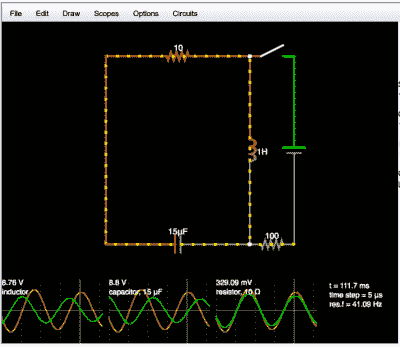
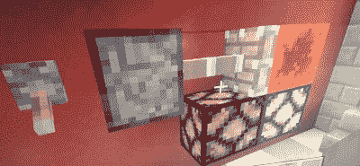
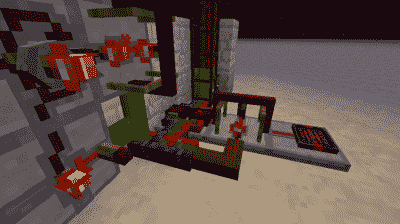
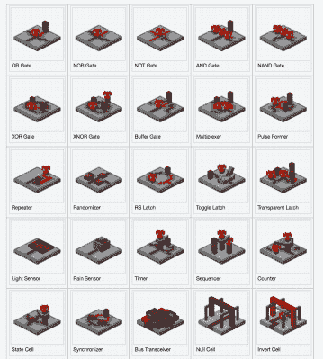

# 《我的世界》和福吉:尝试这种神奇的方式来可视化逻辑

> 原文：<https://hackaday.com/2017/11/08/visualizing-logic-with-minecraft/>

我最近脑子里有虚拟电路。有无数的工具可供我选择来满足这种冲动。但我要去的是《我的世界》。我知道你在想什么……很多人认为《我的世界》年纪大了。但是你可能从来没有尝试过《我的世界》在理解逻辑结构方面所做的一些真正不可思议的事情。这超越了简单的电路，很容易在硬件逻辑和软件逻辑之间来回跳跃。

### 传统电路仿真

电路模拟是一个非常酷的想法——在屏幕上排列虚拟电子元件，并在组装前测试电路。当然，主要的 EE 程序实际上都内置了电路仿真。它们不能代替实际测试，但对于帮助工程师理解电子理论中出现的抽象概念至关重要。

在低端，一些在线布局程序有基本的连接指示器——在 Fritzing 中，一旦连接上，接触点就会变成绿色，如果接触中断，就会变成红色。Circuit123 声称能够可视化电路中的电活动，但这几乎是一个笑话——有一个 LED 似乎亮了起来，还有一个带旋转轴的电机，仅此而已。值得注意的是，它还缺乏衡量标准，这使得它不仅仅是一个新奇的东西。

 还有更严肃的工具，它们在帮助工程师设计电路方面做得很好。SPICE 程序[允许工程师在原理图层面上制作电路原型](https://en.wikipedia.org/wiki/SPICE)。当然，自从几年前发现法尔斯塔德以来，我们在 Hackaday 就爱上了它。不久之后，Al Williams 用它深入理解了逻辑电路。

这些都有助于人类想象所有这些电子发生了什么。他们没有做的是帮你把你的头缠在可编程组件上。如果您想更好地可视化程序中发生的事情，您应该从哪里着手？你不能把一个带有 Python 脚本的 RPi 图标放到这些模拟器中，这真是太遗憾了。坦率地说，它们根本没有解决软件的逻辑结构——当在屏幕上工作时，你不能*看到*if/else 或*。*

具有讽刺意味的是，一个游戏真正做好了让人们沉浸在一个工程丰富的环境中。我当然是在说《我的世界》。

### 当我走进立体兔子洞的时候，让我放纵一下

自首次亮相以来，《我的世界》已经成为众所周知的工程师游戏——复杂的结构可以用各种材料建造，不同的元素按照非常容易理解的规则一起工作。它吸引了所有年龄层次的人，无论有没有怪物和战斗都可以玩，这使它成为所有书呆子级别的孩子的最爱。

《我的世界》的电子类比是红石，一种充满神奇力量的矿石，有点像电。还有开关、灯、比较器、中继器和其他在 EE 世界中也能找到的元件。布线采用“红石灰尘”的形式，撒在要供电的模块上方和旁边的路径上。

很早以前，人们就意识到可以用《我的世界》的红石元素来制作简单的电路和逻辑门。例如，右边的图像显示了一个或门。轻按开关，活塞启动，推动或拉动红石块(红色立方体)，使其接触一个或另一个灯。开关是活塞的电源，所以你可以用红石信号代替开关来达到同样的效果。

您可以看到如何使用这些元素的不同组合来创建其他逻辑门。此外，您可以用同样的方法创建更复杂的结构。举例来说，四个红石中继器组成一个计时电路，每隔一段时间释放红石能量脉冲。

随着游戏开发的进展，[命令块](https://minecraft.gamepedia.com/Command_Block)被引入，作为在后台运行的原始计算机——它们不出现在任何菜单上，只能用控制台命令创建。他们也很强大，能够影响游戏中的任何元素。然而，很快他们也被工程师劫持了。例如，这个家伙[用命令块创建了一个基本的解释器](https://hackaday.com/2016/01/19/basically-its-minecraft/)。使用世界控制软件 [WorldEdit](http://wiki.sk89q.com/wiki/WorldEdit) ，你可以做很多疯狂的事情。

游戏中另一个令人兴奋的元素，《我的世界》也发布了游戏的 Raspberry Pi 版本，不仅允许你创建游戏的[便携版本，更重要的是，它可以与世界互动的 Python 脚本一起运行《我的世界》。你不仅可以用这个装备控制游戏世界，游戏还可以控制 RPi——这个](https://hackaday.com/2016/07/02/raspberry-pi-zero-becomes-mighty-miniature-minecraft-machine/)[游戏中的灯开关](https://hackaday.com/2015/11/25/the-internet-of-minecraft-things-is-born/)就是一个很好的例子。你也可以控制一个 Arduino，这个 Arduino 插在运行游戏的 PC 上。MCreator 是定制软件，允许[通过《我的世界》对 Arduino](https://hackaday.com/2016/06/04/control-the-real-world-with-an-arduino-enabled-minecraft-mod/) 进行串行控制，并呈现一个拖放式无代码界面。

### 但它不是真正的电子产品！

诚然，《我的世界》的方法带有明显的幻想成分。这不是*试图*炫耀电阻和电容。红石灰尘痕迹的行为不像电线，红石比较器以意想不到的方式工作。电力供应来自令人惊讶的地方——火把，真的吗？—以不切实际的方式工作。

好的，所以它并没有在字面意义上教授电子学。但它确实教授工程学——它教你逻辑，让你充分利用有限的组件，研究每个组件的功能，并从从头到尾规划项目的角度出发，清楚地知道应该发生什么以及如何发生。

它有助于磨练工程师的敏感性——仅仅让它工作还不够好。你如何创造最优雅的解决方案？当你用不可靠的代码最大化你的内存时，你无法想象它有多臃肿。但是当你的《我的世界》电路由工厂大小的错综复杂的元件组成时，你几乎可以看到它。你可以看到环，你可以*站在上面*。你可以看到红石痕迹随着电力变亮。它给你一个新的视角来看待元素是如何组合在一起的。

有时你甚至可以创造一些简单实用的酷东西——上图显示了一个 20 通道的非门，中间有一个电源(看起来像一个小黄点)触发了 20 个红石手电筒。虽然正常情况下，这个钻机关闭火炬，只要电源是积极的。多酷啊。

### 《我的世界》计算水平提升

 在《我的世界》创造赛道的头号问题是它们看起来或做起来都不像真的。有事业心的《我的世界》黑客们的经典风车竞赛项目是时钟。能做到吗？别说精度了，你能在不到城堡大小的围栏里创造出这个东西吗？一些在现实世界中相对简单的东西在游戏中不起作用，或者几乎不起作用。

问题的一部分是线路。红石灰尘自动连接到每个相邻的导电表面，所以你必须通过提高一股绝缘或用一个空块绝缘。这就产生了两个问题。首先，你有非常巨大的错综复杂的线路，在游戏地形中延伸到看起来像足球场的地方。此外，红石灰尘布线看起来都一样，当你进入复杂的结构很容易跟随错误的轨迹。

现在，如果有人能创造一个 mod，使《我的世界》的红石零件更像电子产品！幸运的是，有一个可以求助的修改社区。

### 像《我的世界》这样的电子产品

《我的世界》的开发者对普通用户为游戏编写 mod 非常冷静，并在 2012 年发布了他们的 [Forge API](http://www.minecraftforge.net/forum/) 来促进这种创造力——这是游戏对工程师的又一次认可。许多临时的修改者仅仅使用 Forge 来进行表面上的修改；例如，给人民的《我的世界》项目一个万圣节主题。然而，Forge 超越了这一点，它允许用户改写游戏的 Java 构建模块(ha)。你可以把《我的世界》变成一个不同的游戏。

 和任何开源项目一样，许多不同的修改者在不同的部分工作。例如， [ForgeMultipart](https://github.com/Chicken-Bones/ForgeMultipart) 改变了游戏的一个核心原则，那就是每个方块只有一件事情在进行。在其他优势中，它允许人造电子元件变得更加紧凑。另一个很酷的 mod 是 [Forge Relocation API](https://github.com/MrTJP/ForgeRelocation) ,用于在游戏世界中传送方块。

这两个 mod，以及其他几个 mod，共同组成了 [Project: Red](https://projectredwiki.com/wiki/Main_Page) ，这是迄今为止将(更多)现实电子元素引入游戏的最雄心勃勃的尝试。它的一些功能包括 16 种不同颜色的绝缘线，以及捆绑线，以便多个信号可以穿过同一个块。这就是多部分 API 的用武之地，它允许多个信号同时进入同一个块。

绝缘导线仅连接到相同颜色的其他导线，不会像 Redstone Dust 那样为任何支撑块供电，反之亦然——如果一个支撑块由另一个电源供电，它不会影响导线的功率水平。*项目中的布线:红色*也可以放置在块的下侧，不像灰尘。有多色发光二极管，即使在《我的世界》没有彩色灯。

当你进入 ICs 时，红色会变得很不舒服。它们和你想象的一样:定时电路，逻辑门，传感器。本质上，*项目:红色*把那些房间大小的电路和[缩小到一个单独的块](https://projectredwiki.com/wiki/Logic_Gate)，有点像真实世界！对于那些渴望一个《我的世界》时钟的人来说，有两个 7 段显示器，每个由 16 个信号控制。给电线通电会点亮匹配的线段，第 8 个和第 16 个点亮小数点。你的史蒂夫可以用螺丝刀改变任何 IC 的设置。

最让我兴奋的一个新元素是，网络管道传输的不是数据包，而是游戏块，这也是游戏的真正计算能力在这个 mod 中变得显而易见的地方。使用检测模块类型的 IC，很容易看出如何使用这种模块来制造相当复杂的 CPU。

项目:红色是大学生【MrTJP】在其他 mod 创作者的贡献下创作的，你可以[帮助支持他在 Patreon 上的努力](https://www.patreon.com/MrTJP)。下面的视频很好地描述了这个项目。

 [https://www.youtube.com/embed/PKclsUvBhGY?version=3&rel=1&showsearch=0&showinfo=1&iv_load_policy=1&fs=1&hl=en-US&autohide=2&wmode=transparent](https://www.youtube.com/embed/PKclsUvBhGY?version=3&rel=1&showsearch=0&showinfo=1&iv_load_policy=1&fs=1&hl=en-US&autohide=2&wmode=transparent)

### 说真的，模拟电子电路

虽然*项目:红色*的阴谋，仍然有许多来自游戏的文物干扰它是一个实际的电子电路模拟器。从电子学的角度来看，一个模拟电路的工作很奇怪，但从逻辑的角度来看，它真的足够了吗？VR 角度有什么优势吗？能够走来走去，检查每一个连接和组件是否比看着屏幕上的原理图更好？

我不确定，但我觉得一个编程和设计环境——像《我的世界》，但很现实——同时教授组件和逻辑，将是开发和教育的一个很好的工具。让我们开始吧！