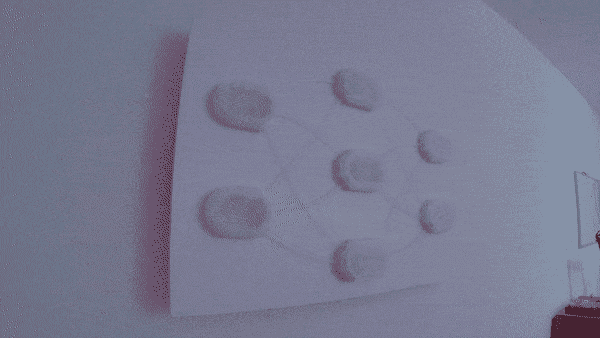

# 神经网络真的把房间联系在一起

> 原文：<https://hackaday.com/2017/10/27/neural-network-really-ties-the-room-together/>

如果说好莱坞对黑客有什么了解的话，那就是他们绝对喜欢数据可视化。有时它被投射在一面大墙上(*黑客，WarGames)* ，其他时候它是胡言乱语，直到剧情另有所指(*运动鞋，黑客帝国*)。但是不管怎样，它必须看起来*酷*。没有一个称职的黑客可以工作，除非他们有一个进化的维恩图或光谱瀑布在后台运行。

受到好莱坞电影的启发，特别是《复仇者联盟:奥创时代》中的一个角色，【扎克·阿基】决定是时候让[在黑客墙可视化万神殿中占据一席之地了](https://github.com/ZackAkil/rgb-neural-net)。但他不满足于仅仅在墙上展示无意义的东西，他开始创造一些至少能展示实际数据的东西。

 【扎克】使用 [scikit-learn 机器学习套件](http://scikit-learn.org/stable/)在 Python 中创建了一个神经网络来处理多标签分类数据。该代码从神经网络训练算法中获取值，并通过 Arduino 将其转换为 RGB 颜色。神经网络中的每个“节点”都是用半透明细丝 3D 打印的，并配有 RGB LED 模块。然后，这些模块通过侧面发光光纤管相互连接，以便根据它们所连接的节点的颜色来混合管内的颜色。这允许一个非常有机的“增长”效果，因为颜色在网络中逐节点移动。

最终，这种特殊的视觉化并不真正意味着什么；它所处理的数据只是为了可视化的目的而存在。但是[Zack]成功地创造了机器学习的实用可视化，如果你是那种需要跟踪学习算法的人，这种设计的一些变体可能正是你正在寻找的。

如果你不喜欢人工智能，但你仍然想要一面 RGB LEDs 墙，[也许你可以使用这款相控阵天线可视化器](https://hackaday.com/2017/01/05/visualization-of-a-phased-array-antenna-system/)来代替。如果你真的很时髦，也许你会[走模拟路线，在墙上放一个大计量器](https://hackaday.com/2011/04/27/data-scraping-and-visualization-with-python/)。

