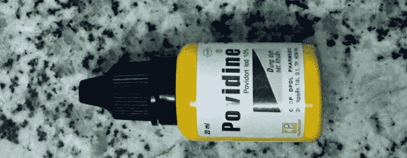
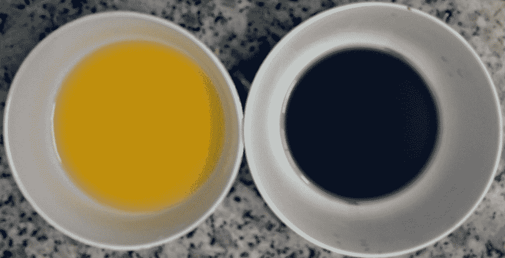
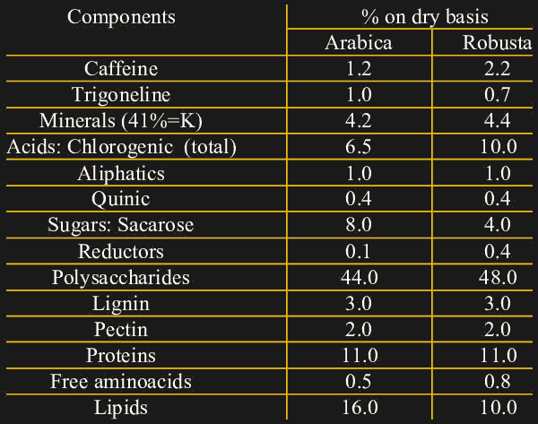
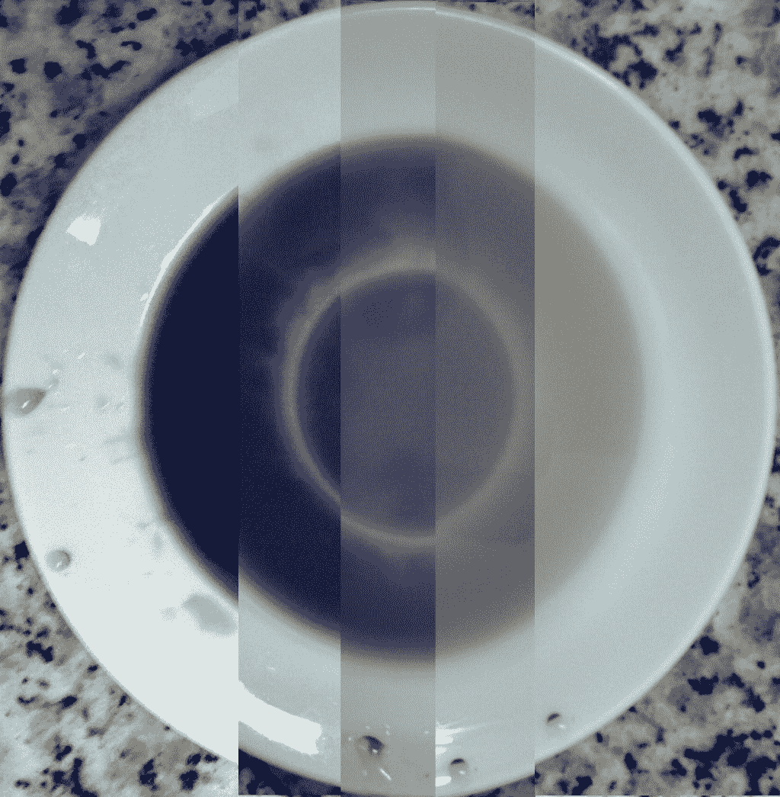

# 咖啡、阴谋和公民科学:碘量法导论

> 原文：<https://hackaday.com/2017/10/30/coffee-conspiracy-and-citizen-science-an-introduction-to-iodometry/>

我对咖啡非常认真。这可能是一天中最重要的一餐，也是美国最大的抗氧化剂膳食来源。不管你是否相信抗氧化剂对健康有影响(我持怀疑态度)，这很有意思！

不幸的是，工业烘焙和研磨的咖啡有时会掺杂各种不需要的“其他东西”:玉米、大豆、小麦壳等。在整个东南亚，人们普遍对食品掺假和食品安全有很多担忧，因为市场的成本驱动性质促使少数供应商采取不诚实的商业行为。在越南，一个具体的谣言是，街头小贩的咖啡实际上不是咖啡，而是不安全的化学调味剂与玉米须、烤椰子壳和大豆混合在一起。当地新闻报道，30%的街头咖啡[甚至不含咖啡因](http://tuoitrenews.vn/business/35885/survey-finds-30-percent-of-coffee-in-vietnam-has-no-caffeine)。

虽然我在街边的咖啡店里听到过一些非常离奇的故事，但其中一些却是基于某种谷物(豆子？)的真相，而且当地新闻肯定已经[经常](http://www.thanhniennews.com/society/coffee-makers-use-chemicals-soy-beans-corn-no-real-coffee-5604.html)报道它。话又说回来，我多年来一直在同样友好的街头小贩那里买咖啡，并对针对他们的毫无根据的指控感到有些生气。

这听起来像是科学的工作，但我们可以用什么来量化许多咖啡样品的纯度，而不用花费大量的金钱？像往常一样，问题的解决方案(双关语)已经在房间里了:

[聚维酮碘](http://en.wikipedia.org/wiki/Povidone-iodine)(又称碘聚维酮)是一种防腐剂，被列入[世卫组织基本药物目录](http://en.wikipedia.org/wiki/WHO_Model_List_of_Essential_Medicines)。它由一种叫做聚维酮的水溶性聚合物、碘化氢和元素碘组成。元素碘与聚维酮形成复合物，缓慢释放元素碘，溶解到已经含有碘化氢的溶液中。

### 厨房里的化学

元素碘是一种非常活泼的物质。在我们的例子中，它在溶液中形成三碘化物离子(I3-)，使其呈深棕色(在稀溶液中呈黄色)并作为氧化剂。它还有一个非常有用的特性，即形成一种令人难以置信的深蓝色的淀粉-三碘化物复合物。这使得我们可以在一种叫做碘量滴定的化学分析中使用可溶性淀粉作为三碘化物离子存在的指示剂。

各种食物都含有可溶和不可溶的淀粉——在我的案例中，我使用了木薯淀粉，它作为一种指标相当不错，而且几乎每个当地家庭都可以买到。

Dilute povidone iodine solution, about 0.1% (left) and prepared reagent with an excess of starch (right)

我们现在可以很好地检测溶液中的三碘化物离子，但这能让我们得到什么呢？考虑干咖啡的成分:

Source: [Santos et al. 2013\. Caffeine and Chlorogenic Acids in Coffee and Effects on Selected Neurogenerative Diseases](https://www.researchgate.net/publication/265124171_Journal_of_Pharmaceutical_and_Scientific_Innovation_CAFFEINE_AND_CHLOROGENIC_ACIDS_IN_COFFEE_AND_EFFECTS_ON_SELECTED_NEURODEGENERATIVE_DISEASES)

注意咖啡因和绿原酸相对较高的浓度。虽然咖啡因可能对我们大多数人来说都很熟悉，但绿原酸根本不在我的日常词汇中。事实证明，这些化合物[是咖啡](http://www.coffeechemistry.com/chemistry/acids/chlorogenic-acid)的大部分涩味和苦味的原因，当植物受到压力时，它们会大量产生。通常在越南种植的罗布斯塔咖啡也含有更多的这些化合物，而不是更昂贵的阿拉比卡咖啡。注意，绿原酸不含也不产生氯，这只是词源上的巧合。

有些人可能称这些化学物质为“抗氧化剂”，但对我们来说，它们是一些相关但更具体的东西:还原剂。还原剂是倾向于通过失去电子与氧化剂反应的物质。因此，我们预计咖啡因和绿原酸会以这种方式与碘反应。理论上，你可以用这个制造一个可怕的电化学电池(让我们知道它是如何进行的)。

总之，咖啡因和绿原酸是咖啡的主要成分。碘量滴定法是一种已知的测定两种化合物浓度的分析方法。木薯淀粉和聚维酮碘的组合是进行近似滴定的试剂的合理候选。总的来说，如果我们建立一个标准的参考溶液，这听起来像是一个合理的测试。

### 首次参考测试

顺便提一下，一项研究发现，在他们描述的所有咖啡中，来自越南的生咖啡豆抗氧化含量最高。这对我们的测试来说是个好兆头，因为它可能会在真假咖啡之间产生更大的局部差异。

我随意混了一批，煮了一些咖啡，然后边搅拌边慢慢往混合物里滴咖啡。它似乎起作用了！

Loss of blue color during titration with undiluted coffee in an initial test

下一步是准备咖啡和试剂的标准溶液。经过一些测试，我发现 10%聚维酮碘和自来水以 1:200 的比例混合 5 克木薯淀粉效果相当好。对于标准咖啡溶液，我使用传统的 ca phe phin 和 150 ml 沸水冲泡了 20 克 Trung Nguyên 'S(一种常见的本地品牌)研磨咖啡，然后以 30:1 的比例稀释，得到大约 300 ml 的标准咖啡溶液。

30:1 稀释的原因是双重的。首先，越南街头咖啡是作为一种浓稠的糖浆出售的，端上来时浇在冰上；相对于我们的试剂来说它太浓了，所以最好稀释一下。其次，我怀疑试剂对光敏感，所以在每次测试中混合较低浓度的新鲜试剂是可行的。

事实证明，需要 2.0 毫升标准咖啡溶液才能完全改变 10 毫升试剂中可溶性淀粉的颜色。有了这些知识，是时候设计一个实验了，骑上我的摩托车，购买数量惊人的街头咖啡。

### 科学咖啡之旅

请继续关注——样本需要一段时间来处理，但我们将在几天内得到结果，以及对研究设计的完整描述。我还会去当地人称之为“死亡市场”的地方寻找所谓的假咖啡…我会尽量不被刺伤和溶解在酸中。

事实上，市场是一个非常整洁的地方，我经常在这个地区。撇开化学安全问题不谈，如果你热爱化学并且不容易做噩梦，这真是一个令人兴奋的地方。

另外，这种方法没有理由不能用于表征其他物质，如抗坏血酸(维生素 C)。我也用非处方药片试过这种方法，它们反应很快，但我认为调查一桩由来已久的咖啡掺假丑闻比研究果汁浓度更令人兴奋。

还可以使用该解决方案来检测向猪肉中非法添加焦亚硫酸钠的行为，以便以更高的利润将其作为牛肉出售。每次测试的成本为 0.002 美元，我们可能会有所发现，但需要进一步调查，看看类似的方法是否可以实际应用。