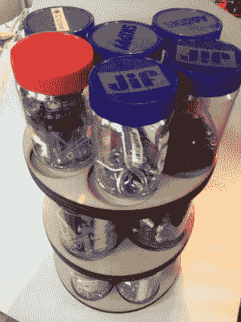
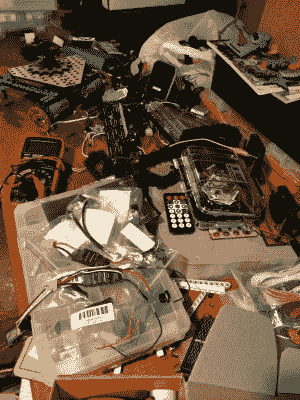
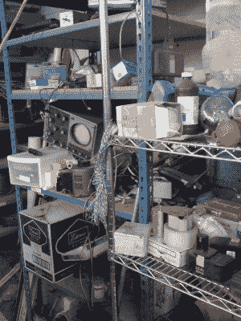

# 克拉特宣言

> 原文：<https://hackaday.com/2017/11/10/the-clutter-manifesto/>

我的地下室工作间塞满了东西，我简直无法使用。我的工作台是一张结实的硬木图书馆桌子，上面堆满了垃圾，以至于我找不到一平方英尺的地方没有两层碎屑——最上面一层是大东西，比如不再工作的旧项目，一箱箱的东西，易碎但很轻的东西放在上面。下面是弯曲电阻器的岩浆，LED 灯条的碎片，#4 螺钉，我永远不会使用的神秘紧固件，旧版本项目的紫色电路板，以及从更高层次过滤下来的惊人数量的 SparkFun 和 Adafruit 突破。

当我在工作时，我会把零件拿到餐厅，放在桌子上工作，这有很多好处——更大的空间，更好的光线，以及更好的命名。不好的一面是，我没有花任何时间把我真正的商店变成一个可行的工作场所，它默认成为一个杂乱的储藏室。

因此，我正专注于一个由四部分组成的计划，从成堆的垃圾中回收我的工作空间。

### 1.有一个系统，而不是一个噱头

 大多数车间杂乱的物品都涉及“巧妙的把戏”一类，你知道，天花板上爷爷的果酱瓶一类的东西。通常可以归结为，有什么可爱有趣的方法来存放你工作室里的东西？

简而言之，它的前提是一个系统就能让你的工作区域井然有序。我想起了那些老派的钉板，主人在那里画出了锯子、锤子、夹子等等的轮廓。不可避免地，旧的工具丢失了，新的工具增加了，从这一点来看，钉板很糟糕。你可以看到锯子的轮廓，前面挂着一把锤子，除非重新上漆。没有人会责怪你在那一点上归零。

这并不是说那些组织思想不能被使用——它们只是不是万灵药。几个月前，我写了一篇关于使用花生酱罐子储存乐高和金属硬件的文章，激光切割的木制托盘让我可以在相对较小的空间内堆叠一堆罐子。

我试图用模块化来建造，每个托盘可以容纳七个小的或四个大的罐子。更重要的是，我确实需要多种灵活的解决方案，这样我的系统才不会成为一个障碍。

### 2.只有工作在板凳上进行

 之所以叫工作台，是因为我在上面工作。当人们谈论杂乱时，他们不应该指的是一个人正在做的事情。那不是杂乱，那只是工作。但是当我不在工作台上做任何事情的时候，它就变得杂乱了，而且仍然很乱。然后长凳变成了储藏室，这是一条危险且令人担忧的道路，至少在清洁领域是如此。

如果你不得不把一个项目放在一边，不管是因为时间、部分还是无聊，把那个项目打包。如果没有别的作用，它可以防止你的东西变得多尘或潮湿。

利用 Z-space 来最大限度地利用您的房地产不会有什么坏处。我的车库里有一堆旧的 2x6s，我有一个在桌子后面放一个低搁板的想法，我可以在那里放我的电表、可调电源、电源板等等。但最终，越多与项目无关的东西，我就越糟糕。

### 3.设置一个溢出区

 在我的工作室里总会有一些没用的东西。大多数情况下，它会停在工作台的顶部。把它放在那里应该会让我想在它上面工作，但相反，它阻止我有效地使用长椅，并使它成为一个有趣但令人沮丧的垃圾堆。

我想建立一个备用存储区——也许是一个架子——我可以在那里临时放东西。没有东西会在架子上停留超过一年。这样，我可以保留一些有趣的东西，同时仍然意识到它是借来的，要么在一段时间内被使用，要么被捐赠或回收。

并非巧合的是，当地的黑客空间有一个很棒的废品架——尽管比以前整洁多了。现在它有严格的政策，不让任何东西永远存在，不管它有多美味。有时候你必须冷酷无情。

### 4.把它扔掉，现在

我已经开始接受我完全是一个电子产品和工具收藏者。我身边有 25 辆 DC 汽车，但我仍然会花两个小时拆卸一个坏玩具来收获另一个。我必须承认我有太多的东西，我需要扔掉它们，这是所有杂乱问题的核心，多余的垃圾。

我在我的核心兴趣之外的领域进行实验，并为它获得基础设施，但有时它从未站稳脚跟。例如，我的桌子上有一套相当坚固的化学玻璃制品，但是我从来没有时间去玩它。其中一些是我制造火药的年轻时代遗留下来的，所以也有怀旧的因素。如果我觉得未来一两年都用不到，为什么不直接捐了？所有这些 DC 汽车能给一些小学带来一些好处。如果我一年没用过它，它就会被放在 hackerspace 的免费书架上。

请分享一些让你的黑客游戏井然有序的想法。一个杂乱的房子在多大程度上意味着一个整洁的头脑？