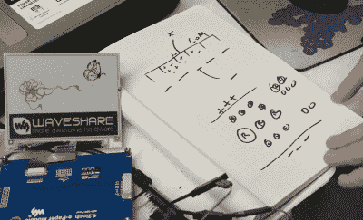

# [Ben Krasnow]破解电子纸以获得最快的刷新率

> 原文：<https://hackaday.com/2017/10/31/ben-krasnow-hacks-e-paper-for-fastest-refresh-rate/>

[Ben Krasnow]因其清晰的解释和令人敬畏的硬件而闻名，是少数拥有电子显微镜的黑客之一。这次他在解释[电子纸如何工作，同时修改 4.2 英寸电子纸模块的固件以获得更高的刷新率](https://www.youtube.com/watch?v=MsbiO8EAsGw)。至于令人敬畏的硬件，他还使用一个超花哨的租借示波器分析了进入电子纸的信号。

E-paper explanation diagram

他先演示了修改前后的固件运行情况，然后解释了电子纸的工作原理。这种显示器由许多隔离的小室组成，每个小室都含有液体中的带电粒子。例如，正粒子可能是黑色的，负粒子可能是白色的。通过在每个腔室中放置一个电场，白色粒子会被吸引到一端，而黑色粒子会被吸引到另一端，这可能就是你正在看的一端。他还解释了如何通过使用不同大小的粒子以及一些额外的电场操作来获得第三种颜色。他还谈到了老化问题以及如何避免老化。

在向我们介绍了这些背景知识之后，他向我们展示了一些固件，并展示了他是如何修改固件以提高速度的，即通过研究各种数据表并随后修改一些查找表。

回到硬件，他展示了他是如何刮掉一些痕迹，以便能够安装示波器探头的。这本身似乎是一个显著的成就，尽管他指出导电层很好地支持了他的刮擦。此时，他在运行一些演示的同时分析信号。

结果就是你可以在下面看到的非常有知识性、趣味性和娱乐性的视频。

 [https://www.youtube.com/embed/MsbiO8EAsGw?version=3&rel=1&showsearch=0&showinfo=1&iv_load_policy=1&fs=1&hl=en-US&autohide=2&wmode=transparent](https://www.youtube.com/embed/MsbiO8EAsGw?version=3&rel=1&showsearch=0&showinfo=1&iv_load_policy=1&fs=1&hl=en-US&autohide=2&wmode=transparent)

在 Hackaday 上，我们和[Ben]还有更多这样令人惊奇的冒险。我们真的很高兴看到他参加闪光灯奖，他加热一个硬币电池以挤出一些额外的电流。他在[举办的 2016 年关于快速原型制作的超级会议](https://hackaday.com/2016/12/01/quickly-prototyping-x-ray-backscatter-machines/)是给所有黑客的一次鼓舞。