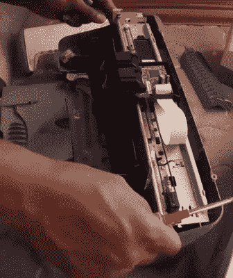

# 用回收的零件自制激光雕刻机

> 原文：<https://hackaday.com/2017/10/31/homebuilt-laser-engraver-using-salvaged-parts/>

现在，任何人都可以上网花 200 美元左右买到一台相当不错的 3D 打印机，他们已经正式脱离了“精英黑客”的武器库，现在是普通的工具，如果可能是高度专业化的工具的话。这对于整个 3D 打印社区来说非常好，但是那些想要处于技术边缘的人呢？告诉人们你家里有一台 3D 打印机不会像过去那样得到广泛的回应。一个“l33t”黑客要做什么？

进入激光雕刻机/切割机:它就像一个 3D 打印机，但更容易建立，并具有更高的身体伤害能力！虽然有几个很好的套件和交钥匙设置选项，就像早期的 3D 打印机一样，但一些最好的机器仍然是家庭制造的。在他的最新视频中，YouTuber [MakerMan]向我们展示了他的构建,其特点是令人印象深刻的低零件数。

 为了开始建造，【MakerMan】拆下四台打印机，打捞出七根高质量的 8 毫米直线杆；这本身就是一个巨大的节约成本的秘诀。在接下来的几个月里，我们肯定会捡起我们在垃圾桶里看到的任何打印机，希望能得到一些棒。通过添加一些便宜的 LM8UU 轴承和 3D 打印支架，[MakerMan]有了一个平滑的 2D 运动平台，只需几美元。机器的框架是由五金店的铝制方管制成的，这里没有昂贵的挤压材料。

对于激光本身，[MakerMan]使用的是 Opt Lasers 的 6 瓦 [PLH3D-6W-XF。该模块具有集成的驱动器和冷却功能，因此您需要做的只是为其提供电源和在工件上移动的稳定方式。他们甚至提供了一个磁性“坞站”,允许您从底座上移除激光器，而无需任何维修工具或工具更换。[MakerMan]报道说他已经能用这个激光模块雕刻不锈钢，切割薄木头。](https://optlasers.com/en/engraving-laser-heads/205-plh3d-6w-xf.html)

这并不是我们看到的第一台用废弃零件建造的激光雕刻机，尽管如果你想节省一些工作[你可以升级一个便宜的商业模型](https://hackaday.com/2017/06/10/drop-in-controller-for-ebay-k40-laser-engraver-gets-results/)。

 [https://www.youtube.com/embed/Vjrh4fSkfWs?version=3&rel=1&showsearch=0&showinfo=1&iv_load_policy=1&fs=1&hl=en-US&autohide=2&wmode=transparent](https://www.youtube.com/embed/Vjrh4fSkfWs?version=3&rel=1&showsearch=0&showinfo=1&iv_load_policy=1&fs=1&hl=en-US&autohide=2&wmode=transparent)

