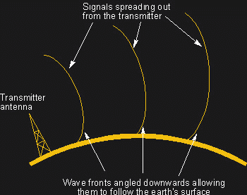
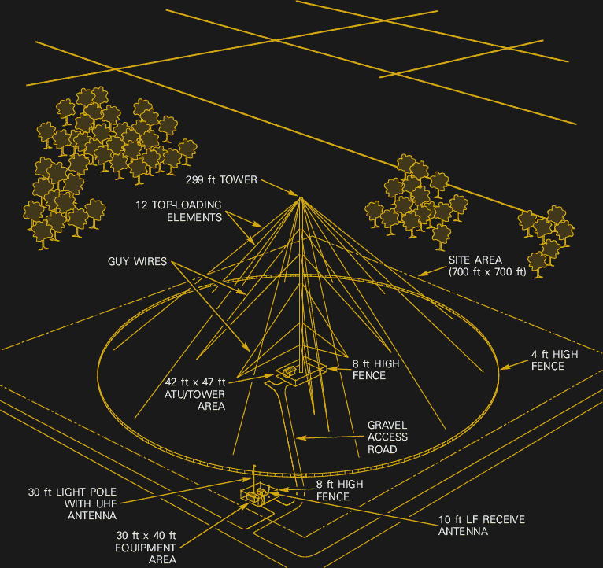

# 无线电启示录:格温系统

> 原文：<https://hackaday.com/2017/11/22/radio-apocalypse-the-gwen-system/>

世界政治舞台上最近的事态发展凸显了电磁脉冲(EMP)的潜在破坏力，人们似乎已经将一枚热核武器带来的威胁内化了。众所周知，一枚部署在足够高的高度的炸弹可以产生快速而强大的电磁场脉冲，能够摧毁地面上的一切电气设备，让文明在眨眼之间回到 19 世纪。

当然，事情很少像媒体描述的那样简单，当涉及到复杂的物理现象时尤其如此。但即使在原子时代的早期，人们就已经了解了电磁脉冲的潜在破坏力，并在设计战略系统时考虑到了这一点。EMP 最大的威胁莫过于将分布广泛的战略资产与中央指挥和控制机构联系起来的复杂通信系统网络。在美国，许多加固的通信网络之一被称为地波应急网络(GWEN ),其快速兴衰的故事是一个有趣的案例，研究了各国如何对真实和感知的威胁做出技术回应。

### 物理学中的可靠性

GWEN 最初是作为连接国家战略核资产(主要是弹道导弹发射设施的发射控制中心(LCC ))和国家指挥机构(基本上是总统)的通信网络中的一个明显差距的补丁。像所有的战略通信系统一样，GWEN 的设计包含了在电磁脉冲的电磁影响下生存的最佳实践。但是格温有另一个任务。

Ground wave propagation. Source: [Electronics Notes](https://www.electronics-notes.com/articles/antennas-propagation/ground-wave/basics-tutorial.php)

地波传播是某些无线电波紧贴地表并沿地球曲率传播的趋势，是无线电波只能沿直线传播的一般规则的例外。在 5 MHz 以下，地球充当导体，因此沿地球表面传播的无线电波会感应出电流。感应电流减缓了地表附近的传播速度，当波前向外扩散时，波前向下弯曲。当然，信号会有相当大的衰减，因此必须仔细考虑天线的设计和构造。但是，如果设计得当，地波传播系统在不依赖于电离层的超视距通信中可以非常有效。

地波传播需要长波长才能工作，因此 GWEN 工作在 150 到 175 kHz 的低频(LF)波段，远低于 530 到 1700 kHz 的商用 AM 无线电中频(MF)波段。

### 格温节点

A GWEN relay node. Source: [Wikipedia](https://en.wikipedia.org/wiki/AN/URC-117_Ground_Wave_Emergency_Network), public domain.

GWEN 被设想成一个由相距大约 150 到 200 英里的 LF *中继节点*组成的广域网。每个 GWEN 中继节点与*输入输出节点*通信，这些节点一般位于空军基地和其他类似设施。中继节点将从 IO 节点获取命令和控制消息，并通过整个网络传播它们，直到它们到达*只收节点*，通常是 LCC 基站。GWEN 使用最小移位键控以 1200 bps 的数据速率对 LF 信号上的消息进行编码。当然，信息是加密的。

1982 年至 1990 年代初，计划中的 240 个 GWEN 站中只有大约 58 个建成，当时该计划被关闭。格温主要是国会的受害者，他们不愿意资助他们认为是苏联解体后冷战的遗迹。关于未来的格温网站也有一定的邻避主义；随着越来越流行的看法，即从电力线到手机信号塔的一切都能够造成深远的生物效应，拥有一个强大的无线电发射机的前景也将成为附近地区的一个可能的战争目标，这足以成为搁置该计划的理由。

到那时，随着互联网的兴起和卫星通信的普及，格温的技术看起来确实有点过时了。然而，这可能被证明是短视的；虽然今天的战略通信系统中肯定有很多冗余，但对于像格温那样使用基本物理原理的简单而强大的系统来说，还是有一些东西可以说的。