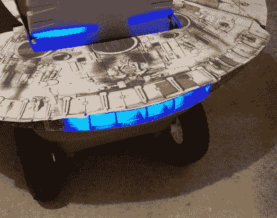

# 迷你千年隼是邻居羡慕的对象

> 原文：<https://hackaday.com/2017/11/03/mini-millennium-falcon-is-envy-of-the-neighborhood/>

这里有一个提示给任何可能在不久的将来要有孩子的读者:有大约两年的时间，你基本上可以把你的孩子作为万圣节的道具。他们还太小，对自己想打扮成什么样子没有任何兴趣，而且作为一个额外的奖励，他们通常大部分时间都在一个有轮子的装置里打滚。只要你能让小家伙温暖安全地坐在车里，你就可以自由地把它们放进各种精致的交通工具里。

一个典型的例子是，shnatko 称之为“千年飞人”的令人敬畏的建筑 T1。千年飞行器建在他女儿的塑料无线电飞行器车顶上，由木头和泡沫板制成。通过使用原本用于可选顶篷的货车上的安装孔，该船本身可以被移除以在明年再次飞行。

[shnatko]注意到他在美术方面没有特别的天赋，所以他决定通过打印出他在网上找到的千年隼的高分辨率图像来改善他的体形。这种方法需要相当大的耐心(更不用说打印机墨水了)，但我们认为最终的结果会说明一切。

为了完成他的建造,[shnatko]从他的个人电脑改装时代找到了一个蓝色的冷阴极灯，并用他放在周围的笔记本电脑电池装配起来。一些泡沫肋骨和蜡纸来漫射光线，使它看起来像“真正的”猎鹰。

在这个造型和几周前的 AT-AT 摇马之间，我们似乎处于童年的黄金时代*、《星球大战》*。尽管我们不介意[看到它被安装到赛车动力轮上](https://hackaday.com/2015/09/06/better-racing-with-power-wheels/)。