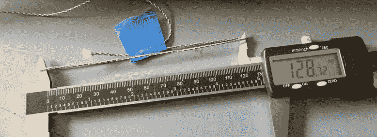

# 复古五金的 3D 打印带

> 原文：<https://hackaday.com/2017/11/03/3d-printing-belts-for-vintage-hardware/>

对于一些年轻的读者来说，这可能很难相信，但曾经有一段时间，硬件充满了小橡胶带。录音机，录像机，甚至一些电脑:它们都有需要将动力传递给其他部件的旋转部件，而皮带是一种廉价而安静的方式。不幸的是，现在几十年过去了，我们意识到这些小皮带往往是经典硬件的致命弱点，在其他组件准备放弃战斗之前很久就变得脆弱和断裂。

这正是[FozzTexx]在试图恢复他新买的 Commodore PET 2001 时发现的。盒式驱动器内部的皮带已经变得坚硬并碎裂，而不是四处寻找替代品，[FozzTexx]推断他可能能够像 NinjaFlex 一样用柔性 3D 打印机细丝打印一个。此外，这不是他家唯一需要更换皮带的老式技术，所以他认为这将是一个值得的实验。

由于原来的皮带比灰尘大不了多少，[FozzTexx]不得不从头开始设计他的替代品。他首先巧妙地用细绳复制出皮带需要经过的路径，然后用卡尺测量细绳圈的内径。[FozzTexx]然后将直径减小了 5%,以考虑新皮带的拉伸。

皮带的轮廓是方形的，这使得建模和 3D 打印更加容易。[FozzTexx]只是从 2D 的一个较大的圆中减去一个较小的圆，然后将该圆向第三维方向挤压 1.18 mm，以匹配原始部分的高度。仔细的测量得到了回报，新印刷的 NinjaFlex 带在第一次尝试时就有了他的 Commodore 加载和保存程序。

我们已经在之前的中介绍了为旧硬件寻找替换皮带的困难，所以看看其他人是否能够利用[FozzTexx]在这里所做的研究将会很有意思。当然，当使用 NinjaFlex 时,[的寿命问题总是被提出来，所以希望【FozzTexx】能让我们保持更新。](https://hackaday.com/2016/09/14/3d-printed-door-latch-has-one-moving-part-itself/)