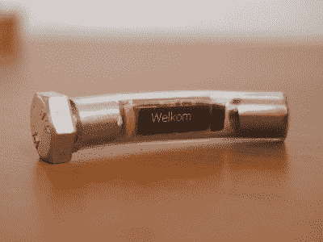

# 蜗牛实际上是巧妙奇怪的地理藏宝航点

> 原文：<https://hackaday.com/2017/11/11/snail-is-actually-cleverly-strange-geocaching-waypoint/>

基本的地理藏宝包括跟随 GPS 坐标到一个位置，然后找到一个藏在附近某处的集装箱。像任何活动一样，人们倾向于添加他们自己的曲折来保持事情的趣味性。[Jangeox]最近发布了一段有机发光二极管蜗牛 2.0 的视频来展示他最近的作品。(这是一个[早期版本](http://www.jangeox.be/2015/10/oled-snail.html)的改进，他在一篇博文中描述了这个版本。)

【Jangeox】的另一个电子路点

【Jangeox】通过创建电子路点来丰富地理藏宝，有机发光二极管蜗牛就是其中之一。不是 GPS 坐标直接把人送到一个目标，而是一个人找到一个显示另一组坐标的路点，这些路点就像面包屑一样被跟踪。

一个典型的航路点是一个 ATTINY85 微控制器，它被编程为在有机发光二极管上显示一个动画消息，该消息显示下一个航路点的坐标。航路点总是被巧妙地隐藏起来，在有机发光二极管蜗牛 2.0 的情况下，外壳是一个大蜗牛的外壳，包含树脂封装的电子设备。这意味着这些设备的寿命是有限的——密封在里面的电池是设备获得的全部能量。幸运的是，在倾斜开关的帮助下，电子设备可以保持休眠状态，直到有人拿起它开始表演。其他的路点包括一个假的植物，和这里显示的假的螺栓。下面是有机发光二极管蜗牛 2.0 的视频。

 [https://www.youtube.com/embed/r62GUluB1Zc?version=3&rel=1&showsearch=0&showinfo=1&iv_load_policy=1&fs=1&hl=en-US&autohide=2&wmode=transparent](https://www.youtube.com/embed/r62GUluB1Zc?version=3&rel=1&showsearch=0&showinfo=1&iv_load_policy=1&fs=1&hl=en-US&autohide=2&wmode=transparent)

地理藏宝是创造性方法的沃土。我们已经看到了红外中的[隐藏代码，不要忘记这个](https://hackaday.com/2012/04/12/infrared-hides-code-combination-on-geocache-puzzle/)[复古灵感的 GPS 设备](https://hackaday.com/2015/07/11/punky-gps-gets-the-steam-built-up-for-geocaching/)，它带有模拟方向和距离表。

谢谢你的提示，[莫里斯]！