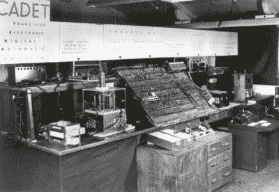
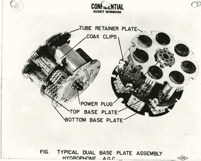
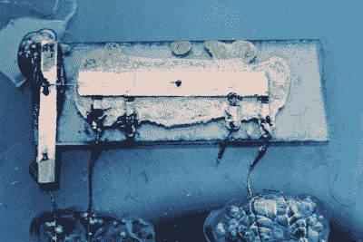
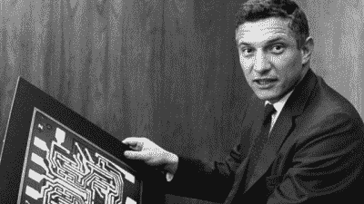
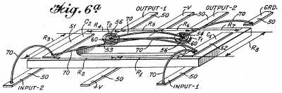
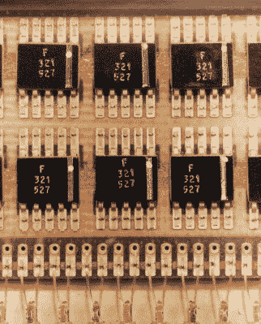
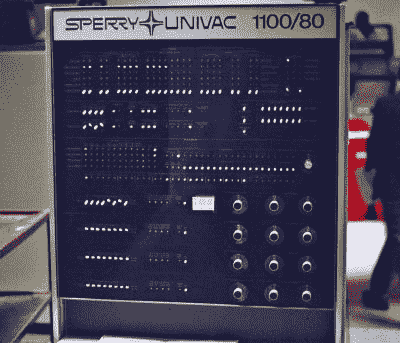

# 集成电路是如何产生的

> 原文：<https://hackaday.com/2017/11/07/how-the-integrated-circuit-came-to-be/>

俗话说，后知后觉是 20/20。你可能会感到惊讶，今天我们都知道并喜爱的微芯片远不是一个显而易见的想法。当时探索的一些将更多组件塞进更小区域的途径现在看来很奇怪。但是谁没有经历过这种事后诸葛亮，即使是在我们自己的板凳上。

让我们像任何好的工程挑战一样开始微芯片的故事，通过潜入当时存在的计算机器复杂性暴涨的问题。

## 问题是:数字暴政

[ENIAC 计算机](https://en.wikipedia.org/wiki/ENIAC)包含大约 20，000 个真空管和大约 90，000 个其他组件，所有这些都使用 ~~5，000，000~~ 500，000 个手工焊接接头连接在一起([【托马斯·黑格】告诉我们](https://hackaday.com/2017/01/31/eniac-the-way-we-were/)虽然 5，000，000 个被广泛报道，但实际数字约为 500，000 个。).到 1956 年，每两天就会有一根管子烧坏，需要 15 分钟才能找到。所有这一切意味着最长的连续运行时间只有不到五天，这与今天的计算机相差甚远，因为它们的寿命都是持续运行的。

Harwell CADET computer

锗晶体管，这个麻烦的真空管的继承者，在 20 世纪 40 年代末被发明，随后在 1955 年被硅晶体管发明。到 1955 年，第一台全晶体管计算机[哈威尔学员](https://en.wikipedia.org/wiki/Harwell_CADET)发布。然而，它只使用了适度的 324 点接触晶体管。尽管如此，计算机从真空管向晶体管的转变已经开始，新晶体管的低功率要求和低热量意味着计算机可以做得更强大、更复杂。

为了最小化复杂性，硬件[被分解成模块](https://en.wikipedia.org/wiki/Tyranny_of_numbers)。几个模块可以一起工作，作为一个加法器。然而，每个模块都是电路板，必须手工焊接。这使得他们容易失败。此外，这些模块必须用大量电缆和它们的接头连接在一起，这是另一个故障源。

这些由计算机的数量和复杂性以及由此产生的尺寸和重量引起的问题被称为“数字暴政”，被视为向更复杂电路发展的障碍。

然而，哪里有问题，哪里就有解决方案。正如你将会看到的，有些毫无进展，有些成功超出了工程师最疯狂的想象。

## 无处解决

解决高故障率的一个办法是给电路增加冗余。例如，收音机会有一个额外的内置电路。但这只是使整个电路更大，而尺寸已经是一个问题。

Project Tinkertoy – Hydrophone

美国陆军倾向于一种涉及微型模块的解决方案，其中每个电子元件将存在于一个小的陶瓷方块上，然后可以连接到其他类似的方块上，就像拼装积木一样。美国海军在修补玩具项目中也有类似的解决方案。

一些解决方案实际上涉及到制造集成电路，但毫无进展。在德国，1949 年，西门子公司的 Werner Jacobi 申请了一项与 IC 非常相似的[专利，IC](https://worldwide.espacenet.com/publicationDetails/originalDocument?CC=DE&NR=833366C&KC=C&FT=D&ND=&date=19520630&DB=&locale=en_EP)由五个晶体管组成，位于一个公共基板上，作为一个小型廉价助听器的三级放大器，但它并没有导致任何商业用途。同样，英国皇家雷达研究所的 Geoffrey Drummer 在 1952 年提出了集成电路的想法，但英国军方无法想象它的用途，英国工业界也不愿意投资它。

## 杰克·基尔比在德州仪器的解决方案

杰克·基尔比在德州仪器(TI)的集成电路确实带来了一些东西。杰克最近加入了 TI，并不愉快地致力于美国陆军的微模块解决方案——不愉快是因为他是一名工程师，喜欢解决正确问题的解决方案。他认为数字暴政问题是一个有太多组成部分的问题。微型模块并没有减少组件的数量。

First integrated circuit. Photo [courtesy of Texas Instruments](http://www.ti.com/corp/docs/kilbyctr/downloadphotos.shtml)

TI 投入了大量资金用于晶体管的半导体研究，学习如何提纯和添加杂质。所以他想知道是否可以用半导体找到解决方案。他认为你可以制造电阻和电容。一旦他得出这个结论，他突然想到了他的想法:用一种材料把所有的电路做成一个整体。结果是把问题浓缩到一个单一的部分。

所以在 1958 年 7 月 24 日，他做了任何一个优秀工程师都会做的事，他在笔记本上写下了他的整体想法。当他把笔记给招他到 TI 的威利斯·阿德考克看时，他获准尝试制作一个电阻器和一个电容器，他做到了。这让他获得了绕场一周的许可。他决定制作一个相移振荡器电路，一个包含电阻、电容和晶体管的电路，共同输出正弦波。

到 1958 年 9 月 12 日，他准备展示它。[组件由](http://www.ti.com/corp/docs/kilbyctr/jackbuilt.shtml)一块 7/16 英寸长、1/16 英寸宽的锗衬底制成，粘合在玻璃载玻片上以保持平整。电线把这些部件连接在一起。在一个实验室里，一群高管聚集在他和他的微型设备周围。他调好示波器，按下开关，一个完美的绿色正弦波蜿蜒不断地穿过示波器的屏幕。已经找到了一个解决数字暴政的好办法。

## 罗伯特·诺伊斯在飞兆半导体的解决方案

“Robert Noyce in 1959” by Intel Free Press CC BY-SA 2.0

当罗伯特·诺伊斯提出他的解决方案时，他是飞兆半导体的联合创始人。但与基尔比不同的是，诺伊斯并没有通过直击问题来解决。他对这个问题想了很多，但毫无进展。

然后，1958 年，同样在飞兆半导体工作的 Jean Hoerni 提出了[平面工艺](https://www.google.ca/patents/US3025589)，这是一种通过在硅片上覆盖一层氧化硅来保护晶体管的方法。Fairchild 的专利律师决定扩大该工艺的专利范围，并要求 Noyce 提出其他用途。他这样做了几天，每次都和另一位联合创始人戈登·摩尔在黑板上回顾他的想法。

首先，诺伊斯想到如何将细导线穿过氧化硅层连接到晶体管，氧化硅层将导线固定在适当的位置。然后他想，为什么要用电线。为什么不直接在氧化层上印刷铜线呢？但是后来他更进一步，问道为什么不用这些印刷铜线把晶体管连接在一起呢？最后他问自己，为什么只停留在晶体管上。为什么不把电阻和电容也做出来，做成一个完整的集成电路呢？

从这些想法中，他想出了一个解决数字暴政的方法。到 1959 年 1 月 23 日，他关于集成电路的想法写满了他笔记本的四页。

因此，德州仪器的杰克·基尔比和飞兆半导体的罗伯特·诺伊斯独立发明了集成电路。

## 专利问题

正如你所料，随着两个独立的发明家，专利战接踵而至。

Kilby 和 TI 的其他人已经做了许多改进，将元件放在一个共同的衬底上，但是他们没有解决将它们连接在一起的问题。他们仍然使用细金线。到了为专利绘制图纸的时候，他们所要做的就是用金线在空中“飞行”来连接组件。但是为了以防万一，他们在[专利](https://www.google.ca/patents/US3138743)中增加了一段关于在氧化硅层上蒸发的可能性

> “然后，可以在绝缘材料上放置金等导电材料
> ，以进行必要的电路连接
> 。”

Flying wires drawing from US patent 3,138,743

Fairchild 比 TI 晚几个月提交申请，但他们的[专利](https://www.google.ca/patents/US2981877)在 1961 年 4 月 26 日更快地通过了系统。当然，一场战斗随之而来。到 1969 年 11 月，裁决是基于 TI 专利中的措辞做出的，特别是关于如何将黄金应用于绝缘材料的“规定”一词。有人认为,“规定”没有明确的含义。在飞兆的专利中，他们使用了“坚持”这个词。有人认为，在 TI 专利图纸中的飞线和氧化层上的布线之间，没有人能够基于 TI 的专利建造集成电路。裁决结果对费尔柴尔德有利。

但他们各自笔记本上的日期显示，是基尔比先想到这个主意的。这两个人的性格如此，无论如何他们都互相信任。

## 美国宇航局和军方的关键资金

Flatpack ICs used in the Apollo guidance computer

当 Fairchild 和 TI 在 1961 年开始发布 IC 产品时，一个包含几个晶体管、二极管和电阻的 IC 价格为 120 美元。所以没有人急着去买。然而，没有更高的销售额，就不可能开发出更好的降低价格的生产技术。

部分原因是太空竞赛挽救了局面。人们需要一种制导和导航系统，其中包括一台能快速引导火箭穿越不同大气层并精确着陆月球的计算机。当然，那台电脑必须很轻。为此，政府愿意承担高昂的代价。

正如已经指出的，美国军方也一直在用他们的微型模块和修补玩具项目解决数字暴政问题，但收效甚微。防御系统，如[民兵导弹](https://en.wikipedia.org/wiki/LGM-30_Minuteman#Minuteman-II_.28LGM-30F.29)，需要紧凑和轻便的电路。当然，军方的财力也足以支付高昂的价格。因此，刚刚起步的集成电路产业将军方作为第二个客户。

因此，美国国家航空航天局和军方提供了必要的销售，到 1971 年，芯片的平均价格为 1.27 美元。他们也证明了该产品是有效的。

## 新的市场接管

UNIVAC 1100/80

集成电路开始慢慢找到用途。1964 年，UNIVAC 1108 计算机的集成控制寄存器堆栈使用集成电路实现，但直到 1972 年推出的 UNIVAC 1110，许多分立逻辑才被 TTL 集成电路取代。1969 年的 [Burroughs 6500](https://en.wikipedia.org/wiki/Burroughs_large_systems#History) 使用了[混合集成电路](https://books.google.ca/books?id=PWHa1jDUSdQC&pg=PA90&lpg=PA90&dq=burroughs+6500+integrated+circuit+chip&source=bl&ots=8zx2RDh2aV&sig=el1rWb49djwqBoI3e6XidsKKHrU&hl=en&sa=X&ved=0ahUKEwi3uY2M4aDXAhVW02MKHYfrC6QQ6AEIQjAI#v=onepage&q=burroughs%206500%20integrated%20circuit%20chip&f=false)，将分立的晶体管和集成电路结合在一块基板上。

诺伊斯和摩尔在 1968 年创立了英特尔公司，在那里他们追求存储芯片。他们的 1 KB 存储芯片在第一年销量很小，但到了 1973 年，4 KB 芯片的销售额达到了 6000 万美元。

1971 年，英特尔还发布了第一款微处理器芯片 4004 T1。与此同时，日本在 1970 年发布了第一台使用集成电路的袖珍计算器。1971 年发布的佳能 Pocketronic 计算器是基于 Kilby 在 20 世纪 60 年代进行的代号为 Cal Tech 的 a TI 项目。集成电路已经起飞。

但是集成电路下一步将走向何方？我们自己的[Brian Benchoff]带领我们了解 3D 集成电路的过去、现在和未来。

## 本文的来源

本文通篇都是对资源的链接，但文章的核心来自 T.R. Reid 写的非常有趣的书*【芯片】。从托马斯·爱迪生对热离子发射的探索到 2000 年 12 月 10 日杰克·基尔比获得诺贝尔物理学奖，它将为你讲述一个故事。注意，这本书有时很难放下。*