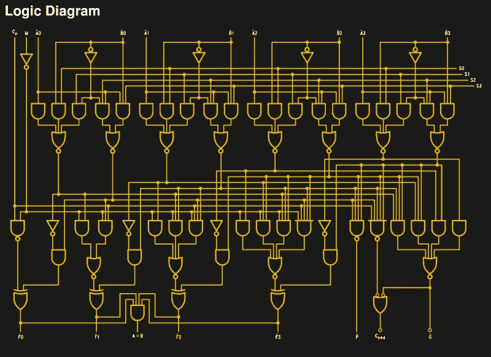

# 庞大的 74181 是一个经典的 ALU 你其实可以理解

> 原文：<https://hackaday.com/2017/11/18/huge-74181-is-a-classic-alu-you-can-actually-understand/>

你再也买不到全新的 74181 了，它们已经停产多年了。然而，一切还没有结束，因为[Dave 的开发实验室]已经使用现代的单门 74 系列芯片在印刷电路板上制作了一个复制品。

我们听到你问，你究竟为什么想要一个近 50 年前过时的逻辑芯片的超大复制品？答案在于教育。如果你想通过一个现代的例子来学习微处理器的内部结构，比如你正在阅读的这个设备的电源，你会发现这是一项艰巨的任务。六十多年来，计算机技术的进步带来了性能的增强，让你的智能手机中有了一台超级计算机，但代价是当代微处理器是一台极其复杂的机器，你无法深入了解。

Simple enough to work your way through the logic

对于学习微处理器内部结构的学生来说，起点往往是过去。20 世纪 70 年代早期的技术掌握了理解现代处理器的基本原理，但仍然足够简单，初学者可以完全掌握。寄存器、指令解码器、计数器和算术/逻辑单元或 ALU。几十年来，74181 作为一种在 20 世纪 70 年代初的小型机上就能找到的一体化 4 位片上 ALU，代表了教授这些器件操作的最便捷方式。各个年龄段的电子工程师和计算机科学家在获得资格证书时都会遇到它们。

181 的 PCB 版本忠实地遵循原始版本，但现代 74LVC 门的布局与芯片电路图相同，led 显示电路不同部分的逻辑状态。因此，当它被用来教授 ALU 操作时，它可以以一种真正的 74181 永远不会做的方式详细地显示设备的每个部分。

如果 74181 引起了您的兴趣，我们之前已经为您带来了[Ken Shirriff]使用令人惊叹的硅图像对该器件进行的详细逆向工程。