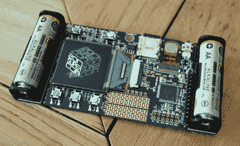

# 获得 2017 年黑客日超级大会徽章

> 原文：<https://hackaday.com/2017/11/08/get-your-hands-on-a-2017-hackaday-superconference-badge/>

我们昨天刚刚拿到了一批热门的 Hackaday 超级会议徽章，坦率地说，它们棒极了。由于伟大的制造合作伙伴和[迈克·哈里森]的出色设计，我们最终制造缺陷太少，徽章太多。这算不算一个好问题？

但是我们的收获就是你的收获！我们有足够的徽章给每个来参加活动的人，我们正在 Tindie 上出售剩下的徽章。

 如果你没注意到的话，[这个徽章是一个数码摄像机](https://hackaday.com/2017/10/11/building-the-hackaday-superconference-badge/)，或者至少这就是它将如何开始它的生命。它有一个摄像头传感器，足够的板载处理能力来处理图像数据，一个屏幕和 SD 卡存储。它也有各种各样的按钮，更重要的是，原型空间和大量的针供您使用。关于细节，请参见[徽章的 Hackaday.io 项目页面](https://hackaday.io/project/27427-camera-badge-for-supercon-2017)。我们已经编写了明显的应用程序，添加了一些具有挑战性的谜题，现在我们把它们交给你。

### 黑客徽章历史

你会用它们做什么？这还有待观察。我们第一次穿上 Supercon，我们做了你见过的最好的徽章，一个空白的原型板和一大堆零件。加入一群热情而有创造力的人，魔法就会出现。去年，[Voja]制作了一个有技巧和更多资源的[徽章，增加了 blinkies，IR 和加速度计，我们看到](https://hackaday.com/2017/01/10/what-makes-the-perfect-hardware-badge/)[黑客利用了每一个功能](https://hackaday.com/2016/11/21/showing-off-the-badge-hacks-from-supercon/)。今年，我们更进一步。现在轮到你了。

超级会议将于本周末举行，数百名黑客将染指这块开放硬件。一些奇妙的事情肯定会发生。如果你不能做到，但仍然想一起玩，现在是你的机会！

对于硬件黑客来说，会议徽章是一个奇妙的游乐场:它们是一个足够小的项目，可以完成，但也足够大，可以做一些有趣的事情。有些徽章，比如布莱恩·本考夫为汀蒂设计的[徽章，非常简约。其他的，像](https://hackaday.com/2017/10/06/bom-cost-optimization-and-tindie-badge-engineering/)[这个 DEFCON](https://hackaday.com/2017/07/18/def-con-badgelife-someone-finally-did-it/) 的非官方徽章，是四轴飞行器。在这两者之间，有艺术和美学的[和单纯的聪明的空间。别忘了实用性。2017 年第一层会议徽章(](https://hackaday.com/2017/07/12/hands-on-new-andxor-unofficial-def-con-badge/)[在 Hackaday.io](https://hackaday.io/project/13262-layerone-2017) 上)很容易转换成 [OBD II CAN 总线嗅探器](https://www.tindie.com/products/charliex6/obd-ii-can-bus-cable-for-layerone-2017-badge)或[视频游戏机](https://www.tindie.com/products/charliex6/usb-controller-for-layerone-2017-badge--microsd/?pt=full_prod_search)——你的选择。

Hackaday 喜欢定制硬件，像这样的徽章不仅仅是一个充满元件的 PCB。他们是他们首次亮相的活动中的一部分文化。我们很高兴能与今年未能参加 Supercon 的一些黑客分享这一点。