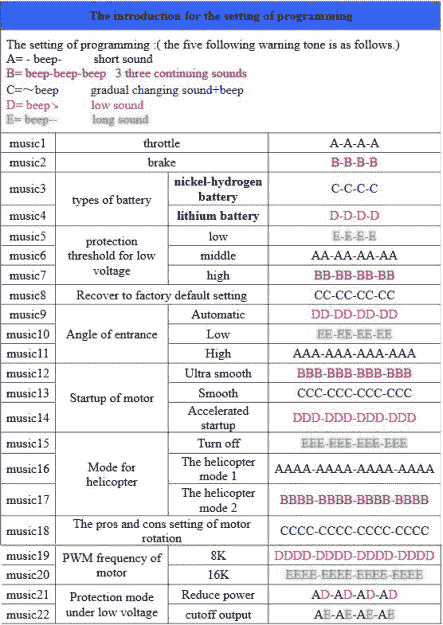
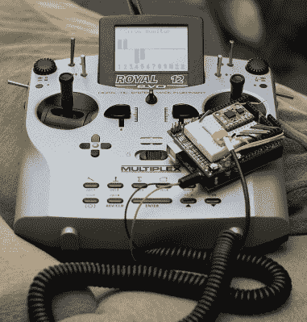

# 商品钢筋混凝土控制器能保持相关性吗？

> 原文：<https://hackaday.com/2017/11/20/can-commodity-rc-controllers-stay-relevant/>

想象一下过去一些无线电控制飞机的狂热分子，必备的巨大控制器挂在一根带子上，伸长脖子看天空中嗡嗡作响的小点的轮廓。有点老套了吧？那些大的发射器又重又贵，而且很难改装，但这只是挑战的一部分。此外，外形必须在一定程度上保持刚性:带万向节的盒子，或者对于 3 通道控制器，带大锅的手枪式握把，看起来像一个劣质的赛车车轮。

随着 RC 功能发生如此多的变化，以及定制电子产品在如此多不同应用中的兴起，商用 RC 控制器还能保持相关性吗？我们正面临着这样一个时代，在钢筋混凝土设备上投资最多的人也是最有可能想要的人，并且知道如何为他们快速发展的设备定制。只有有人站出来满足这种需求才有意义。

### 笨重的垃圾

RC 爱好充斥着糟糕的硬件和软件。它来自一个重视廉价而非开放的时代，几乎没有标准。每个厂商都有自己的做事方式。

像许多昂贵的爱好一样，制造商不重视 RC 的开放性或定制化——也许复杂性是一种资产，当参与者征服界面时，他们会有一种优越感。基本上，没有手册就不会给录像机编程的人都被排除在 RC 之外。

让我用一句话来说明商品遥控装置的糟糕之处:哔哔声菜单。这些是多级菜单系统，使用声音作为唯一的反馈机制，几乎被普遍厌恶。

许多 RC 设备很难使用，因为它来自一个人们真的不使用计算机(更不用说移动设备)来连接和修改他们的 RC 组件的时代。低端的 RC——便宜的东西——根本不需要电脑。“哔哔”菜单是与电子速度控制器(ESC)等“无头”组件一起工作的现实。

当您进入配置模式时，它开始列出菜单选项，一次一个，不同的提示音或提示音数量表示不同的选项。您可以使用控制杆来浏览菜单。你必须密切关注，以免跳到错误的菜单，开始重新配置你已经微调过的东西。

哔声菜单可以通过特殊的硬件编程设备导航，其中 led 表示各种菜单选项。也有软件包做同样的事情，尽管一些低端的软件有非常粗略的 PC 专用应用程序。谁想经营一家？他们从某个神秘网站下载了 EXE 文件？不是我。你没有解决问题，只是让一台机器代表你处理它，没有任何增加功能的暗示。

### 别黑我，兄弟

除了导航菜单，大多数 RC 制造商不希望你以任何方式破解或修改他们的设备。平心而论，大多数商品电子产品都是这样工作的。你要求黑掉你烤面包机的固件吗？但无人机和烤面包机之间的关键区别是，有一个庞大的黑客群体希望玩 RC 硬件。现在还有比无人机更大的东西吗？

对于商用遥控设备来说，软件的唯一目的似乎是将人们束缚在生态系统中。允许的修改是根据你想要的油门、副翼、方向舵和升降舵来重新配置操纵杆。更糟糕的是，商用控制器是为特定格式设计的——四轮飞行器、漫游车、直升机、飞机。如果你改变你的格式，你也必须修改你的硬件。例如，油门杆不像方向舵/副翼控制器那样自动居中，有些有棘轮来帮助保持它们在适当的位置。如果你想把那根棍子用在别的地方，你必须拆开箱子，希望那根棍子能被修改。

所有这些都是基于以平面为中心的配置，但是如果你有一些不类似的项目呢？忘掉四轴飞行器和固定翼飞机吧。你应该可以用遥控器控制任何东西。

黑进去就是了。

### 更换或刷新

 不用说，黑客们已经接受了挑战，让这些控制器更好地工作。在最简单的层面上，发射器只是一些连接到微控制器和发射器的控制杆、开关和按钮。也许有一个液晶显示器。在处理神秘芯片时，通常更换主板比更换硬件更有意义。我们不是在谈论强大的处理能力。即使像 Arduino UNO 这样基本的东西也有很多功能。

例如，有很多 RC 控制的 Arduino 项目。【Ryan Boland】使用示波器[弄清楚他的发射器和接收器是如何工作的](https://ryanboland.com/blog/reading-rc-receiver-values/)，他的项目基于 RC Arduino 乡亲们关于[使用 UNO 解释 RC 接收器信号的文章](http://rcarduino.blogspot.com/2012/01/how-to-read-rc-receiver-with.html)。如果你的微控制器可以监听模拟和数字引脚并控制 ESC，它就可以运行无人机。

### 艰苦的工作已经完成了

也就是说，越普通的发射机型号越容易被黑客攻击。有了 pin 图和论坛讨论的现有知识库，一切都会变得更容易。还有一些有趣的项目。

在有机发光二极管的支持下，对他的 HK-T6A 进行了彻底的改装。在 Turnigy 方面，他们的 9X 控制器是最受欢迎的控制器之一，具有 LCD 显示屏和 9 个频道。[dave1993]正在一个他称之为 core9x 的项目中建造他自己版本的 9X。

简单地给控制器增加一块 ESP32 板就能立刻改变你的飞行方式。另一个有用的项目是 [DIY 多协议 TX 模块](https://github.com/pascallanger/DIY-Multiprotocol-TX-Module)，旨在让发射机与不同品牌的接收机进行交互，而不是被困在发射机制造商的生态系统中。

### 解锁潜在功能的固件项目

然而，并不是每个人都想这么麻烦。原来有一个更简单的方法:刷新固件！无线电的许多限制都是由软件驱动的。例如，3 信道无线电可以具有与 9 信道无线电相同的处理器和 RF 模块。

许多中等以上质量的收音机都有相当健壮的芯片，这意味着在微控制器还在的时候刷新它的固件更有意义。OpenTX 就是这样一个项目，为基于 ARM 的发射机创建了[固件，包括流行的 Turnigy 9x。FrSky 甚至选择它作为他们 200 美元的 Taranis 9x 收音机的新操作系统，证明了开源可以与行业合作。](http://www.open-tx.org/)

OpenLRS 是另一个开源固件项目，[专注于 OrangeRX 和鹰眼发射机](https://openlrsng.org/)。同时， [DeviationTX](https://www.deviationtx.com/) 专注于 Walkera Devo 收音机。另一个很酷的项目试图[刷新 FlySky 的 M0+芯片](https://github.com/opentx/opentx/wiki/FlySky-FS-i6-Development)——这些项目中我最喜欢的部分是参与者费力地映射所有微控制器的引脚——M0+的 Freescale MKL16Z64VLH4 上的 64 个。

重新刷新可以切换无线电上的射频模块，改变频道的数量和目的，以及所有其他有助于普通人控制无人机的一种配置，但黑客发现这种配置非常有限。

### 与此同时，商用收音机也在不断发展

让我们回到中心问题。遥控控制器还能继续存在吗？

 有可能老式的发射机只是有点乏味。对于飞行控制器驱动的飞行(无人机比赛除外)，使用操纵杆的技能已经退居其次，随着组件的不断缩小，一些较大的盒子开始类似于一个老式的学校遥控器，质量是基于它有多少个按钮，而不是界面的实用性。

笔记本电脑和移动设备已经扩大了它们在无人机控制中的作用，突显出视频在商业中发挥着越来越大的作用。作为回应，Turnigy 创造了类似 Turnigy Evolution 的游戏控制器风格的收音机(见右图)。它有一个大屏幕，又轻又方便，非常适合 FPV。它几乎没有与起落架和灯光等相关的按钮和开关，而是依靠触摸屏来实现这些功能。它有五种型号的存储器，允许你在不同型号之间切换。它有一个 USB 端口，所以它可以控制飞行模拟器和给电池充电。在 Hobby King 上只需 40 美元，这是一个诱人的购买。

也就是说，Evolution 打包了通常的工厂固件，并保持封闭。尽管这个价位的进化可能很棒，但只要它被锁定，它仍然无法发挥其全部潜力。要是这些无线电制造商能从这么多不得不接受开源硬件和软件的公司那里得到一点启示就好了！借你的声音，让我们知道开源控制器固件可以改变我们飞行方式的重要方式，请在下面留下评论。

【被黑的发射机照片由 [syvwlch](https://www.flickr.com/photos/27164521@N00/1813373215 "Go to syvwlch's photostream") ，知识共享。]