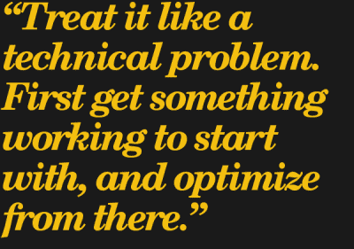
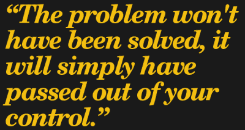

# 合同生活:我要收多少钱？

> 原文：<https://hackaday.com/2017/11/30/life-on-contract-how-much-do-i-charge/>

如果你对成为顾问或承包商的技术方面感到满意，但不确定服务收费，你并不孤单。“我收多少钱？”这是一个棘手的问题，讨论金钱可能会令人尴尬，有时甚至是禁忌，这使得问题变得更加棘手。

因此，这个问题因为超出了自己的舒适区而被推迟的情况并不少见。技术人员尤其容易遭受“如果你建造了它，他们就会来”的心态；我们把事情的技术方面都搞清楚了，只是假设剩下的部分——客户、资金等等——会在之后到位。如果你幸运的话，会的！但是还是做一些规划比较好。

简单明了的答案是“视情况而定”和“不管市场承受多少”，但当然，这本身毫无帮助。是时候让整个入门过程不那么不透明了。

多年来，解决自己问题的坚定决心给了我很多犯错误和低效率的机会；我最终找到了一个适合我的过程，但我也碰巧认为它相当普遍适用。希望，分享我学到的经验将有助于使你自己的计算过程更容易，或者至少使不可避免的错误成本更低。

## 把它当作一个技术问题

有条不紊地处理金钱问题，并尽早开始思考。你拖得越久，就越有可能抓住你遇到的第一个数字，然后用它来跑。这感觉像是进步，但是问题并没有得到解决，它只是脱离了你的控制。

好消息是，虽然设定完美的*T2 价格是一项不可能完成的任务，但通过遵循几个步骤，不难得出可行的*T4 价格。这就是目标:一个明智的起点。**

以下是最直接影响你的工作收费的因素:

*   你的服务或产品是什么，它的市场是什么样的。
*   你自己工作的客观价值(理想的表达方式是每小时的工资)。)
*   你所做工作的责任和风险程度。

好消息是，你不需要一开始就把所有事情都做得完美无缺。你会犯错误，效率低下；试着用你可以从中学习的方式去犯错误，并且不要犯两次同样的错误。首先从一些可行的东西开始，并在此基础上优化。

## 定义你在做什么

首先，您必须定义您提供的服务。描述你打算为客户做什么服务，并根据实际完成的工作类型来定义它们。如果你做不止一种工作，坚持每次做一种。

## 确定你工作的价值

你的价值将是你正在做的工作的客观“公平市场价格”，由你带来的任何特殊知识或特殊优势进行修改。修改后的价格是你在决定收费时的一个基准，它也将为任何具体工作的谈判提供结构。下面有两种方法可以找到你计划提供的任何服务的市场价格；使用最适合你的情况。

**1。找到做类似工作的人，看看他们收费多少**

最简单的方法是找同一个地区做相同或相似工作的人，了解他们收费多少。如果你幸运的话，你会遇到一些人，你可以简单地询问他们，并得到坦率的回答和反馈。否则，你可能会发现人们在讨论钱的时候有点谨慎。杰克·查普曼在他的书《谈判你的薪水》中给出了一个从人们那里获得这类信息的有用策略:提供一些回报。告诉他们你正在做一项本地调查，调查该行业的服务收费是多少，如果他们同意与你交谈，你将与他们分享你的匿名调查结果。使用 Google Forms 创建一个简单的调查，您可以单独通过电子邮件发送出去。当你有结果时(五六个就可以了)，与受访者分享匿名报告。提供回报的基本交易——即使只是分享你学到的东西——对于与人交往是很有用的，尤其是那些你与之没有关系的人。

**2。找到具有相似责任和风险水平的工作，找出这些工作的报酬**

也许你的工作太独特、不寻常、专业化或跨学科，以至于没有同行或很容易被定义，而以前的方法是没有用的。在这种情况下，请改用下面的方法。在相同或相关的行业中寻找与你将要做的工作有相似责任和风险的工作。找到并记录这些工作的工资范围(像 glassdoor.com 的[或 indeed.com](http://www.glassdoor.com)的[这样的网站会派上用场),并根据这些数字来工作。即使工作描述不匹配，在一个行业内，职责和风险相似的工作通常在薪酬方面是可比的。](http://www.indeed.com)

**3。根据您添加的任何特定个人值进行修改**

你收集的数据应该会给你一个数值范围。对这些研究值进行平均，得到一个粗略的基线。然后根据以下内容进行修改:

*   你个人有什么额外的价值吗？(无法量化的东西，比如“冷酷的献身精神”不算。)考虑一下你可以增加的效率，或者由于专业知识、培训、经验、关系或其他优势，你可以消除的风险。你拥有的优势越多，你的利率就应该越接近你研究的区间的*上限*。
*   如果你缺少什么会增加你工作的效率或者增加客户的风险，修改可能是负面的。问问你自己对你将要做的工作中的未知有多了解。一般来说，你面对未知越不自在，你的经验就越少，你就越应该向你研究的比率的较低一端调整。
*   如果您研究的费率是针对员工工资的，您收取的费率应该比这些费率高*。原因是，作为一名顾问，你要负责以下部分或全部:工具、培训、工作空间、车辆、设备、税收、保险、健康福利和其他成本。这些是雇主通常代表雇员支付的费用，他们通过雇佣顾问来避免这些费用。因此，你的税率应该提高多少？这取决于太多不同的因素，无法在这里完全解决，但可比员工时薪的 1.2 至 1.6 倍是一个合理的范围。*
**   市场会承受什么，要看当地市场。在城市 A 定价为 100 美元/小时的服务在城市 b 可能只有 60 美元/小时。如果您研究的费率不是来自您所在的地区，请查找他们所在地区与您所在地区之间的生活成本差异，并根据该金额修改他们的数字。这不是最优的，但这是一个合理的方法来调整地区差异。*

 ***4。市场价格+附加值=您的基准价格**

重要的是要记住，这里的目标是确定一个合理的小时费率，让你可以开始工作，同时避免犯一个明显的错误，导致轻微的尴尬。在你的职业生涯中，完善你所做的事情和你的工作收费将是一个持续的过程。

总之，你的个人价值应该是一个基准时薪，这个基准时薪来自于你所在地区类似工作的成本(如果你是一个经验丰富的专家，接近上限；如果你不是，接近下限)，再加上你的特殊优势或知识。出于前面解释的原因，该小时工资应高于可比员工的小时工资。

如果你觉得你可以通过解释你是如何得出你的价格的，为什么它有意义，来证明你对客户的价值，并且可以展示你所做的研究来支持它，那么你就准备好了。

## 需要时调整你的工作和评分

为你的服务设定一个基本价格是很重要的，但是为满足客户需求而提出工作和价格的过程通常会涉及一些谈判。这超出了本文的范围，但是不要害怕在定价和服务上有所创新。例如，如果低成本对你的客户来说是最重要的，他们可能会愿意自己做一些工作(比如装配、测试或修整)。找出客户认为重要的东西，用你的创造力瞄准那些领域。你也可以协商交换服务或使用设备来弥补不足。

这些只是在不降低价格或费率的情况下降低成本的几种创造性方法。除非你仔细考虑过，否则不要轻易降价。

## 保留记录，这样你就知道哪里需要改进

记录和数据你的决定，以及为什么。原因很简单:你的目标是做更多有效的事情，减少或消除无效的事情。没有数据，你将无法知道什么是有效的，什么是无效的，你的决定将不得不来自主观的、不可靠的东西，如习惯和正确的预感。

如果你认为你可以从实验中学到东西，不要犹豫。可能有必要尝试不同的方法来找到有效的方法，尤其是当你提供一种新的服务时。例如，我的一个同事为房地产经纪人提供了房地产的无人机镜头。他一开始收取的费用与美国主要大都市的无人机摄影师收取的费用相同。他很快发现，那里的人们愿意支付的价格与这里的人们愿意支付的价格非常不同。他最终确定了当地市场愿意承受的价格，但这只是基于数据的谨慎调整的结果。

首先专注于为你的服务确定一个至少是可持续的价格，然后寻求优化。你的错误没有一个是永远的，随着实践和经验的积累，一切都会变得更容易。

## 想想被遗忘的和意想不到的

总是问你自己你可能忘记了什么，并试图解释那些意想不到的事情。如果工作需要材料，谁支付费用？费用包括在费用里吗？你将如何得到补偿？这个项目需要不同种类的工作吗，比如商店时间和编程时间，你会按相同的费率还是不同的费率收费？如果事情出乎意料地出错，您必须重新开始，该怎么办？

考虑意想不到的事情，但不要让你的思维爆炸成一个无限分支的雪崩。只要你没有让自己完全陷入 T2 的思维中，大多数无法预料和不受欢迎的惊喜都不过是学习的经历。

有了经验，一切都会变得更容易，但是你现在能做的最好的事情就是[学会准确估计项目时间](https://hackaday.com/2016/09/09/life-on-contract-estimating-project-time/)。通过遵循良好的项目评估过程，您将避免许多常见的陷阱。

作为工作中可能出现的意外问题的例子，建立数百个 Hackaday Superconference 2017 徽章的[经验](https://hackaday.com/2017/11/15/the-perils-of-developing-the-hackaday-superconference-badge/)有许多好的经验。

关于如何给自己的作品定价，你有什么建议或知识可以分享吗？关于早期成功或失误的故事？不要害羞，在评论中告诉我们。*