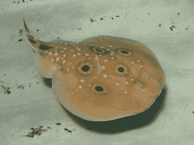
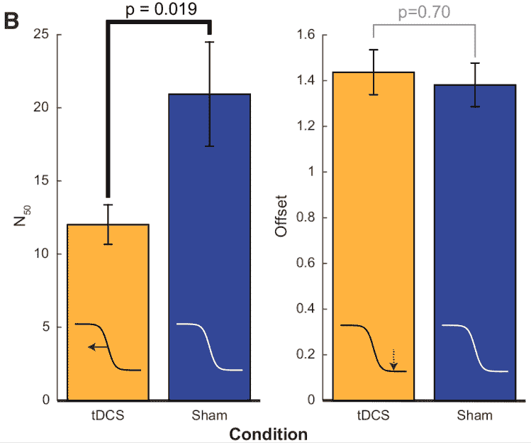

# 令人震惊的是，DARPA 的大脑刺激器可能不完全是胡说八道

> 原文：<https://hackaday.com/2017/11/13/shockingly-darpas-brain-stimulator-might-not-be-complete-nonsense/>

当你听到电击疗法这个词时，你会想到哪里？使用电流治疗各种医学疾病有着悠久而有争议的历史。我们对电的医疗应用的着迷已经产生了从最令人震惊的专利药物到像起搏器和自动体外除颤器这样的救生设备的一切。

我能找到的最古老的参考文献是在公元 43 年用鱼雷鱼据说治愈了头痛、痛风等等。顺便说一句，*鱼雷鱼雷*是一个令人敬畏的物种名称。

Dosage: Apply live fish as needed to face? [Source](https://en.wikipedia.org/wiki/Common_torpedo)

最近，人们对经颅直流电刺激(tDCS)产生了兴趣。本质上，这是一种技术，通过这种技术，你可以在头上有策略地放置的电极之间传递电流(通常约为 2 毫安)。这样做的确切原因有点不清楚；不同的期刊文章建议改善认知、学习和/或各种疾病的潜在治疗。

我想我们这里的大多数人都花了很多时间学习。一个简单的、非侵入性的设备可以加速这个想法非常有吸引力。我们已经报道过[一些人](http://hackaday.com/2017/03/31/transcranial-electrical-stimulation-with-arduino-hot-glue)建造他们自己的[这样的设备](http://hackaday.com/2013/05/28/shocking-your-brain-and-making-yourself-smarter)。

不幸的是，我们想成为真实的是无关紧要的。从表面上看，这看起来像是 DARPA 资助的灵丹妙药，没有明确的作用机制。[各种商业产品](http://thebrainstimulator.net)正在销售，暗示(但像往常一样，不要直接声明)tDCS 对治疗几乎所有疾病都有用，大量使用“证明”。

虽然在一些国家，医生可以开出 tDCS 来补充中风康复疗法，但出于标签外的目的，你也可以在脸上敷一条鱼。让我们深入挖掘现有的文献和产品，看看我们是否能找到隐藏在炒作中的承诺。

## 到底是什么问题？

在进一步的研究中，我发现了一篇写得很好的评论文章，指出了 tDCS 研究中的几个重要缺陷。这项检讨界定了目前贸易发展局研究不足的五个主要范畴。

在不同的研究中，tDCS 治疗报告了实验组之间和实验组内的不同反应。在被认为是潜在有用的治疗(或增强)之前，需要理解或减少这种变化。这篇综述的作者指出，这方面的工作明显不足。同一测试对象的不同测试之间也存在可变性。一些研究测量了不同日子的效果，报告了不可靠的效果，一些日子表现出认知增强，而另一些日子表现出抑制。目前还不清楚我们能期望中期或长期 tDCS 治疗达到什么样的效果。

假治疗也有问题。假治疗对于程序，就像安慰剂对于药物一样。在假治疗中，实验者只是做做治疗的动作，而不是实际应用。这就是为什么受试者(理想情况下，实验者也是)不知道治疗是否真的实施了。这被称为盲法，是临床试验的一个重要因素。在一项强有力的研究中，治疗组和对照组之间的唯一区别应该是实际的治疗。但是在 80 个 tDCS 研究中，评论者发现只有不到 15%建立了适当的控制组。

tDCS 面临的运动/认知干扰问题当然是一个奇怪的问题。一些研究将 tDCS 治疗期间或之后的精神和身体活动与任何益处的无效联系起来。如果这是真的，这就很难控制，因为很难精确控制一个主体在想什么。这似乎是一个小问题，但目前 tDCS 有时是中风康复的处方。中风康复通常包括体育锻炼。因此，除了开发更好的实验研究，了解这一潜在的混杂因素可以改善中风康复。

最后，海绵电极经常被用于 tDCS 研究。头发不是一个伟大的电导体，一些研究使用大量的盐溶液来进行所需的连接。事实证明，这使得精确控制电流流向变得困难。

总的来说，在认真对待 tDCS 认知增强之前，似乎还有一些问题需要解决。仅仅是缺少好的对照组就是一个重要的问题。

因此，当我读到今年 10 月发表在一本高影响因子期刊上的一项研究时，我感到非常惊讶，该研究详细描述了一项应对这些批评的实验。它还具有统计学意义的结果，以及相关的效应大小。这足以开始生物黑客了吗？

## 改进的方法

在他们的研究中，他们让两只不同年龄的雄性恒河猴接受针对两个不同大脑区域的 tDCS。猕猴是认知研究中最常用的动物，以更好地了解人类大脑。这些猕猴接受了视觉觅食任务，并用红外线眼球追踪来测量它们的表现。

Achievements include: beating us to space, cloned before us. Well done, dear cousin! [Source](https://en.wikipedia.org/wiki/Rhesus_macaque)

这并没有提供处理受试者之间差异的数据，尽管他们确实对每个受试者进行了核磁共振扫描，并使用这些数据建立了一个数学模型，试图确保受试者之间大脑的相同区域受到刺激。不过，测量受试者之间的差异不属于这项研究的范围，这没关系。

单个受试者治疗效果的可变性是这项研究的一个优点。受试者每天进行 1-3 组 75-100 次试验，持续多日。我无法确定论文中的确切天数，但从图 3A 来看，似乎是相当长的一段时间。随着时间的推移，结果似乎是一致的。

他们还使用假刺激(“安慰剂”)技术来建立适当的对照组。此外，他们测量了假刺激技术是否对目标大脑区域的局部场电位有任何影响，假治疗和实际治疗之间的差异非常明显。

除了要求动物在实验前和实验过程中保持坐姿，运动和认知干扰并没有真正被考虑进去。这是可以理解的，我想很难指导猕猴思考什么，所以这似乎也超出了这项研究的范围。

最后，他们没有使用海绵电极，而是选择了涂有导电凝胶的衬垫，并粘附到位。他们测量了一个可变的阻抗，但容忍了这一点，而不是把一切都浸在盐水溶液中。

总的来说，这项研究似乎已经解决了 tDCS 研究中存在的一些缺点。但是他们发现了什么？很有趣的事情，但是[在](http://futurism.com/darpas-new-brain-device-increases-learning-speed-by-40)[最近的新闻](http://uk.news.yahoo.com/headband-makes-40-better-learning-sale-within-five-years-135323569.html)中误报了。他们发现，接受 tDCS 的猕猴学习觅食任务的效率明显更高。

Figure 3B. Behavioral results. Adapted from “Transcranial Direct Current Stimulation Facilitates Associative Learning and Alters Functional Connectivity in the Primate Brain” by M. Krause et. al., 2017, Current Biology, 27, p. 5.

他们使用的测量方法叫做 [N50](http://en.wikipedia.org/wiki/N50,_L50,_and_related_statistics#N50) ，一种测量[数据连续性的方法](http://en.wikipedia.org/wiki/Contiguity)。这在心理学中被用来衡量联想学习，但 N50 分数低 40%并不等于学习速度快 40%(最近的科技新闻中经常报道)。如果使用的度量是平均值，那么报告将更加正确。

他们还提出了他们的 tDCS 结果，与一个特定的拟议行动机制一致:调节神经元尖峰的时间。此外，他们测量了局部场电位(LFP)和一些频带的功率和相干性的相关变化，观察到了加速学习。LFP 类似于我们更熟悉的脑电图(EEG ),主要区别在于它们是使用嵌入脑组织而不是头皮表面的薄电极测量的。这绝不是 tDCS 如何增强学习的完整和可测试的模型，但它看起来很像进步。

### 在商业产品中使用 TDC

当然，以上所述并不是信任现有商业设备制造商的理由。这类产品在美国的法律地位也相当有趣(免责声明:我对大多数事情都感兴趣),而且它本身已经被杂志报道过。

尽管如此，我不得不承认，我过于草率地忽视了贸发会议的潜力。它已经被批准用于治疗某些疾病，我错误地认为进一步的应用是不可能的。我仍然不会建造一个，因为有太多有效的批评，但看起来这项研究至少可以取得成果。我非常怀疑它会像以几毫安的价格将我的学习速度提高一倍这样方便，但我仍然很兴奋地看到这项研究的进展。

### 资源

此处引用的期刊文章的引文(如果有用的话)是:

Krause 等人，经颅直流电刺激促进联想学习并改变灵长类动物大脑的功能连接，当代生物学(2017)，[https://doi.org/10.1016/j.cub.2017.09.020](https://doi.org/10.1016/j.cub.2017.09.020)

你们现在可以开始参考某部电影了，你们这些疯子。