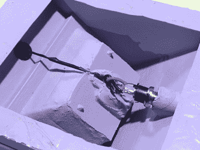

# 导电混凝土混淆电路

> 原文：<https://hackaday.com/2017/11/12/conductive-concrete-confounds-circuitry/>

你很有可能从未尝试过将电子设备嵌入混凝土中。说实话，在这一个通过提示线到达我们之前，这个想法甚至从未在我们身上出现过。毕竟，电子元件在浇注和固化过程中必须忍受的条件听起来像是一场可怕的完美风暴:潮湿、碱性，还有一堆粉碎的矿物质。

但事实证明，将电子设备嵌入混凝土的最大问题是大多数人甚至没有意识到的:混凝土是导电的。提醒你一下，导电性不是很好，但足以引发问题。[这正是 Makefast Workshop 的【亚当·库姆普夫】发现自己](http://makefastworkshop.com/hacks/?p=20171110)的地方，当时他正在为一个名为 [LightNudge](http://makefastworkshop.com/lightnudge/) 的变色气压计制作混凝土外壳。

 虽然将印刷电路板嵌入混凝土显然不可行，但【亚当】希望通过将 DC 电源插孔和电容式触摸传感器嵌入混凝土本身来简化设备的制造。不幸的是，[Adam]发现触摸传感器和电源插孔之间有一个大约 200k 欧姆的电阻；足以干扰触摸传感器工作所需的敏感测量。

更糟糕的是，随着养护过程的持续，混凝土的电阻会随着时间而变化，这可能会持续数周。由于没有可靠的方法来校准混凝土的内部电导率，[Adam]需要一种方法来将他的电子元件与混凝土本身隔离开来。

通过反复试验，[亚当]最终找到了一个便宜的方法:将他的感应垫和电线浸入五金店的丙烯酸搪瓷涂层中。它需要 24 小时才能完全固化，并涂上两层以确保没有金属暴露在外，但至少这是一个简单的修复方法。

虽然关于混凝土潜在导电性的提示本身就足够有趣，但[Adam]也提供了大量关于浇注混凝土部件的信息，这可能是一个有用的知识，可以储存起来供以后使用。我们不得不承认，最终的结果肯定比我们预期的要好得多。

这是我们遇到的第一个嵌入混凝土的项目，[但是我们不缺少其他](https://hackaday.com/2017/06/08/controlling-a-moog-werkstatt-with-a-capacitive-touch-janko-keyboard/)[电容式触摸项目的](https://hackaday.com/2012/05/27/making-capacitive-touch-sensors-with-pencil-and-paper/)，如果你[想得到灵感](https://hackaday.com/2012/08/08/making-a-game-with-capacitive-touch/)。