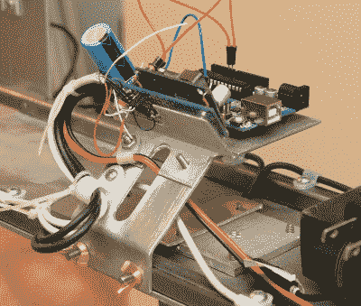

# 高速计时看起来像专业齿轮

> 原文：<https://hackaday.com/2017/11/14/high-speed-chronograph-looks-like-pro-gear/>

拍一张奔跑的小孩或宠物的好照片可能会很难，如果我们诚实的话，有时甚至静止的物体也会设法避开我们的焦点。现在想象一下，试着拍一张快速移动的东西的照片，比如子弹。试图捕捉快速移动的射弹击中物体的瞬间，对于快门按钮后面的人来说是根本不可能的。

进入弹道计时器:一种使用一组传感器门和高度精确的计时器来确定物体飞行速度的设备。每秒运行几百米的天文钟是相对常见的，但[td0g]想到了更快的东西。他发明了一种光学装置，声称可以捕捉速度高达 2 马赫的物体。通过将这款计时器与高速闪光灯绑定，[td0g]能够捕捉到令人难以置信的镜头，例如子弹打碎一杯水的精确瞬间。

 因为他找不到任何具有亚微秒响应时间的光电晶体管来检测以 1000 米/秒速度移动的小物体，[td0g]最终在光电导配置中使用 led，其中 27 VDC 反向施加到二极管上。仔细监控二极管两端的电压波动可以检测接收到的光水平的变化。为了减少干扰，[td0g]使用红外发光二极管作为他的光源，理由是如果他使用可见光范围内的东西，环境红外会更少。

这个版本真正令人印象深刻的是对细节的关注和设计中投入的大量抛光[td0g]。从支撑 Arduino 和 LCD 的光滑角度支架到光学闸门上的 3D 打印外壳，最终设备看起来像一件专业设备，其价格标签可以与二手车媲美。

对于未来，[td0g]计划升级到比他目前安装的 LM339 更快的比较器，并购买专业制作的 PCB 而不是 protoboard。在目前的状态下，这已经是一个非常令人印象深刻的套件，所以我们很想看看它“完成”后的样子。

如果你[不需要这么高端的东西](https://hackaday.com/2011/02/06/paintball-chronograph/)，但仍然想看看[事情进展有多快](https://hackaday.com/2016/05/05/35-mph-nerf-darts/)，我们已经涵盖了[天文钟的构建，以适应每一个预算](https://hackaday.com/2014/08/03/supersonic-nerf-dart-speedometer/)。