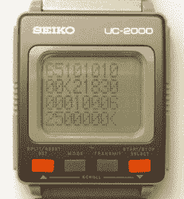

# 80 年代的智能手表终于可以玩俄罗斯方块了

> 原文：<https://hackaday.com/2017/11/14/80s-smartwatch-finally-plays-tetris/>

虽然当前一代智能手表上市才几年，但早在 20 世纪 80 年代，各公司就一直试图在你的手腕上安装电脑，并取得了不同程度的成功。其中一家公司是 Seiko，他在 1984 年推出了 UC-2000:一个令人愉快的古老尝试，试图弥合手表和个人电脑之间的差距。UC-2000 采用 4 位 CPU、2kb RAM 和 6kb ROM，比现代的同类产品更接近电子鸡，但至少可以运行基本功能。

Dumping registers

自从他看到网上提到的 UC-2000 后，[Alexander]就想买一台，并尝试为它开发自己的软件。在易贝获得一台电脑后，第一个挑战是将它连接到一台现代电脑上。([此处译自俄语。](https://translate.google.com/translate?sl=auto&tl=en&js=y&prev=_t&hl=en&ie=UTF-8&u=https://habrahabr.ru/post/338116/))【Alexander】在 ATtiny85 的帮助下，成功实现了 UC-2000 基于感应的新型数据传输机制的现代化，这使他能够在手表上获得自己的代码，剩下的就是如何编写代码了。

在极其有限的公开信息和没有工具链的情况下，[Alexander]完成了一项令人难以置信的工作，计算出了与硬件交互所需的组件。在这一过程中，他的许多发现阻碍了他的计划，例如没有办法直接控制屏幕上的单个像素；所有的图形都必须使用内置符号。

所有这些努力的最终结果？玩俄罗斯方块，自然。虽然[亚历山大]承认，设备的硬件限制意味着游戏必须简化一点，但几乎可以肯定，他比 UC-2000 的任何原始所有者都更喜欢这款设备。[他建立了一个 GitHub 知识库，任何人都可以加入他的行列](https://github.com/azya52/seiko),进入这个全新的老式手腕计算世界。

【亚历山大】并不是唯一一个[尝试边缘可穿戴电脑](https://hackaday.com/2016/01/13/cheap-smartwatch-teardown/)的人。我们已经看到了相当多有趣的智能手表，从[新颖的输入法](https://hackaday.com/2016/11/26/controlling-this-smartwatch-is-all-in-the-wrist/)到[完全的刮刮乐](https://hackaday.com/2016/08/12/diy-smartwatch-based-on-esp8266-needs-classification/)无所不包。

 [https://www.youtube.com/embed/BHnZNJsGcyE?version=3&rel=1&showsearch=0&showinfo=1&iv_load_policy=1&fs=1&hl=en-US&autohide=2&wmode=transparent](https://www.youtube.com/embed/BHnZNJsGcyE?version=3&rel=1&showsearch=0&showinfo=1&iv_load_policy=1&fs=1&hl=en-US&autohide=2&wmode=transparent)

