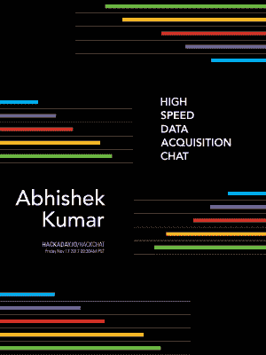

# 星期五黑客聊天:高速数据采集

> 原文：<https://hackaday.com/2017/11/15/friday-hack-chat-high-speed-data-acquisition/>

在本周的黑客聊天中，我们将谈论所有关于[高速数据采集](https://hackaday.io/event/28018-high-speed-data-acquisition-chat)的话题。如果你曾经需要将电压、电流、逻辑信号、温度、压力或声音输入计算机，你一定用过 DAQ。如果你曾经需要以非常高的速度获取信号，你可能已经为那件设备付了很多钱。

 我们本周 Hack Chat 的嘉宾是[ [库马尔·阿布舍克](http://theembeddedkitchen.net/about) ]，工程学学生，Hackaday 奖决赛选手，非常非常酷的 Beaglelogic 的创造者，BeagleBone 的逻辑分析仪。关于 Beaglelogic 有趣的一点是它利用了每个 BeagleBone 中都有的可编程实时单元(PRUs)。

这些 pru 基本上是 DMA 机器，在内存和 GPIOs 之间来回传送位。今年，[Kumar]将 beagle logic cape[变成了 beagle logic Standalone](https://hackaday.io/project/25745-beaglelogic-standalone)，这是一款基于 Octavo Systems OSD3358 的设备(“[beagle bone On A Chip](https://hackaday.com/2016/05/10/new-part-day-a-beaglebone-on-a-chip/))，让这些 Saleae 逻辑分析仪物有所值。

在这次聊天中，我们将讨论在 BeagleBoard 的各种迭代中发现的 pru，Beaglelogic 如何执行其数据采集，以及如何实际完成对 pru 的编程。如果您对[Kumar]有问题，[请在黑客聊天页面](https://hackaday.io/event/28018-high-speed-data-acquisition-chat)上发表评论

 我们的黑客聊天是在 [Hackaday.io 黑客聊天群发消息](https://hackaday.io/project/5373/token/7879571d-62c3-46a8-af36-2b6f265590f2?redirect=messages)上的现场社区活动。通常，我们的黑客聊天会在太平洋时间周五中午进行。*这个不一样。因为[Kumar]在印度，我们将在太平洋标准时间 11 月 17 日星期五 9:30 进行这次黑客聊天。印度现在是几点，你们那里是几点？谁在乎！这里有一个时区转换器！*

点击左边的语音气泡，你会被直接带到 Hackaday.io 上的黑客聊天群。

你不必等到星期五；随时加入，你可以看到社区在谈论什么。

我们也在寻找新的黑客聊天嘉宾！如果你已经做了一些很酷的东西，你正在做一个有趣的项目，或者你将要推出一个非常酷的产品，请联系我们！给我们出色的社区经理发电子邮件，我们会看看是否能把你安排进去。