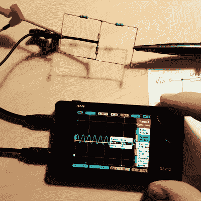

# DS212 示波器评论:开源和伟大的黑客

> 原文：<https://hackaday.com/2017/11/18/ds212-oscilloscope-review-open-source-and-great-for-hacking/>

我们已经看到很多示波器看起来像重新利用的手机。不过，通常他们只有一个频道。DS212 有两个通道和一个信号发生器！[Marco]给了[他的评论](https://www.youtube.com/watch?v=lxxS6rvrk3o)，并在下面的视频中快速撕下。

示波器不会取代大型台式仪器，但对于一个带充电电池的便携式示波器来说，它还不错。1 MHz 模拟带宽与每秒 10 兆样本前端和 8K 样本存储器相结合。信号发生器可以产生最高 1 MHz 的基本波形。我们有点惊讶该设备没有触摸屏，这就是为什么你可以在上面的截图中看到[Marco 的]手指。他似乎喜欢该设备用于导航的双旋转编码器系统。

真正突出的地方是[它是运行在 STM32 处理器内部的固件](http://www.minidso.com/forum.php?mod=viewthread&tid=1816)的开源。我们很少在商业可用的工作台工具中看到这一点，这使得它成为一个很好的黑客平台。很容易想象添加数字信号输出和解码数字数据等功能。将它与 WiFi 芯片结合，并通过 WiFi 将其用作另一个设备的前端，这将是一件有趣的事情。很多可能性。[Marco]展示了即使他不熟悉 STM32，他也能够轻松地为器件添加自定义波形输出。这有可能成为您构建的定制故障排除平台。针对每种特定类型的测试，排列所有的感测和信号生成设置，这意味着您不需要专家来浏览产品的常见故障模式。

有很多便宜的小望远镜，可能比不上大型的台式仪器，但仍然非常有用。[Jenny List] [刚刚评论了一款售价约为 21 美元](https://hackaday.com/2017/11/09/review-jye-tech-dso150-oscilloscope-kit/)的产品。去年，我们看到了一个低于 100 美元的示波器，它将使你[仅获得一个频道示波器](https://hackaday.com/2016/01/27/a-tale-of-two-sub-100-oscilloscopes/)。这就是进步！

 [https://www.youtube.com/embed/lxxS6rvrk3o?version=3&rel=1&showsearch=0&showinfo=1&iv_load_policy=1&fs=1&hl=en-US&autohide=2&wmode=transparent](https://www.youtube.com/embed/lxxS6rvrk3o?version=3&rel=1&showsearch=0&showinfo=1&iv_load_policy=1&fs=1&hl=en-US&autohide=2&wmode=transparent)

