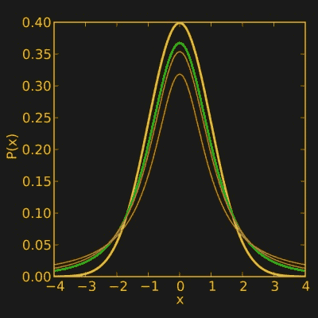

# 统计和黑客:一个结实的小分布

> 原文：<https://hackaday.com/2017/12/13/statistics-and-hacking-a-stout-little-distribution/>

之前，我们讨论了[如何应用最基本的假设检验:z 检验](https://hackaday.com/2017/12/01/statistics-and-hacking-an-introduction-to-hypothesis-testing/)。它需要相对较大的样本量，并且可能不太受时间和金钱预算紧张的黑客的青睐。

作为一种选择，我们简单地提到了 t 检验。基本的程序仍然适用:形成假设，样本数据，检查你的假设，并执行测试。不过这一次，我们将使用来自物联网传感器的真实数据进行测试，并以编程方式而不是手动方式进行测试。

z 检验和 t 检验之间最重要的区别是 t 检验使用不同的概率分布。它被称为“t 分布”，原则上类似于 z 检验使用的正态分布，但它是通过研究小样本量的特性而发展起来的。分布的精确形状取决于样本大小。



The t distribution with different sample sizes, compared to the normal distribution (Hackaday yellow). Source: [Wikipedia](https://en.wikipedia.org/wiki/Student%27s_t-distribution)

在前面的示例中，我们只处理了想要将样本与恒定值进行比较的情况，即一批电阻的值是否符合预期。事实上有三种常见的情况:

1.  您希望将一个样本与一个固定值进行比较:一个样本 t 检验
2.  你想比较两个独立的样本:两个样本的 t 检验
3.  您对每个样本进行了两次测量(如处理和控制)，并对差异感兴趣:配对 t 检验

这种差异主要影响你如何设置你的实验，尽管如果你有两个独立的样本，如果你有不同的样本大小或者一个样本比另一个差异更大，就需要做一些额外的工作。在这种情况下，你最好使用一种稍微不同的 t 检验，叫做[威尔士的 t 检验](http://en.wikipedia.org/wiki/Welch%27s_t-test)。

在我们的例子中，我们正在比较两个不同传感器随时间变化的温度和湿度读数，因此只要传感器的读数大致相同，我们就可以将数据配对。我们的无效假设和替代假设在这里很简单:传感器要么不会产生明显不同的结果，要么会产生。


The two DHT11 sensors were taped down to my desk. They were read with a NodeMCU and the data pushed to a ThingsBoard server.

接下来，我们可以采样。来自两个传感器的读数每 10 秒钟在基本相同的时间被获取，并通过 MQTT 发送到一个 [Thingsboard](http://thingsboard.io/) 服务器。几天后，检索每个传感器在 10 分钟内记录的平均温度。该传感器没有很高的分辨率(1°C)，因此像这样平均数据会使其粒度变小。做这件事的方法在黑板上看起来很简洁。

首先，您设置一个访问令牌:

```
$curl -X POST --header 'Content-Type: application/json' --header 'Accept: application/json' -d '{&quot;username&quot;:&quot;yourusername&quot;, &quot;password&quot;:&quot;yourpassword&quot;}' 'http://host.com:port/api/auth/login'
```

然后请求特定变量的所有数据，以 JSON 格式每 10 分钟平均一次(包括时间戳):

```
$curl -v -X GET &quot;http://host.com:port/api/plugins/telemetry/DEVICE/devicekey/values/timeseries?keys=variablename&amp;startTs=1510917862000&amp;endTs=1510983920000&amp;interval=600000&amp;limit=10000&amp;agg=AVG&quot; \
--header &quot;Content-Type:application/json&quot; \
--header &quot;X-Authorization:Bearer (token goes here)&quot; &gt; result.txt
```

使用这样的 API 的酷之处在于，您可以轻松地将数据管理和测试自动化，作为决策引擎的一部分。如果您使用不太精确的传感器，或者只是测量变化很大的东西，使用统计显著性作为决策的基础，而不是单个传感器值，确实可以提高可靠性。不过我跑题了，回到我们的数据上！

接下来，我做了一点数据管理:JSON 被转换成 CSV 格式，并删除了列标题(时间戳和温度)。这让我更容易用 Python 来处理。t-test 像 z-test 一样假设数据是正态分布的，所以我将数据从 CSV 文件加载到一个列表中并运行测试:

```
import scipy.stats as stats
import csv
import math as math
import numpy as numpy
#Set up lists
tempsensor1=[]
tempsensor2=[]
#Import data from a file in the same folder
with open('temperature1.csv', 'rb') as csvfile:
datareader = csv.reader(csvfile, delimiter=',', quotechar='|')
for row in datareader:
tempsensor1.append(float(row[1]))
with open('temperature2.csv', 'rb') as csvfile:
datareader = csv.reader(csvfile, delimiter=',', quotechar='|')
for row in datareader:
tempsensor2.append(float(row[1]))
#Subtract one list from the other
difference=[(i -j) for i, j in zip(tempsensor1, tempsensor2)]
#Test for normality and output result
normality = stats.normaltest(difference)
print &quot;Temperature difference normality test&quot;
print normality
```

在这种情况下，正态性检验的结果是 p>0.05，因此我们认为数据是正态的，以便进行 t 检验。然后，我们用下面的代码对数据进行 t 检验。请注意，该测试在统计包中标记为“ttest_1samp ”,这是因为对两个数据集之间的差异进行单样本 t-测试相当于对两个数据集进行配对 t-测试。在上面的正态性检验中，我们已经从一组数据中减去了另一组数据，现在我们正在检查结果是否与零有显著差异。

```
ttest = stats.ttest_1samp(difference, 0, axis=0)
mean=numpy.mean(difference)
print &quot;Temperature difference t-test&quot;
print ttest
print mean
```

测试返回的 t 检验统计量为-8.42，p 值为 1.53×10 ^(-13) ，远小于我们的阈值 p=0.05。平均差异为-0.364°C。这意味着两个传感器产生的结果明显不同，我们对 30°C 左右的温度差异有一个大概的数字。将该结果外推至非常不同的温度是无效的，因为我们的数据只覆盖了很小的范围(29-32°C)。

我还对湿度数据进行了上述测试，但结果并不有趣，因为根据[数据表](http://akizukidenshi.com/download/ds/aosong/DHT11.pdf) (PDF 警告)，相对湿度的计算取决于温度，我们已经知道两个设备测量的温度明显不同。有趣的一点是数据不是正态分布的——那么该怎么办呢？

一种常用的技术是对数据进行对数转换，而不做进一步的考虑，看看它是否是正态分布的。对数变换具有使异常值接近平均值的效果:

```
difference=[(math.log1p(i) - math.log1p(j)) for i, j in zip(humidity1, humidity2)]
normality = stats.normaltest(difference)
print &quot;Humidity difference (log-transformed) normality test&quot;
print normality
```

在我们的例子中，这实际上使得数据足够正态分布以进行测试。然而，由于两个原因，这不是一个非常严格的方法。首先，它使你正在比较的东西复杂化了(如果我比较温度值的对数，有意义的结果是什么？).其次，很容易对数据进行各种转换，以掩盖这样一个基本事实，即您的数据根本不适合您试图运行的测试。关于更多细节，[本文指出了一些可能出现的问题](http://www.ncbi.nlm.nih.gov/pmc/articles/PMC4120293/)。

一种越来越受欢迎的更严格的方法是使用非参数测试。这些测试没有假设特定的数据分布。与成对 t 检验等效的非参数检验是 [Wilcoxon 带符号秩检验](http://en.wikipedia.org/wiki/Wilcoxon_signed-rank_test)(对于不成对数据，使用 [Wilcoxon 秩和检验](http://en.wikipedia.org/wiki/Mann%E2%80%93Whitney_U_test))。它的统计能力比成对 t-检验弱，并且它会丢弃任何成对之间的差异为零的数据，因此在处理非常细粒度的数据时，可能会有显著的数据丢失。您还需要更多的样本来运行它:20 个样本是一个合理的最小值。无论如何，我们的数据是足够的，而且[用 Python](http://docs.scipy.org/doc/scipy-0.14.0/reference/generated/scipy.stats.wilcoxon.html) 运行测试很简单:

```
import scipy.stats as stats
list1=[data__list_goes_here]
list2=[data__list_goes_here]
difference=[(i -j) for i, j in zip(list1, list2)]
result=stats.wilcoxon(difference, y=None, zero_method='wilcox', correction=False)
print result
```

当我们运行它时，测得的湿度差异非常显著，平均差异为 4.19%。

你可能会问所有这些工作的实际价值是什么。这可能只是测试数据，但想象一下，我有两个这样的传感器，一个在屋外，一个在屋内。为了节省空调，每当室外温度比室内温度低时，窗户风扇就会打开。如果我假设这两个器件完全相同，那么我的系统有时会测量到温差，而实际上并没有。通过描述我的两个传感器之间的差异，我可以减少系统做出错误决定的次数，简而言之，让我的智能设备更智能，而无需使用更昂贵的部件。

顺便说一句，用统计数据撒谎很容易，这一点被夸大了。借用安德烈·邓克尔斯的一个观点，真正的问题是没有他们很难说出真相。