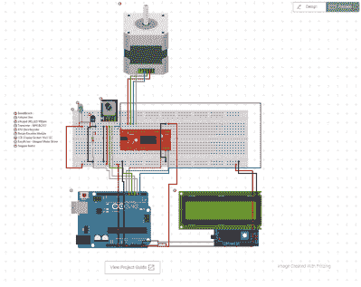

# 这个 DIY 转盘变得异常新鲜

> 原文：<https://hackaday.com/2017/11/24/this-diy-turntable-just-got-freaky-fresh/>

摄影转盘是为精确的人和懒惰的人设计的。无论你是担心拍照时角度一致性的精确度，还是你只是不想在每张照片后都站在那里旋转盘子——是的，它确实会变旧——一个懒惰的苏珊风格的自动摄影转盘就是你的票。[circuito . io 的这款自动 360°设计以一种低调的包装满足了这两种需求](https://www.circuito.io/blog/photography-turntable/)。

制作这个周末 DIY 项目所需要的零件是最少的。Arduino Uno 通过旋转编码器输入和字符 LCD 显示设置来控制这一切。转盘使用步进电机和 EasyDriver 移动。它甚至使用红外 LED 控制相机。

最有可能出现的最大障碍是创建实际的激光切割套管本身。circuito 团队通过使用 [Pololu](https://www.pololu.com/product/749) 的在线定制激光切割服务为 4 个必要的激光切割部件避免了这一困难。所有的部件都组装好之后，剩下要做的就是~~复仇者联盟~~的组装。他们为这个过程提供了一步一步的指导，以一种简单明了的方式，你可以蒙着眼睛把这个东西组装起来。

我们以前在 Hackaday 上看过一些其他受启发的摄影转盘。[NotionSunday]基于旧 DVD-ROM 驱动器的弹出机制创建了一个真正的转盘黑客。随着整个东西在录像机的磁头组件上旋转，这是不让任何东西浪费的缩影。我们还展示了另一个非常相似的 [Arduino Uno 控制的转盘](https://hackaday.com/2015/05/24/spin-diy-photography-turntable-system/)，它是由【Tiffany Tseng】在两年前制作的。甚至还有一种非电子版本的[DIY 360°摄影转盘](https://petapixel.com/2017/02/23/build-diy-turntable-360-product-photography/)，它只使用了一个转盘和卷尺。所有这些摄影转盘黑客做得很好，但有一些我们喜欢这个干净的感觉。该项目的所有必要代码已在 GitHub 上提供。你最喜欢的摄影转盘是什么？

 [https://www.youtube.com/embed/ynGiFiS51o8?version=3&rel=1&showsearch=0&showinfo=1&iv_load_policy=1&fs=1&hl=en-US&autohide=2&wmode=transparent](https://www.youtube.com/embed/ynGiFiS51o8?version=3&rel=1&showsearch=0&showinfo=1&iv_load_policy=1&fs=1&hl=en-US&autohide=2&wmode=transparent)

