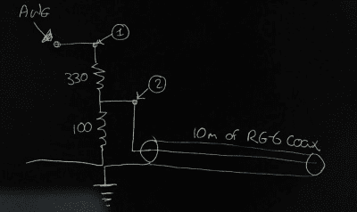

# 在 DIY 同轴共线天线中测量高频信号速度

> 原文：<https://hackaday.com/2017/12/06/measuring-hf-signal-speeds-in-a-diy-coaxial-collinear-antenna/>

空中交通管制员使用自动相关监视广播(ADS-B)作为二次雷达的替代方案来跟踪飞机。ADS-B 由飞机发射，包含 GPS 位置、压力、高度和呼号等信息，频率为 1090 MHz，可以使用许多软件工具进行解码。

[Mike Field]住在一个机场附近，他决定为了好玩而偷看跟踪信号。他求助于 RTL 的电视加密狗。由于普通天线不能切割它，他决定[专门为 1090 MHz 信号](https://forum.digilentinc.com/topic/5202-measuring-the-speed-of-rf-waves-in-coax-cable-with-the-ad2/)制作一个。他的设计基于【杜桑·巴拉拉】的[ADS-B 接收器同轴共线天线](https://www.balarad.net/)，使用切割成合适长度的同轴电缆。在确定电缆的尺寸时涉及到许多计算，但是，这种设计的诀窍在于他使用基于 USB 的示波器来测量相关线路中 RF 波的速度。

我们联系了[迈克]，这就是他要说的。想法是使用波长一半大小的电缆，计算如下

λ= c/f

为了获得最佳接收效果，同轴电缆段需要半个波长，但同轴电缆内信号的波长比自由空间中的波长要短。由于这是一种普通电缆，他不知道将芯线与屏蔽层分开的电介质，因此“速度系数”可以是任何取决于具体成分的值。

为了确定电缆中信号的速度，他的方法省略了更昂贵的设备。一段同轴电缆相当于一根短截线——任何送入电缆的能量都会到达传输线的远端，然后被反射回信号源。当电缆长度为 1/4 波长时，反射信号以 180 度相位差从信号起点返回，在理想情况下，它会完全抵消输入信号。

[Mike]从一根 10m 长的电缆开始他的实验，因为他需要一个波长为 40m 的测试信号。为了让测试信号进入电缆，只需要连接器背面的两个电阻。该图显示了 330 欧姆和 100 欧姆串联，中心点约为 75 欧姆，与电缆匹配。

使用 Digilent Analog Discovery 2 的网络分析仪，连接器在不连接电缆的情况下从 1kHz 扫描到 10Mhz，然后连接电缆。可以非常清楚地看到同轴电缆反射信号在 5.666 MHz 处引起的下降。从这里开始就是简单的数学计算——40 米/周期*每秒 5，666，000 周期=每秒 226，640，000 米或光速的 75.6%。

所以 ADS-B 信号的波长是(226，640，000 m/s) / (1090，000，000 Hz) = 0.208m，需要切割的长度是 104mm 1/2 波元和 52mm 1/4 波元并得到焊接！

这是一个很好的例子，说明一点点数学和人类的聪明才智如何胜过昂贵的测试设备，如果您希望从头开始进入软件定义无线电，[从零开始](https://hackaday.com/2017/10/29/scratch-that-sdr/)。