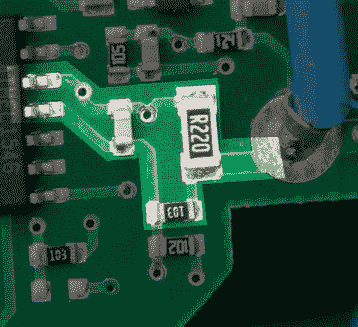

# 拆胶枪揭开微控制器之谜

> 原文：<https://hackaday.com/2017/11/23/glue-gun-teardown-reveals-microcontroller-mystery/>

有一把博世胶水笔无绳热胶枪。这个东西有一些很好的功能——它在 15 秒内加热，通过 USB 充电，通常对于热胶枪执行的小型快速工作很方便。乍一看，这似乎是对各种插件的巨大改进，插件似乎需要永远加热，而你需要的只是快速涂抹胶水。

虽然这个产品听起来很酷，但[bob]做了任何一个有头脑的黑客都会做的事情，打开它看看这个吸盘是如何工作的，然后[在](http://www.electrobob.com/bosch-glue-pen-teardown/)里面发现了一个 ATtiny24A。最有趣的是，除了电池充电电路中的热敏电阻之外，似乎没有温度调节或传感功能。这是一个有趣的谜。

ATtiny 根据手册控制一个功率 MOSFET，使加热元件达到“大约 170 度”。[bob]找不到热端的温度调节，它在晶体管的栅极测得稳定的 12 V，然后胶枪通电的整个时间。

运行整个系统的 ATtiny24A 包含 12 个 GPIO 引脚、4 个 PWM 通道和 2 KB 程序存储器。对于一个胶枪控制器来说，它显得有点过了。[bob]发现 Tiny 的一个引脚连接加热元件，另一个连接充电电路。万一电池着火了呢？

没有电路板背面的清晰照片，这有点像猜谜游戏，但 12 个 GPIO 引脚中有 8 个似乎正在使用中。在评论中留下你的理论。如果你对剩下的四个 GPIO 引脚有什么好的想法，那就试试吧！

关于[bob]的另一个工具技巧，请查看我们今年早些时候发布的他的[恒流下沉](https://hackaday.com/2017/06/01/current-sink-keeps-the-smoke-in/)。