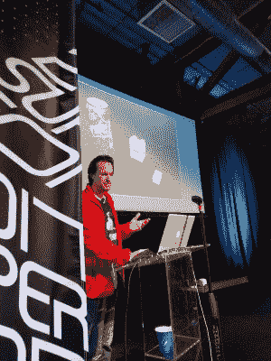

# 耶鲁安·多姆伯格将苹果电脑小型化

> 原文：<https://hackaday.com/2017/11/27/jeroen-domburg-miniaturizes-a-mac/>

他的名字可能听起来没什么印象，但他的名字将会成为这些网页和世界各地黑客活动的常客。来自荷兰途经上海的耶鲁安·多姆伯格在 2017 年 Hackaday Superconference 上给[做了一个关于他的](https://www.youtube.com/watch?time_continue=57&v=V-PiNVPp5h0)的宠物项目的演讲:把苹果电脑变成一只宠物。

你可以说这是耶鲁安第二次缩小复古硬件。在去年的黑客日超级大会上，他推出了有史以来最小的游戏机。这个令人难以置信的硬件和软件黑客把一个完整的游戏男孩塞进你口袋里的东西里。你如何超越史上最具标志性的视频游戏系统的微缩版？当然，是通过创造史上最具代表性的计算机的微缩版。

在标题图片中，耶鲁安面前的小东西实际上是他制作的一台工作中的 Macintosh Plus。使用 2017 年的零件重现 80 年代中期的技术似乎很容易，尽管这显然比打破物理定律更容易，但耶鲁安在这个过程中面临了一些严峻的挑战，他在他的演讲中详细介绍了这些挑战。

Jeroen, aka Sprite_tm, shows off his “disembiggened” Mac Plus at the Hackaday Superconference 2017.

其中最主要的是重现了革命性的 Mac GUI 的外观和感觉，这需要一个小巧的显示器。将分辨率为 512 x 342 像素的原始 9 英寸 CRT 显示器缩小到(字面上的)缩略图大小是一项艰巨的任务，耶鲁安详细介绍了导致他开发 320 x 320 像素智能手表显示器的所有设计选择。为了让 MIPI 界面显示器在他的建筑中工作，耶鲁安利用了迈克·哈里森的一些逆向工程努力，他是 2017 年 Hackaday 超级大会徽章的设计师[。](https://hackaday.com/2017/11/15/the-perils-of-developing-the-hackaday-superconference-badge/)

鉴于耶鲁安目前在 Espressif 的工作，难怪他选择 ESP32 作为运行他的迷你 Mac 的芯片，尽管正如他提到的那样，SoC 仅勉强有足够的马力来做这件事。Mac emulation 在一个内核上运行，而 display scaling 在另一个内核上运行，GPIO 几乎不足以连接显示器和他自己构建的微型鼠标，这款迷你 Mac 确实突破了极限。老实说，如果能听到更多关于这个版本的软件方面的信息就太好了，耶鲁安并没有详细介绍。然而，公平地说，这是一个巨大的项目，他只有 30 分钟的发言时间，毕竟，超级会议都是关于硬件的。

[https://videopress.com/embed/Q793DVUE?hd=1&cover=1&loop=0&autoPlay=0&permalink=1&muted=0&controls=1&playsinline=0&useAverageColor=0](https://videopress.com/embed/Q793DVUE?hd=1&cover=1&loop=0&autoPlay=0&permalink=1&muted=0&controls=1&playsinline=0&useAverageColor=0)