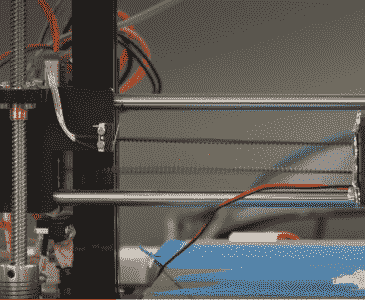
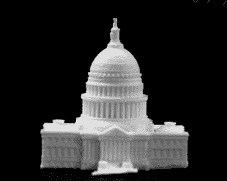
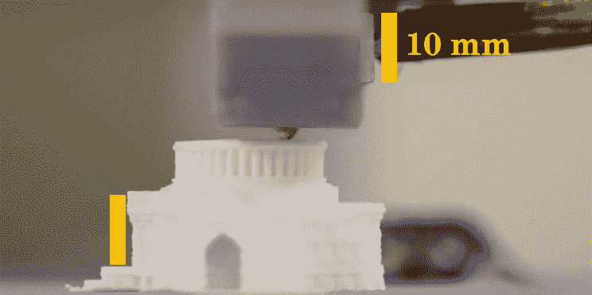
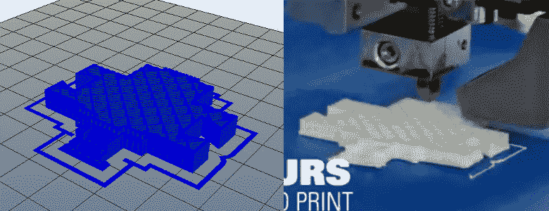
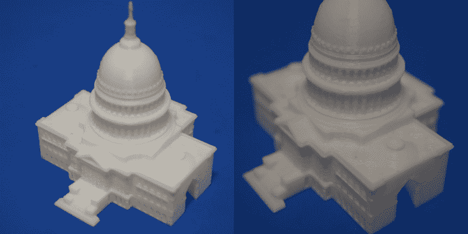

# 病毒视频时代的同行评议

> 原文：<https://hackaday.com/2017/11/29/peer-review-in-the-age-of-viral-video/>

最近，YouTube 上的一段视频在网上流传，它展示了两个印刷的美国国会大厦模型之间的惊人对比。[从“3d 打印机现在可以打印两倍的速度”](https://www.youtube.com/watch?v=6sN71fx9frk)开始，视频显示，一张打印花了四个小时完成，另一张仅用了两个小时就完成了，这得益于密歇根大学开发的减振算法。围绕这个视频的兴奋是可以理解的；当前 3D 打印机技术的最大限制之一是生产一个可接受质量的模型需要多长时间，如果驱动这些机器的软件的改进可以将总打印时间减少一半，后果将是巨大的。

仅在几周内，该视频就获得了数万次观看，一些热情洋溢的文章出现在头条位置，如:“[密歇根大学如何将 3D 打印时间减少一半](https://3dprintingindustry.com/news/cut-fff-3d-print-times-half-university-michigan-123158/)”和“[密歇根大学教授使用减震算法将 3D 打印速度提高一倍](http://www.3ders.org/articles/20171020-university-of-michigan-professor-doubles-3d-printing-speeds-using-vibration-mitigating-algorithm.html)”。可以预见的是，我们的提示热线受到了 3D 打印机所有者的欢迎，他们希望听到更多关于这项令人难以置信的研究的信息，这项研究承诺只需升级固件就可以将打印速度提高一倍。

唯一的问题是，视频显示没有这种东西。更重要的是，当被追问细节时，视频的创作者现在也在声称同样的事情。

## 低于标准的标准

在 YouTube 的评论中可以找到该视频可能与看起来不太一样的第一个迹象，一些观众提到他们的“标准打印机”的状态充其量是有问题的。在打印机的传送带上可以清楚地看到强烈的振动，最终打印模型上的底座粘附问题表明底座水平不佳或 Z 轴校准不正确。对于那些花费了比他们可能关心的时间多一点的时间来承认调整和校准 3D 打印机的人来说，这些问题是机器处于糟糕状态的危险信号。

  Visible belt vibrations  Print lifting from bed

当视频继续显示这台机器上的打印如何随着加速设置的逐渐增加而失败，最终以一个滑稽的不平衡的建筑结束时，这并不奇怪。所示的严重的层偏移再次明显地表明，打印机的皮带在测试开始时没有被正确张紧。

对于任何有打印经验的人来说，视频中演示的“标准打印”显然不是衡量桌面 3D 打印性能的好指标。

## 复制实验

如果在“标准打印”中使用的打印机的条件有问题，下一个合乎逻辑的步骤是尝试复制视频中显示的实验，并找出适当调整的 3D 打印机需要多长时间。不幸的是，没有给出关于所用模型、印刷比例、层高或填充百分比的信息。如果打印机本身的状况是视频中的第一个危险信号，那么遗漏这一关键信息肯定是第二个。如果视频只是在描述中列出了这些信息，任何一个家里有 3D 打印机的人都可以独立地验证这些说法。

幸运的是，模型本身并不难识别。在 Thingiverse 上快速搜索发现“[国会大厦-立法机关](https://www.thingiverse.com/thing:461272)”，这是 MakerBot 的“政府结构”收藏的一部分。但是模型的大小显然比视频中显示的要大得多；下一步是找到打印过程中使用的比例因子。

了解到视频中使用的打印机是一个 HICTOP 品牌的 Prusa i3 克隆版，确定比例只是简单地将机器可识别部件的外观尺寸与打印模型进行比较。了解到 HICTOP 打印机上的加热器块有 10 毫米厚，从侧面近距离观察打印机提供了一个绝佳的机会。

由于从台阶顶部到前门廊顶部的高度大约为 10 毫米，模型的比例可以在切片机中调整，直到达到所需的尺寸。这样就确定了密歇根视频中模型的比例不超过 60%。

然后，通过比较不同填充百分比下切片器的层视图与视频中正在进行的打印的层视图，估计填充约为 15–20%。

20% infill in slicer, versus print in Michigan video

现在，模型、比例和填充物都在合理的误差范围内，剩下的唯一问题是使用哪一层的高度。根据相当粗糙的表面质量来判断，0.2 毫米的层似乎是可能的。然后用这些设置打印模型，并对过程进行计时，以查看它与密歇根视频中给出的两个示例相比如何。

Scale: 60%, Infill: 20%, Layers: 0.2 mm, Print Time: 1 hour 20 minutes

该模型在 **1 小时 20 分钟**内打印完成，几乎是视频中演示的“加速”打印所需时间的一半，比“标准打印”快近 4 倍。有些事情显然不合情理。

## 寻找答案

Chinedum Okwudire

在比例和填充的估计中肯定有误差，但不足以解释我们的实验和原始视频中显示的如此巨大的差异。有了视频证据和真实世界的测试，我们联系了 Chinedum Okwudire 教授，让他对这种情况有所了解。

Okwudire 教授同意，透明度和同行评议是科学过程的重要方面，他信守承诺，向我们提供了一份非常详细的声明，内容涉及原始 YouTube 视频的性质、团队的研究，以及他们认为它如何适应桌面 3D 打印的当前艺术状态。

Okwudire 教授的核心论点是，尽管视频和美联社报道中使用了清晰的语言，但演示只是为了描述他的团队在狭窄的研究范围内取得的成果；并且不被视为该技术在不同环境下必然产生相同的性能改进的声明:

> “有些人似乎误解了我们的工作(以及我们视频中展示的 4 小时案例研究),认为我们展示了‘标准’台式打印机打印国会大厦部分的最快速度。这是一个非常错误的认识。打印时间在很大程度上取决于打印机和用于打印的参数。

此外，Okwudire 教授说，“标准印刷”并不意味着是最好的情况。事实上，恰恰相反。在本研究中，“标准打印”是指维护不良的机器，以最低速度打印，由新手操作:

> “原因是我们发现，3D 打印机的普通非技术用户往往对打印速度和加速度持保守态度。我们从许多博客中发现，为了避免零件故障或表面质量差，人们通常在高振动打印机上使用约 40 毫米/秒的速度和/或约 1 m/s^2 的加速度，如 hictop prusa i3。因此，尽管通过反复试验，零件可能会以更高的速度和加速度打印出来，而不会出现故障，但许多非技术用户在博客上提到，他们宁愿保守一些，以确保他们总能获得可靠的打印结果。”

## 重复测试

Scale: 50%, Infill: 25%, Layers: 0.1 mm, Print Time: 1 hour 55 minutes

针对我们的要求，Okwudire 教授向我们提供了视频中使用的比例、填充和图层高度。我们对比例和填充的估计都在 10%以内，当然不足以造成打印时间的显著差异。然而，视频中使用的图层高度为 0.1 毫米，而我们测试的高度为 0.2 毫米，这将对打印时间产生重大影响。以尽职调查的名义，我们用提供的精确设置重新运行了打印。

使用与测试视频相同的参数，打印在其“加速”打印的几分钟内完成，进一步加强了视频的初始印象。“标准打印”绝不是，而“加速打印”是您应该从正确配置和维护的打印机中获得的性能。

密歇根大学在其视频中展示的更准确的描述是一种振动补偿算法，能够克服轻薄或配置不当的打印机的缺点。公平地说，这可能是一个有价值的研究途径，因为制造商试图推动 3D 打印机的成本越来越低，但它肯定不是一种使 3D 打印速度翻倍的算法。

## 轰动效应 Vs 科学

值得称赞的是，奥克武迪尔教授和他的团队非常及时地收到了一份异常详尽的文件，详细介绍了他们的实验条件和研究范围。从这些文件中可以清楚地看出，发布到 YouTube 上的原始视频不是假的，因为它确实表明，在非常特殊的情况下，打印模型所需的时间减少了一半。

话虽如此，视频中使用的明显误导性措辞、用作基线的故意阻碍的软件和硬件条件，以及他们的“标准打印”控制缺乏独立可验证的参数，都是不容忽视的。很难相信这个视频的创作者不是故意以这样一种方式制作它，以耸人听闻地报道这个实验在极其狭窄的范围内取得的结果。

作为一个更广泛相关的例子，想象一下 YouTube 上的一个视频，该视频旨在展示一种将汽车燃油经济性提高一倍的方法。视频一开始展示了一辆几十年的老破车在路上蹒跚而行，回火并冒烟，指示效率为每加仑 8 英里；紧随其后的是经过调校和维修的同一辆车，跑起来明显更好，现在每加仑能跑 16 英里。在这两个例子中，演示从一个不合理的差位置开始，引入了改进，但仍然以一个并不比更现代或构造更好的样本更好的结果结束。

Okwudire 教授坚持认为，密歇根大学正在开发的算法可能会使 3D 打印机的打印速度翻一番，假设打印机一开始就运行不良。尚未证明在目前没有机械问题的机器上有可能获得类似的收益，尽管肯定有改进的潜力。我们和整个 3D 打印社区一样，热切期待对这项技术及其在更合理条件下的潜在用途进行更广泛、更透明的研究。

* * *

如果你觉得同行评审的概念很吸引人，可以考虑作为我们自己杂志的同行评审来帮你一把。昨天我们宣布了[你不知道的黑客日志](https://hackaday.com/2017/11/28/hjwydk-the-journal-our-community-has-been-awaiting/)，我们正在寻找投稿、副主编和同行评审。