# 数控铣削比你想象的更需要手工操作

> 原文：<https://hackaday.com/2017/11/27/cnc-milling-is-more-manual-than-you-think/>

我在加州帕萨迪纳参加 Hackaday 超级会议，在[供应框架设计实验室](https://hackaday.io/project/80-supplyframe-design-lab)度过了一段美好时光。常驻工程师 Dan Hienzsch 说我可以有几个小时的时间，并问我想做什么。约束条件是，它必须足够小，可以装进托运的行李，但必须足够酷，以保证占用丹的时间，并为我学习一些新技能加分。我家里有一家不错的木材店，虽然我的 3D 打印机农场不像设计实验室那样专业，但我知道其中的诀窍。这留下了一个显而易见的选择:在工业 Tormach 三轴数控金属轧机上的快乐扳手。

[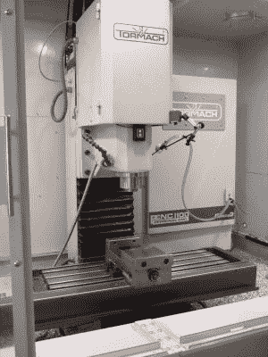](https://hackaday.com/wp-content/uploads/2017/11/dscf0292-e1511775669680.jpg) 数控铣床是一个很棒的工具，但它不是一个无所不知的吃金属的机器人，你可以把一个设计文件交给它。如果你认为拥有一台数控铣床会让你变成一个不需要经验的金属切割怪物，那你就大错特错了。

当然，这种机器能够切割任意形状，如果用手工完成，这种切割的精度会非常高，但在确保事情不会偏离方向方面，操作者的技术不亚于手动研磨机。每一步都需要丹良好的判断力、经验和投入。老实说，我对整个过程与手工铣削如此相似感到惊讶。所以，如果你想知道坐在一个严肃的数控铣床操作员的肩膀上是什么感觉，请继续读下去！

## 规划:计算机辅助设计和计算机辅助制造

我说“丹，铝制的快乐扳手！”第二天早上我来的时候，他已经在我背后偷偷工作了。他拥有的扳手的 SVG 文件实际上是由微小的线段组成的，而不是平滑的贝塞尔曲线。试图匹配所有由此产生的无穷小的尖角将驱动 CAD 软件(Fusion 360) batty。因此，丹用全新的、平滑的曲线描绘了原始图像，得出了一些在我看来与原始图像难以区分的东西，但对计算机来说更容易处理。

有了所需的轮廓集，我们必须选择我们的工具。这里，在忠实于输入文件和在短时间内完成作品之间有一个权衡。如果 Dan 在铣刀上选择了太大的切割头，精细的细节就不可能被切割出来——特别是扳手的尖端有内角，而这些内角的锋利度受到钻头直径的限制。用最好的头来做整首曲子看起来会更好，但这要花很长时间。因此，通常的策略是进行一次粗加工，挖出大部分铝，然后用较小的工具进行精细加工。但是多大才算大，多小才算小？两遍就够了吗，还是应该三遍？

我 [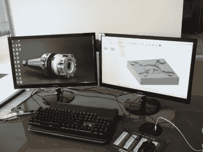](https://hackaday.com/wp-content/uploads/2017/11/dscf0282.jpg) 最后，这是一个判决。在 Tormach 上切换工具架非常快，但它不会自动完成。这意味着我们必须在适当的时候将它们替换掉。从这个意义上说，工具更换越少越好。丹选择了第一阶段的磨机，刚好适合扳手的眼睛和头骨的边缘之间，但没有注意扳手尖端的小细节。使用更好的工具进行第二次扫描可以处理它们。添加倒角钻头的最后一遍只是为了展示:因为我喜欢弯曲倒角边缘的外观，用手永远做不出这么好的效果。

CAM 软件还想知道大量关于实际切割的细节，但由于 Dan 使用这些特殊工具头切割铝的经验，这些细节中的大多数都有很好的先前值。尽管如此，他还是傲慢地将进给速度设定为正常速度的两倍，并说我们将“骑着滚轮”来调整速度。

甚至在我们打开机器的红色大*开关*之前，丹就已经根据他对软件、机器、工具和我们正在切割的材料的了解做出了许多判断。像我这样的新手，早就输掉比赛了，该死的 CNC。

## 人和机器

我们上传了 CAM 文件，并启动了 Tormach 的预热和自润滑程序。丹确保它散发出切削液的薄雾，然后我们开始寻找废铝条。头骨被设计成大约 4 英寸(10 厘米)见方，商店有一些稍大的棒料需要切割。剁锯上良好的润滑和干净锋利的金属刀片使一根沉重的铝棒快速工作，但这基本上就像你在家里用一些切削液和锯子做的一样。只会更快。

棒料不一定是方形的，而且表面看起来也不怎么样，所以当磨机预热后，丹把飞刀头放进去，我们就开始修整棒料。尽管他使用数控铣床进行切割，但这几乎完全是手工操作。首先，他通过逐渐深入来切割参考边缘，直到他去掉所有的原始金属。然后他把它翻过来，重复这个过程。用两个平行的边和精密的方形块，他把剩下的面切成方形。在所有情况下，这是一个过程，降低飞刀慢慢地，直到它刚刚触及(猜测)高点的脸，并工作下来，一遍又一遍，直到一切都是闪亮的。脱多少？喂多快？操作员体验。CNC 在这里帮不了你。

 [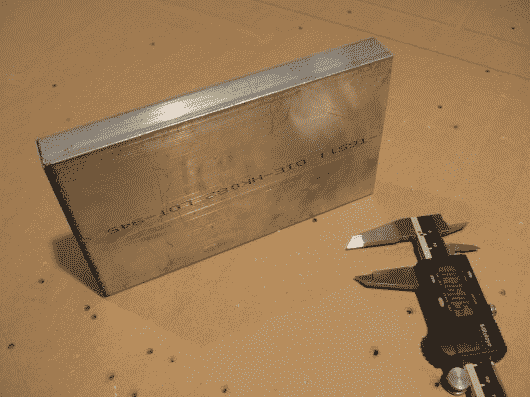](https://hackaday.com/2017/11/27/cnc-milling-is-more-manual-than-you-think/dscf0284/) It Always Starts Here [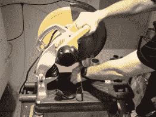](https://hackaday.com/2017/11/27/cnc-milling-is-more-manual-than-you-think/dscf0289/) Chop Chop [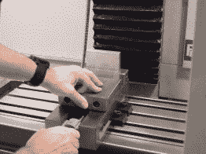](https://hackaday.com/dscf0293/) The First Face [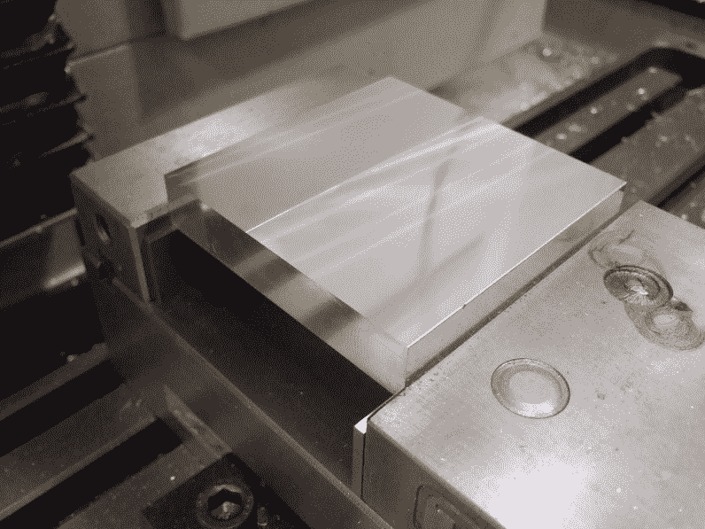](https://hackaday.com/dscf0298/) Flat and Square

最后，我们的积木尺寸为 4.001 英寸×3.985 英寸——还不错，但是用锯子第一次切割时有点不稳，导致我们需要在一边切掉太多才能弄干净。不管怎样，这是一个镇纸，所以重要的是让扳手居中。再次输入操作员经验。丹已经用机器的零点在扳手头的正中心建立了 CAM 文件。这意味着，只要我们能够将数控机床指向铝型材的中心，我们就不必担心一边比另一边短 0.015 英寸(0.4 毫米)这一令人烦恼的问题——通过设计，一切都会变得对称。

Tormach 有一个 3D 距离探头尖端，这可能是我见过的最酷的东西。你把它放在机器里，它在 X，Y，Z 轴上测量。这使得在所有维度上找到该块的准确宽度和高度变得轻而易举，并允许 Dan 告诉机器我们的块中心的顶部表面在哪里。到目前为止，一切都是 100%手动的，但现在机器是定向的，CNC 可以帮忙。

## 骑着滚轮

[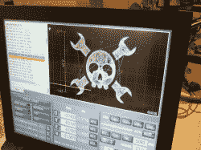](https://hackaday.com/wp-content/uploads/2017/11/dscf0302.jpg) 换入第一把刀具，他刚才是不是按了播放键？嗯，算是吧。Tormach 有单独的切割速度和行驶速度控制装置。第一项任务是通过以大约 10%的移动速度将铣床移动到工件上，并将切削进给速度设置为 0%,再次检查我们的零点设置。这让我们验证了磨机正好停在它应该停的地方。如果他犯了一个错误，它可能会在一个危险的深度或疯狂的进给速度下进入金属，打碎碎片或更糟。像这样的健全检查是关键。

然后，他慢慢提高切削进给速度；请记住，他在 CAM 阶段故意将进给速度设置得过高。我们看着磨螺旋下降到正确的切割深度，然后开始它的模式。他慢慢加大音量，直到它以合适的速度移动。每秒应该带走多少材料？就像手动磨一样，这是一个经验问题。他听着机器的声音，看着芯片飞出，检查切割的质量。全自动数控？恰恰相反。

粗加工过程很快就完成了，我们更换了用于细节铣削的刀具。同样，我们重复同样的程序，慢慢地将工具磨到铝的表面。它停在该停的地方了吗？刀架的长度是机器认为的长度吗？两个都是肯定的，但这是一个很好的复查。然后，丹慢慢地将机器调到工作速度。

 [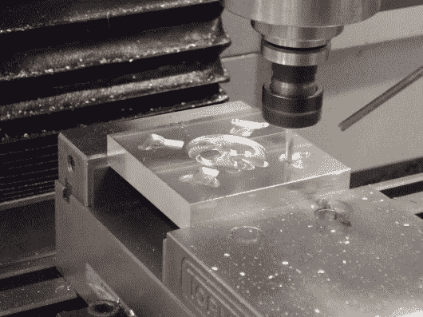](https://hackaday.com/dscf0304/) Roughing [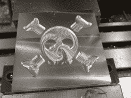](https://hackaday.com/2017/11/27/cnc-milling-is-more-manual-than-you-think/dscf0306-2/) After Roughing [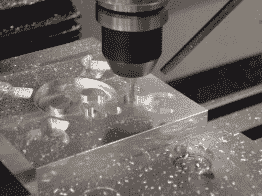](https://hackaday.com/2017/11/27/cnc-milling-is-more-manual-than-you-think/dscf0311/) Finishing [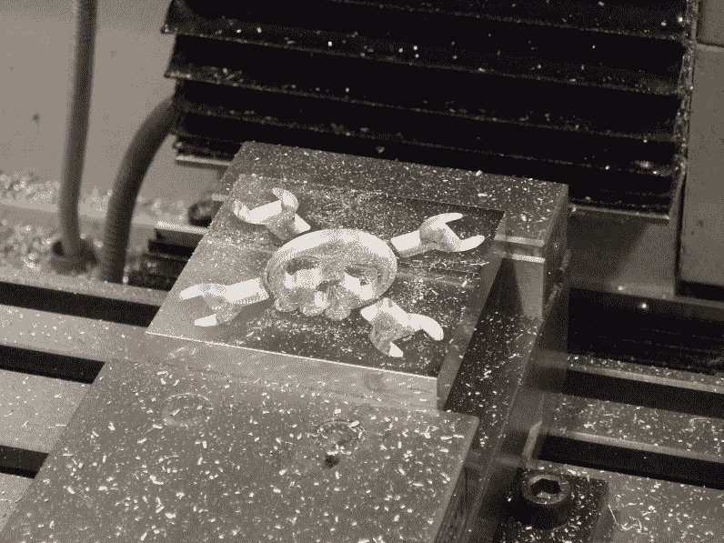](https://hackaday.com/dscf0313-2/) Cut, Ready to Chamfer

正如你们中任何一个有 3D 打印机的人都知道的那样，看着工厂工作是令人着迷的，我最终看着铝片飞起来，而我本可以在外面喝咖啡。但是这十五分钟的完全自动化结束得太快了。又换了一次工具，换成了倒角钻头，又花了几分钟的机器时间，乔利镇纸就完成了。磨坊凹槽中心的漩涡使它看起来几乎像一个糖头骨。太棒了！

## 收场白

当然，铝扳手是一个快速和肮脏的一次性项目。如果我们生产多个，我们会写下理想的进给速度，并可能在下一次迭代中跳过手动慢行。但总的来说，60%的时间都需要相当多的操作员参与和判断。规划工作、整理库存，甚至引导机器完成它已经“知道”的步骤，都需要一个从手动角度熟悉加工的操作者，他可以在规划当前工作的同时考虑接下来的步骤。

虽然传统的金属工人可能会在半夜醒来，为机器人从他们手中夺走工作而汗流浃背，也许在大规模生产中这是正确的，但肯定不会有一个从未有过金属加工经验的人可以走到这些数控奇迹之一面前，递给它一个图像，然后按下播放键。在看了 Dan 和 Tormach 给我的扳手后，我想说学习手工磨的绳索不足以成为数控大师，但它是绝对必要的。

但我只是个数控铣削新手。你们怎么说？你的手工金属加工技巧有多少被转移到了 CNC 世界？

非常感谢丹和设计实验室的每个人的热情款待！