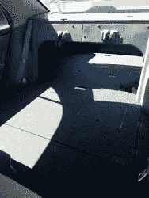
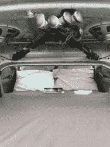

# 在…露营。卡罗拉？

> 原文：<https://hackaday.com/2017/12/09/camping-in-a-corolla/>

在野外露营一个周末可以对一个人的心智产生奇迹，在最近改装的露营车中度过的快乐增加了这种快乐。redditor [Gongfucius]和他的妻子将他们的 2005 年丰田卡罗拉改装成了两人完美的[度假车。](https://imgur.com/a/VTxSj)

 为了腾出足够的空间，后排座位必须拆掉，而且拆除起来似乎很容易。[宫夫齐斯]能够建造并安装一个布满储物舱口的平台，这些舱口可以咬合到位，并覆盖后备箱和后座——用毛毡覆盖以增加舒适度。一个床垫被切割成 5 英寸的记忆泡沫，他的妻子给床垫缝上合适的覆盖物。后备箱里有更多的储物角落，可以随时存放必需品。

作为一辆你绝对想不到会在里面露营的车，【宫福齐斯】坚持认为这辆  卡罗拉的睡眠安排没有你想象的那么拥挤，但单人驾驶时却非常豪华。在这两种情况下，一个不利之处可能是需要一定的灵活性才能舒适地进出。因为他们倾向于在远离人迹罕至的地方扎营，所以隐私屏被忽略了——但是如果需要的话，一些双反射绝缘材料就可以解决问题。还有一个二氧化碳积聚的小问题，但是把窗户关小一条缝可以解决这个问题。

当然，有更多的传统交通工具可供露营，比看上去的多得多。

[通过 [/r/DIY](https://www.reddit.com/r/DIY/comments/7fol7c/corolla_rv_conversion_i_built_a_bed_in_the_back/)