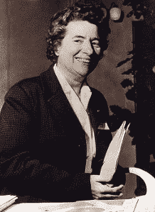

# 玛格丽特·佩雷:当实验室助手得到荣誉时

> 原文：<https://hackaday.com/2017/11/28/marguerite-perey-when-the-lab-assistant-gets-the-credit/>

大多数人在获得硕士学位之前都获得了学士学位，甚至这也是获得博士学位的先决条件。然而，大多数人没有发现新的化学元素。

玛格丽特·佩雷 1929 年毕业于巴黎女子教育技术学校，获得化学文凭，并申请到居里研究所工作，该研究所当时是世界上领先的化学和物理实验室之一。她被雇用了，并被安排去编目和准备锕元素的样本。三十年前，一位也在居里实验室工作的化学家发现了这种元素，但这是化学革命的高峰，研究必须继续下去。

当玛丽·居里于 1934 年去世时，锕系元素的发现者安德烈·路易·德比尔内继续他的研究，佩雷一直提供样品。玛格丽特的工作得到了认可，后来她从一名简单的实验室助手被提升为放射化学家。毫不夸张地说，玛格丽特是当时世界上制备锕系元素的顶尖专家。这种专业知识将引导她发现元素周期表的左下角:钫，87 号元素，电负性最小的元素，也可以说是最难分离的自然元素。

### 87 号元素被发现的最初几次

钫是一种稀有元素，最稳定的同位素只有二十二分钟的半衰期。据估计，任何时候在地壳中只能找到几十克钫。由于这种难以置信的稀有，在元素周期表中铯的下面，镭和锕的左边有一个洞。多亏了门捷列夫，19 世纪晚期的化学家们知道了 87 号元素的存在，而第一个发现它的科学家将会获得荣誉。

随着 x 射线发射光谱学在 20 世纪最初几年的发展，科学家们在寻找 87 号元素。1925 年，Gerald J.F. Druce 和 Frederick H. Loring 宣布他们在铯的样品中发现了“碱金属”。他们的研究无法复制。同年，D. K. Doboroserdov 写道在钾的样品中发现了 87 号元素，并以他的家乡命名这种新元素为“russium”。1930 年，Fred Allison 使用“磁光化学分析方法”在锂云母和铯榴石样品中再次发现了 87 号元素，并将他们的发现命名为“virginum”。九年后，Horia Hulubel 和 Yvette Cauchois 使用他们的高分辨率 x 射线光谱仪在铯榴石样品中发现了 87 号元素，将其命名为“moldavium”。这些“发现”实际上都没有把 87 号元素说对。

### 佩里对铯的发现

Marguerite Perey after being inducted to the Academy of Sciences

佩雷在居里研究所担任实验室助理，她的任务是分析锕系元素的样本。作为这个星球上最伟大的实验室之一的一名工作人员，她被期望跟上她所在领域的最新发展。1935 年，她读了一篇报告锕-227 发出α粒子的论文。佩雷对这种同位素的所有分析告诉她，会有一种衰变产物，一种β粒子，衰变能量为 220 keV。尽管如此，她还是准备了一份超高纯的锕-227 样本，并发现了论文报道的内容:一种能量低于 80 keV 的衰变粒子。重复了试验，试验排除了衰变产物是钍、镭、铅、铋或铊的可能性。化学测试显示，锕的衰变产物具有碱金属的性质，并由此发现了 87 号元素。

1946 年，在准备提交给国际纯粹与应用化学联合会的论文时，Perey 建议将她的元素命名为“catium ”,作为所有元素中电负性最大的阳离子。令人欣慰的是，她在居里研究所的一位导师，玛丽·居里和皮埃尔·居里的女儿伊琳·乔里奥-居里会说英语。佩雷接着建议使用“钫”,符号是“Fa ”,但这很快就被改成了“Fr”。

### 问题

虽然通过阿尔法衰变从锕中剥离出两个质子显然会产生 87 号元素，但她的发现仍有问题。Hulubei 的高分辨率 x 射线光谱学的早期工作令人信服，他的导师是诺贝尔奖获得者让·巴蒂斯特·皮兰。佩兰给巴黎科学院写信，支持胡鲁贝的发现，并淡化了佩兰的工作。佩雷没有这样一位具有同等科学地位的导师，有一段时间，87 号元素的发现似乎应归功于葫芦碑，最后一种碱金属将被命名为摩尔多瓦。

然而，佩雷做了细致的笔记，掌握了数据，并幸运地得到了她在居里研究所的两位导师艾琳·乔里奥-科尔和安德烈·德比尔内的支持。在对 Hulubei 工作的毁灭性和详细的批评中，Perey 最终被认为是 87 号元素的唯一发现者，由于该元素的半衰期非常短，所有以前的发现都被排除了。

### 承认

在她发现钫之后，佩雷被巴黎大学录取攻读博士学位，她的论文显然会被接受。这个计划有一个问题；佩雷没有学士学位，巴黎大学拒绝任何没有达到入学要求的人。佩雷在二战期间攻读学士学位，并于 1946 年被授予博士学位。

晚年，佩雷成为居里研究所的高级科学家，斯特拉斯堡大学的核化学主席，原子量委员会的成员，并在 1962 年获得了当选为法国科学院第一位女性的荣誉。佩雷于 1975 年死于骨癌，享年 65 岁，最有可能的原因是她从事的核化学工作。

佩里的作品是一个惊人的故事。钫是最后发现的自然元素，也是所有自然元素中最不稳定的。这种事情只能通过精确的技术和多年的经验来完成。一名实验室助理可以准备样本并做出发现的事实不应该令人惊讶，但她将获得荣誉的事实才是令人惊讶的。