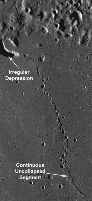
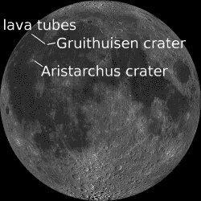
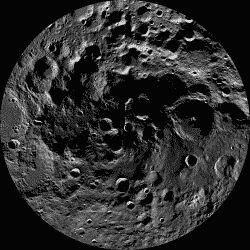
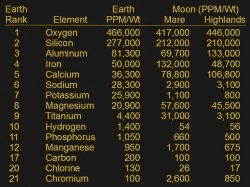
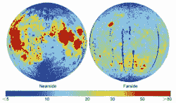

# 生活在月球上:挑战

> 原文：<https://hackaday.com/2017/12/12/living-on-the-moon-the-challenges/>

当我们写到在火星上生活时，总有人会问为什么不去月球？它近得多，而且有丰富的矿物可供选择。但是它缺少大气，这增加或加剧了我们在火星上会遇到的问题。因此，这是一个关于在月球上生活的古老梦想的有趣的思想实验。

## 居住在熔岩管道中

[](https://hackaday.com/wp-content/uploads/2017/12/lunar_collapse_pits.jpg)

Lava tube with collapsed pits near Gruithuisen crater

月球的辐射防护甚至比火星更差，几乎没有大气层。大气的缺乏也意味着更多的微陨石到达地面。处理这些问题的一个方法是将建筑物埋在几米厚的月壤——松散的土壤之下。另一种是在熔岩管中建造结构。

熔岩管是由熔岩形成的隧道。随着熔岩流，外层地壳冷却，形成一个管道，让更多的熔岩流过。熔岩耗尽后，会留下一条隧道。月球上的视觉证据可能是一个长长的凸起，有时被屋顶坍塌的孔洞打断，如图所示，这是 Gruithuisen 火山口西北部的一个熔岩管。如果管道在地下足够远，可能看不到明显的凸起，只是地面上的一个大圆洞。已知一些管道的直径超过 300 米(980 英尺)。

地下多达 40 米(130 英尺)的熔岩管也可以在大约-20 摄氏度(-4 华氏度)的温度下提供热稳定性。拥有这种稳定、相对温暖的温度使得建筑结构和设备更容易。一个单独的[太阴日](https://en.wikipedia.org/wiki/Lunar_day)平均有 29.5 个地球日长，这意味着我们将有大约 2 周有阳光，然后有 2 周没有阳光。在这些时间里，赤道表面的平均温度范围从 106°C(224°F)到-183°C(-298°F)，这使得很难找到能够承受这么长时间的材料。

但是住在地下也会带来问题。

## 沟通

住在地下的一个问题是，从一个地方到另一个地方很难交流，甚至可能是在不同的熔岩管道之间。为了克服这一点，电缆可以穿过管道，天线可以位于地面。

熔岩管经常出现在高地和母马之间的边界上。月海是从地球上肉眼可见的均匀的黑暗区域，月海在拉丁语中是“海洋”的意思。天线可能位于那些高地的高处。理想情况下，在通信范围内至少要有一颗通信卫星和一个网络，以便在月球上的任何地方进行传输。

## 电气接地和带电灰尘

土壤中的水分有助于离子移动，从而有助于导电性，使[成为良好的电气接地](https://hackaday.com/2017/07/25/earth-ground-and-the-grid/)。然而，月球土壤是干燥的，因此是不良的电气接地。用电缆将结构连接在一起，至少可以将这些结构连接到同一个电位，形成某种接地。

[](https://hackaday.com/wp-content/uploads/2017/12/harrison_schmitt_apollo_17_retrieving_samples_as17-145-22157_cr.jpg)

Schmitt’s dusty suit while retrieving samples

但比这更大的问题是月球尘埃。阿波罗号的宇航员发现灰尘附着在所有东西上，他们把灰尘带进了着陆器。阿波罗 17 号的哈里森“杰克”施密特对此反应强烈，称这导致他的鼻甲(鼻子中细长的骨头)肿胀，尽管几个小时后效果减弱。甚至他们用来清理灰尘的真空吸尘器也堵塞了。

这些尘埃也会因太阳风暴而带电，只是在太阳辐射打掉多余的电子时才会放电，但这种放电不会发生在漫长的夜晚。从 1998-1999 年期间由月球探勘者收集的数据推断，充电也发生在月球穿过由太阳风产生的地球磁场时。这种情况以 18 年为一个周期，目前正处于高峰期。

在地球和火星的大气中，积累的电荷可以通过尖锐的金属点释放到大气中，这些金属点可以电离周围的空气。在月球上，这种方法远没有那么有效。将所有住宅用作接地至少提供了一个大电容器来吸收杂散电荷。如果你知道解决这个问题的好办法，我们很想听听。

## 从土壤中产生氧气

我们当然需要氧气来呼吸，其中一个来源就是月球土壤。该过程通常包括在加热到 1000°c 左右时，使某些含氧矿物与氢气反应。人们已经对矿物钛铁矿(FeTiO [3] )做了大量工作，使该过程:

```
FeTiO3 + H2 + heat -> Fe + TiO2 + H2O

```

[](https://hackaday.com/wp-content/uploads/2017/12/lro_wac_nearside_mosaic_an1.png)

Where to live and mine

这给了我们水蒸气，水蒸气可以从其他成分中分离出来。然后我们可以直接使用水，或者我们可以用电解来分离氢和氧。我们将氧气浓缩储存，并将氢气回收到生产过程中。月球上氢很少，所以氢最初可以从地球运出，然后不断回收。

这种钛铁矿在月球上很丰富，首先是在阿波罗宇航员返回的月球岩石中发现的，然后哈勃太空望远镜推断出了其他位置，其中一个位置在阿里斯塔克斯陨石坑区域。幸运的是，那也在我们上面提到的 Gruithuisen 火山口附近的带有塌陷坑的熔岩管附近。然而，为了获得丰富的水，我们需要观察北极和南极。

## 来自两极的水

[](https://hackaday.com/wp-content/uploads/2017/12/lro_wac_south_pole_mosaic.jpg)

South pole

非常有力的证据表明，月球表面存在羟基(OH)和水(H [2] O)的混合物。理论认为它来自彗星撞击月球，以及太阳风与土壤中的氧气相互作用产生的氢离子。

但是对于月球的大部分，太阳辐射会将氢和氧原子从它们的分子中释放出来，它们会逃逸到太空中。然而，月球两极有永久处于阴影中的区域，永远没有释放氢的太阳辐射。经过几十年的宇宙飞船对这些区域的探测，那里存在水和羟基的证据非常有力，尽管其数量仍不确定。

这意味着月球采矿前哨站的一个很好的位置应该是在阳光照射的区域，靠近这些永久阴影的区域。甚至在两极周围有一些这样的地方，它们足够高，可以永远沐浴在阳光中。永久的阳光是利用太阳能电池板发电的理想选择，我们可以在月球上用开采的矿物制造太阳能电池板。

## 采矿和制造业

[](https://hackaday.com/wp-content/uploads/2017/12/astrobotics_polaris_test_vehicle.jpg)

Polaris lunar mining test vehicle via [Astrobotics](https://www.youtube.com/watch?v=bzY3M3tYLHk)

月球缺乏挥发性化学物质，这些化学物质沸点低，氢、氮和碳的含量可以忽略不计。但是它富含许多其他化学物质和矿物质。开采它们之所以重要，有两个原因:一是为了制造我们需要的东西，二是为了以原材料或制成品的形式出口到地球以外的殖民地。

我们已经提到过使用钛铁矿(FeTiO [3] )来生产氧气，但其副产品是铁(Fe)和钛(Ti)，这两种物质都可以用于建造生活空间、车辆和其他刚性物体。

检查地球和月球地壳成分表，你会发现月球含有丰富的有用矿物质。



Earth and lunar crustal compositions from [LRU for Space Construction – 1979](http://www.nss.org/settlement/spaceresources/1979-LunarResourcesUtilization2-Results.pdf)

硅可以与磷和硼一起作为掺杂剂用于生产太阳能电池。制作该表的研究不包括硼，但其他研究在月球岩石中发现了硼，尽管含量为 25 PPM 或更低，因此可能必须进口。

[](https://hackaday.com/wp-content/uploads/2017/12/he-3-chang-e-201012-798x473.png)

Helium 3 distribution via [Lunar Networks](http://lunarnetworks.blogspot.ca/2010/12/change-1-maps-moons-helium-3-inventory.html)

氦 3 是另一种可以在月球上开采的有价值的物质。中国嫦娥号月球卫星估计月壤的总量为 6600 亿公斤。人们希望它可以用于未来的聚变反应堆，因为这种聚变不会产生辐射，比其他聚变反应产生更多的能量。但是，它也需要更高的温度。只需要 6700 公斤就能为美国供电一年。幸运的是，氦 3 在我们开采钛铁矿的同一地区很丰富。

## 发电

我们已经提到过，在两极周围有一些地区常年处于阳光之下。因此，在漫长的夜晚，这些地区的太阳能发电厂可以发电作为产品在整个月球上销售。

地热能源不是月球的选择，至少不是殖民地早期的选择，因为在温度达到水的沸点之前，你必须向下钻大约 45 公里(28 英里)。在阿拉斯加的切纳温泉，地热能已经被用来发电，那里的温度只有 57 摄氏度(135 华氏度)，但仍有大约 20 公里(12.5 英里)深。

如果氦 3 聚变能够成功，那么当当地太阳能发电场关闭时，它可以用来在漫长的月夜中提供电力。这可能是必须的，因为月球上的铀供应不足。

## 甜蜜的家

所以我们会在 Gruithuisen 火山口附近的熔岩管中有一个中心殖民地。一些居民将花时间在阿里斯塔克斯陨石坑附近稍往南的地方开采钛铁矿，以生产氧气和矿物副产品。与此同时，其他人将花时间在北极的水矿上工作，并维护那里的太阳能发电厂，这些发电厂常年沐浴在阳光中。

你什么时候准备搬家？你会有什么不同的做法？我们甚至还没有触及种植食物，鉴于缺乏氮等挥发性物质，这将有其自身的挑战。你还能想到什么问题？请在下面的评论中告诉我们。