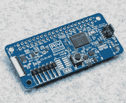

# 谷歌的 AIY 视觉套件用视觉处理器增强了 Pi

> 原文：<https://hackaday.com/2017/12/17/googles-aiy-vision-kit-augments-pi-with-vision-processor/>

谷歌[宣布](https://blog.google/topics/machine-learning/introducing-aiy-vision-kit-make-devices-see/)他们即将推出[视觉套件](https://aiyprojects.withgoogle.com/vision)，这是他们下一个易于组装的人工智能自己(AIY)产品。你必须提供自己的 Raspberry Pi Zero W，但这没关系，因为它的特别之处在于谷歌提供的 VisionBonnet 板，基本上是一个运行 TensorFlow 的低功耗神经网络加速器板。

AIY VisionBonnet with Myriad 2 (MA2450) chip

VisionBonnet 是围绕[英特尔 m ovidius Myriad 2(又名 MA2450)](https://www.movidius.com/myriad2) 视觉处理单元(VPU)芯片构建的。参见下面的视频对这种芯片的概述，但它允许的是计算密集型神经网络的快速处理。我们不认为你会用它来训练神经网络，只是用来做推理，或者用人类的话来说，用来利用训练好的神经网络。可能值得为这种板单独获得工具包，以便在您自己的黑客中使用。另一种选择是购买[莫迪维乌斯的神经计算棒](https://developer.movidius.com/)，它在 USB 棒上有相同的芯片，价格约为 80 美元，不到视觉套件 45 美元价格的两倍。

视觉套件还没有推出，所以我们不能确定细节，但根据硬件，看起来你可以将相机指向某个东西，按下按钮，它就会说话。我们以前在 Pi 3 上看到过这个[会说话的对象识别器(完全公开，它是由你真正制作的)，但是没有硬件加速，单个对象识别需要大约 10 秒。在视觉套件中，我们预计识别将是实时的。所以视觉套件可能比这更有活力。如果不清楚的话，这里的一个关键特性是，在云上什么都不做，所有的处理都是本地的。](http://hackaday.com/2017/06/14/diy-raspberry-neural-network-sees-all-recognizes-some/)

该套件有三种不同的应用:一种是物体识别，可以识别多达 1000 种不同类别的物体，另一种是识别人脸及其表情，第三种是检测人、猫和狗。虽然你可以做很多恶作剧，但你也可以运行自己的神经网络。如果您需要复习 TensorFlow，请查看我们的简介。请务必查看休息时间下方的 Myriad 2 VPU 视频。

这是谷歌发布的第二个 AIY 套件，第一个是语音套件[，我们也介绍过](https://hackaday.com/2017/05/04/google-aiy-artificial-intelligence-yourself/)。这启发了我们自己的[Inderpreet Singh]，在短短几周内，推出了[他自己的等效语音套件](https://hackaday.com/2017/05/30/diy-google-aiy/)。

这是 Myriad 2 VPU 的视频。对于更多的硬件概述，跳到 2:25 左右。

 [https://www.youtube.com/embed/hD3RYGJgH4A?version=3&rel=1&showsearch=0&showinfo=1&iv_load_policy=1&fs=1&hl=en-US&autohide=2&wmode=transparent](https://www.youtube.com/embed/hD3RYGJgH4A?version=3&rel=1&showsearch=0&showinfo=1&iv_load_policy=1&fs=1&hl=en-US&autohide=2&wmode=transparent)

