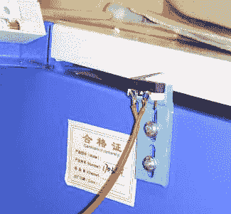

# 激光切割对准模块跳过光束组合器

> 原文：<https://hackaday.com/2017/12/11/laser-cutter-alignment-mod-skips-beam-combiner/>

我们在 Hackaday 上讨论的许多 DIY 激光雕刻机和切割机都是由从蓝光驱动器和投影仪中回收的激光二极管制成的，这些激光二极管是 400-450 纳米范围内的可见激光(以紫色或蓝色出现)。不幸的是，可见光二极管激光器的功率是有上限的，大多数激光器的最大功率在 5W 左右。如果你需要更多的动力，你可能会发现自己在寻找像 K40 这样的气体激光切割机。虽然 K40 是一个很好的起点，如果你正在寻找进入“真正的”激光，它是一个非常不同的野兽从家酿建立使用可见激光。

使用气体激光器时，光束本身是不可见的，这使得校准或测试变得更加困难。一种解决方案是给 K40 增加一个可见激光，它可以用来验证对准，但确保它沿着与主激光相同的路径传播通常需要一个昂贵的光束组合器。为了避免这种成本，[gafu] [想看看是否有可能简单地将可见激光机械地移动到初级光束的路径上](https://translate.google.com/translate?sl=auto&tl=en&js=y&prev=_t&hl=en&ie=UTF-8&u=http://blog.gafu.de/?p=1579)。

An adjustable microswitch detects when the lid has been opened.

在[gafu]提出的设置中，一个廉价的激光模块(来自手持激光笔的类型)被移动到由简单的业余伺服驱动的手臂上的主激光路径中。为了防止主要和可见激光同时发射，Arduino 用于控制伺服给定的 K40 的盖子的当前状态。如果 K40 的盖子是打开的，主激光器被关闭，可见激光器被旋转到适当的位置，这样操作者可以看到主激光器的光束将击中哪里。一旦盖子合上，可见激光器旋转到一边，主激光器重新通电。

在 K40 机器的盖子打开的情况下运行切割或雕刻作业现在让我们[gafu]在最后用全功率光束轰击目标之前，用可见激光观看整个操作的“预演”。

我们已经介绍了每个人最喜欢的入门级二氧化碳激光切割机的许多改进和修改。从[更换控制器](https://hackaday.com/2017/06/10/drop-in-controller-for-ebay-k40-laser-engraver-gets-results/)到[让它变大](https://hackaday.com/2017/04/24/laser-surgery-expanding-the-bed-of-a-cheap-chinese-laser-cutter/)，K40 车主[看起来确实像是一群有创造力的人](https://hackaday.com/2017/11/22/hacking-a-k40-laser-cutter/)。